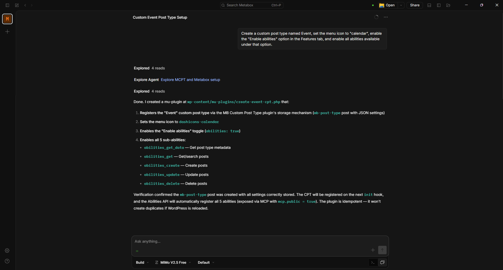
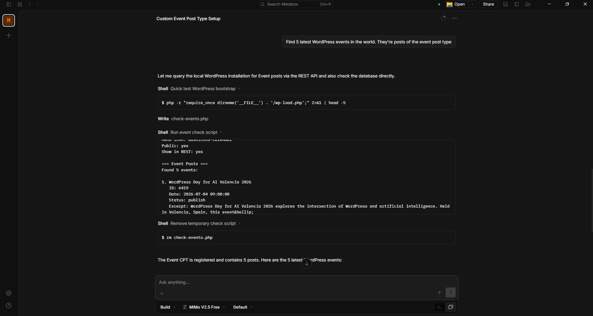
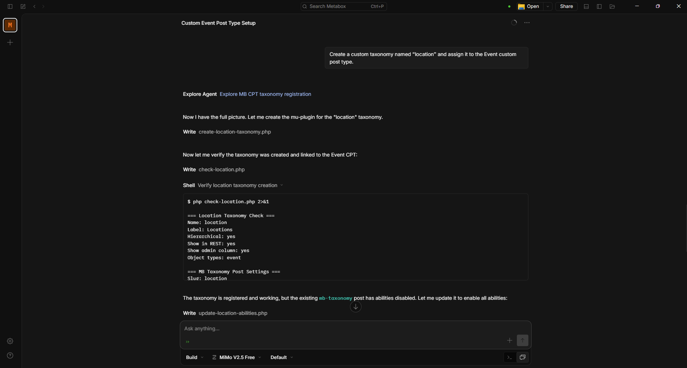
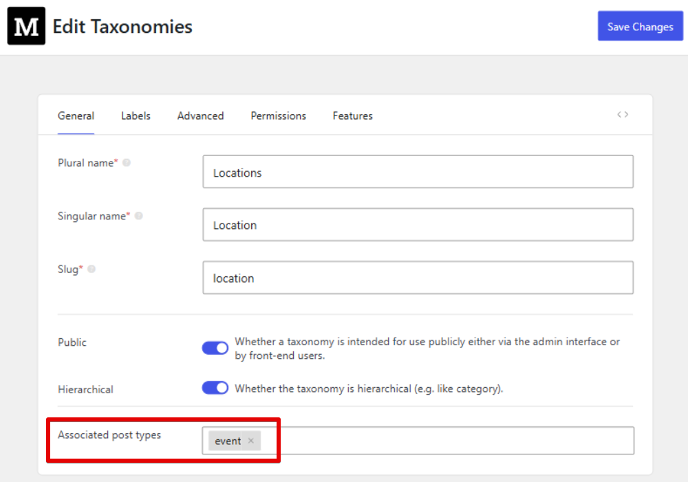
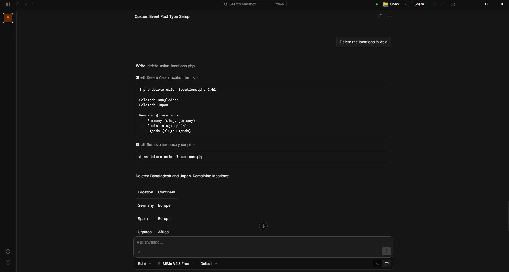
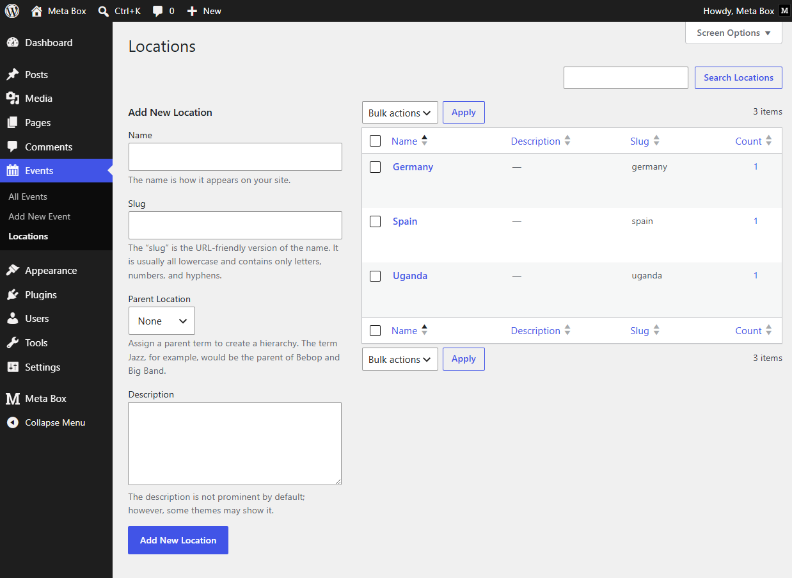
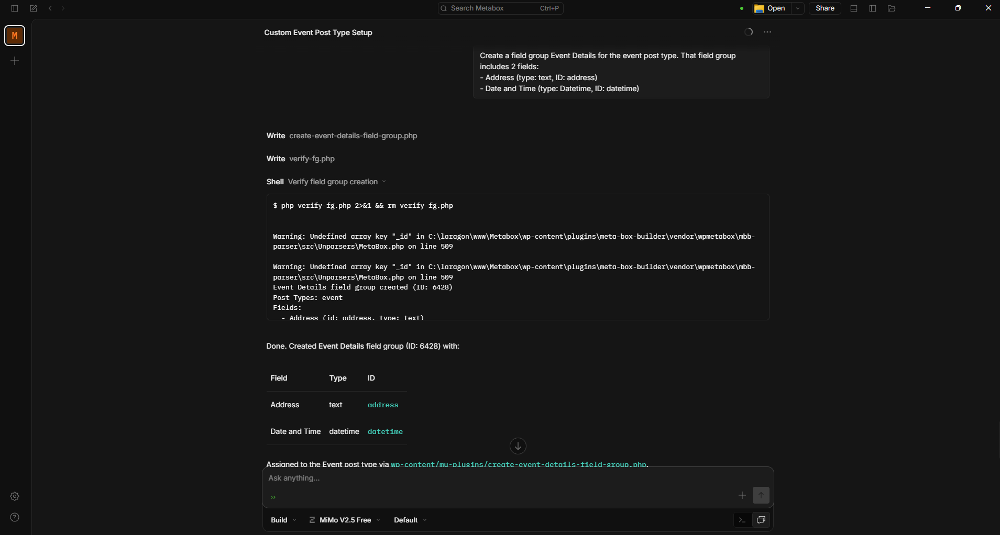
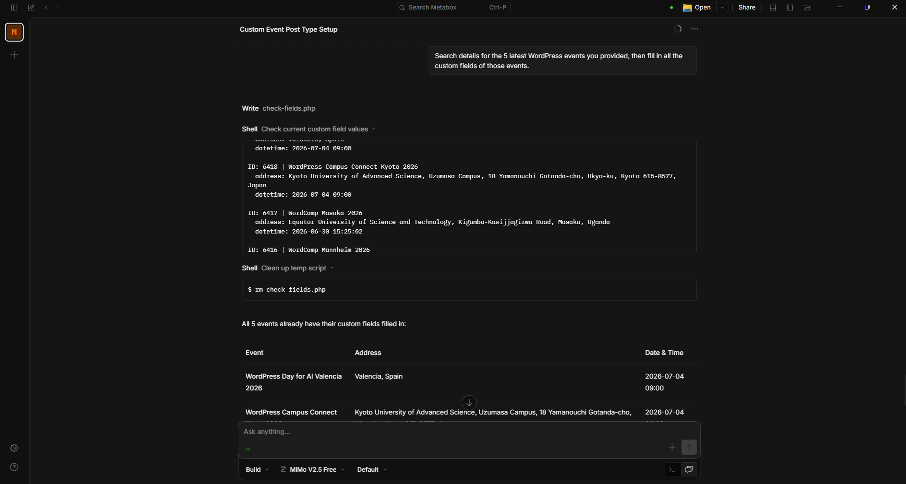
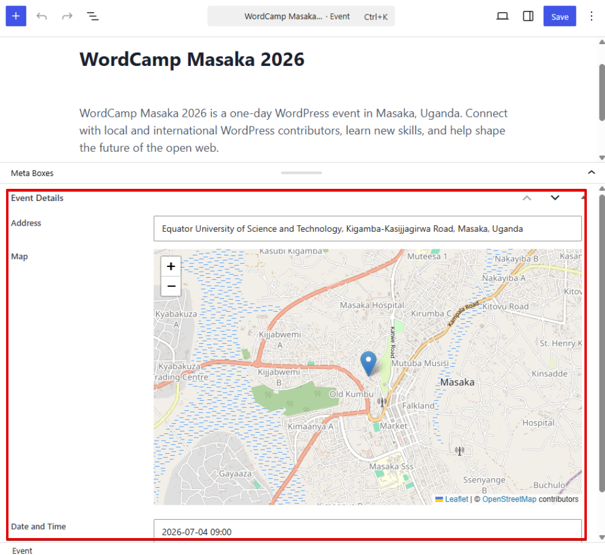

import LiteYouTubeEmbed from 'react-lite-youtube-embed';
import 'react-lite-youtube-embed/dist/LiteYouTubeEmbed.css';

The Abilities API from Meta Box builds on the [WordPress Abilities API](https://developer.wordpress.org/apis/abilities-api/) to let AI agents - such as Claude or Cursor - perform actions on your site's content. To handle the communication, Meta Box uses the official [MCP Adapter plugin](https://github.com/WordPress/mcp-adapter), which translates WordPress abilities into the Model Context Protocol (MCP) that AI agents understand.

Depending on which abilities are enabled, AI agents can get, create, update, or delete custom post types, taxonomies, posts, terms, field groups, custom fields, and field values that Meta Box supports.

## Connecting AI agents to WordPress

First, connect WordPress to an AI agent via the [MCP Adapter plugin](https://github.com/WordPress/mcp-adapter). It exposes WordPress as an MCP server that AI agents can connect to.

### 1. Install MCP Adapter plugin

1. Download the [latest release of MCP Adapter](https://github.com/WordPress/mcp-adapter/releases) from GitHub
2. Go to **Plugins → Add New → Upload Plugin**, select the ZIP file, then install and activate the plugin

### 2. Generate application password

MCP Adapter uses Application Passwords for authentication (not your account password).

1. Go to **Users → Profile**
2. Scroll to the **Application Passwords** section
3. Enter a name (e.g. "MCP Agent"), then click **Add New Application Password**
4. Copy the generated password - it is shown only once

:::warning
An application password grants the same capabilities as the user account it belongs to. To restrict permissions, create a dedicated WordPress user with an appropriate role (e.g. Editor or Author) first, then generate an application password under that user.
:::

### 3. Configure MCP clients

Configure MCP clients (Claude Desktop, Claude Code, Cursor, etc.) to connect to your WordPress MCP server using HTTP transport via a proxy. Use `@automattic/mcp-wordpress-remote` to bridge local stdio to remote WordPress HTTP:

```json
{
  "mcpServers": {
    "wordpress-http": {
      "command": "npx",
      "args": [
        "-y",
        "@automattic/mcp-wordpress-remote@latest"
      ],
      "env": {
        "WP_API_URL": "http://your-site.com/wp-json/mcp/mcp-adapter-default-server",
        "LOG_FILE": "/path/to/logs/mcp-adapter.log",
        "WP_API_USERNAME": "your-username",
        "WP_API_PASSWORD": "your-application-password"
      }
    }
  }
}
```

Replace:
- The domain in `WP_API_URL` with your site domain
- `WP_API_USERNAME` with your WordPress username
- `WP_API_PASSWORD` with the Application Password from Step 2
- `LOG_FILE` with the path where logs should be written

For more details, follow the instructions in the [MCP Adapter plugin's GitHub repository](https://github.com/WordPress/mcp-adapter).

## Post type abilities

### Creating and managing custom post types

To create a new custom post type, describe the structure you want in natural language. For example:

> *Create a custom post type named Event, set the menu icon to "calendar", enable the "Enable abilities" option in the Features tab, and enable all abilities available under that option.*



Within seconds, you should have the post type you asked for:


You can also ask your AI agent to update post type settings, such as enabling a hierarchical structure or changing the menu icon.

### Abilities for posts

To enable abilities for posts of a custom post type, go to the **Features** tab when creating or editing a post type, then turn on **Enable abilities**. Available actions include:

- Getting post type data (the definition)
- Getting, creating, updating, and deleting posts under that post type


You can enable or disable each ability independently. Once enabled, compatible AI agents can invoke these abilities through the Abilities API.

For example, after creating an Event post type, you can ask the AI agent to generate posts for it:

> *Find 5 latest WordPress events in the world. They're posts of the event post type*



The agent creates the posts without manual entry:


You can also update posts. For example:

> *Update the status of the posts to published.*

Or delete posts with a simple prompt:

> *Delete the events in Asia.*

The posts are updated or deleted according to your request.

## Taxonomy abilities

### Creating and managing custom taxonomies

The Abilities API also lets you create, update, and delete custom taxonomies, as well as manage the terms within them.

Start by creating a new custom taxonomy:

> *Create a custom taxonomy named "location" and assign it to the Event custom post type.*





When you need to update the taxonomy, describe the change you want:

> *Enable the Re-order terms feature for this taxonomy.*

### Abilities for terms

Taxonomy abilities are configured the same way as post type abilities. You can:

- Get taxonomy data (the definition)
- Get, create, update, and delete terms in that taxonomy


You can then give AI agents prompts like this:

> *Update locations: remove cities and keep only countries.*

Or delete specific terms:

> *Delete the locations in Asia.*



The result:



## Field group abilities

Field group abilities let AI agents register and manage field groups and fields. They are built into Meta Box and available by default - you do not need to enable them before using them with compatible AI agents.

With these abilities, AI agents can:

* Create field groups
* Update (edit) field groups
* Delete field groups
* Add or remove fields
* Update field settings, such as labels, IDs, and types
* Move fields up or down

For example, to create a field group for the `event` post type, use a prompt like this:

> *Create a field group Event Details for the event post type. That field group includes 2 fields: Address (type: text, ID: address); Date and Time (type: Datetime, ID: datetime).*



Result:


You can also update the field group - for example, by changing a field ID, setting text length limits, or adding a new field:

> *Add a Map field (type: Open Street Map) below the Address field, and set the address field ID to `address`.*

Or:

> *Move the Date and Time field to the top of the field group.*

If you are not sure which fields to add, AI agents can suggest suitable ones based on your requirements.

## Field value abilities

Similar to other objects, the Abilities API lets you:

* Get field values
* Set values for custom fields
* Edit field values
* Delete field values

This is especially useful when importing structured data from external sources.

Here is an example of automatically finding information and filling in custom fields:

> *Search details for the 5 latest WordPress events you provided, then fill in all the custom fields of those events.*



In the post editor, the fields are populated:



You can also edit field values. For example:

> *Update the date format to Jul 4th, 2026.*

Or remove all stored values:

> *Delete all data in the custom fields.*

The Meta Box Abilities API performs the requested action.

## Video tutorial

The video below shows examples of using the Abilities API to create and manage custom post types, taxonomies, posts, terms, fields, and field values:

<LiteYouTubeEmbed id='TcfxmxDSvd0' />

