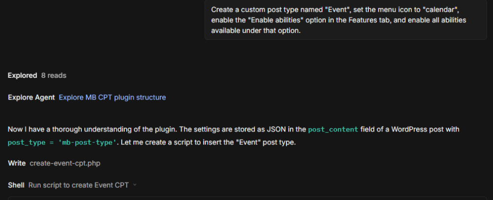
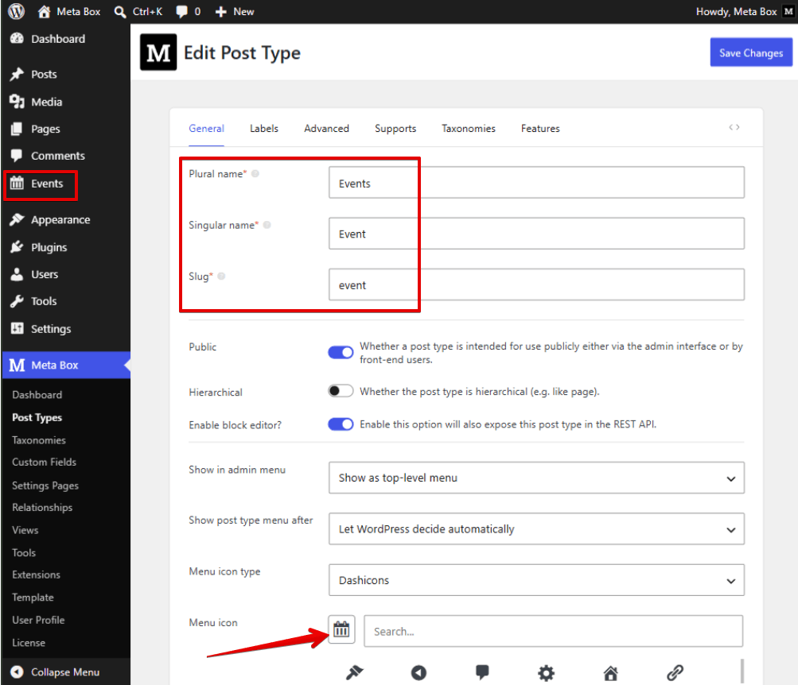
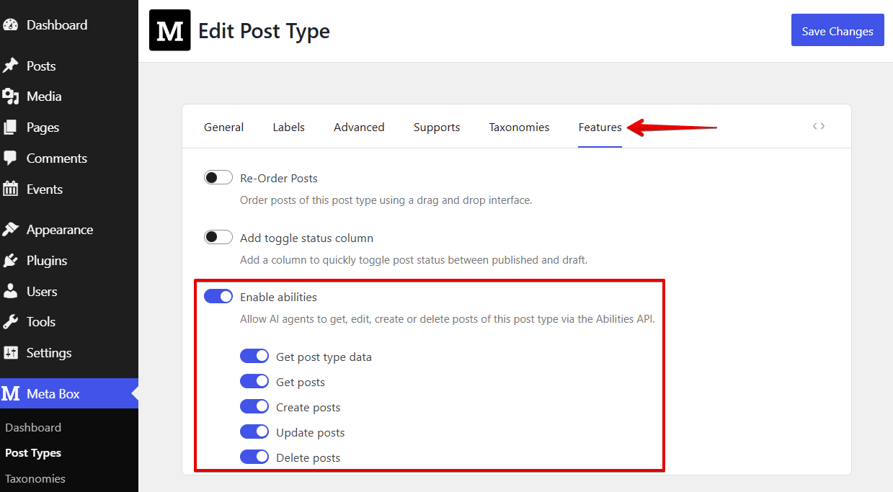
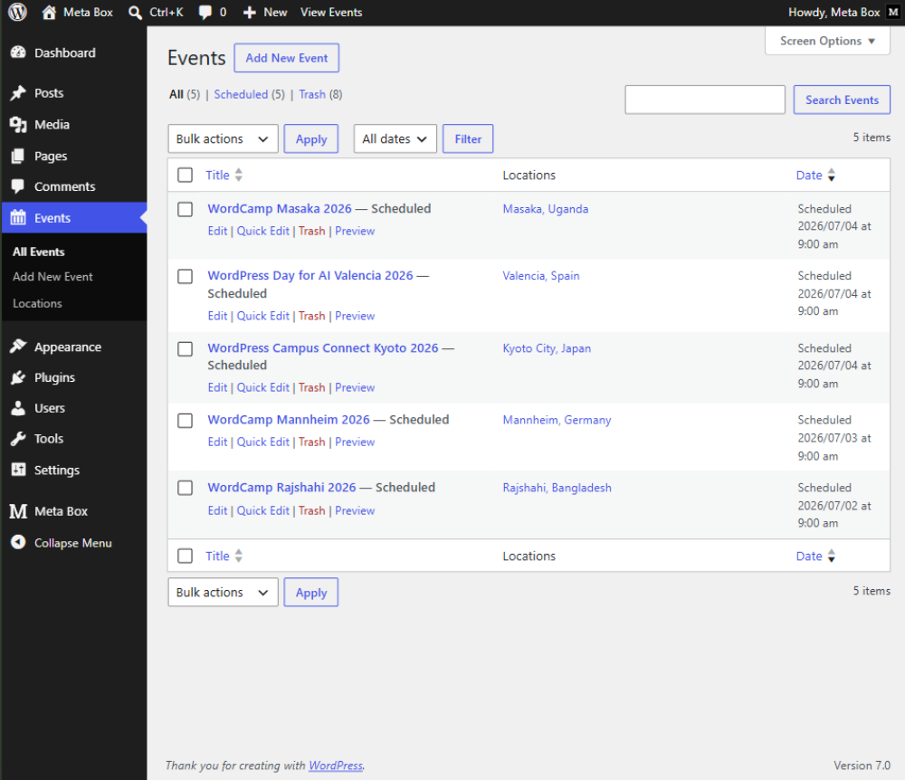
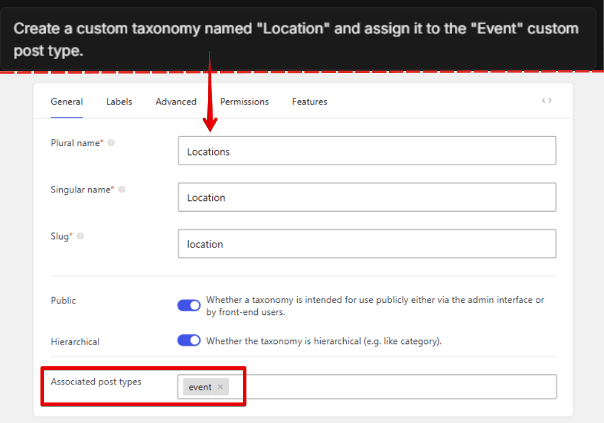
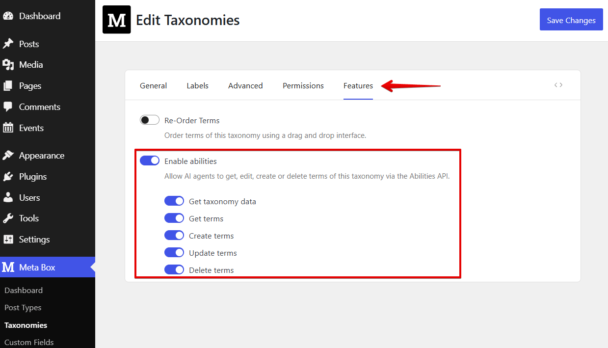
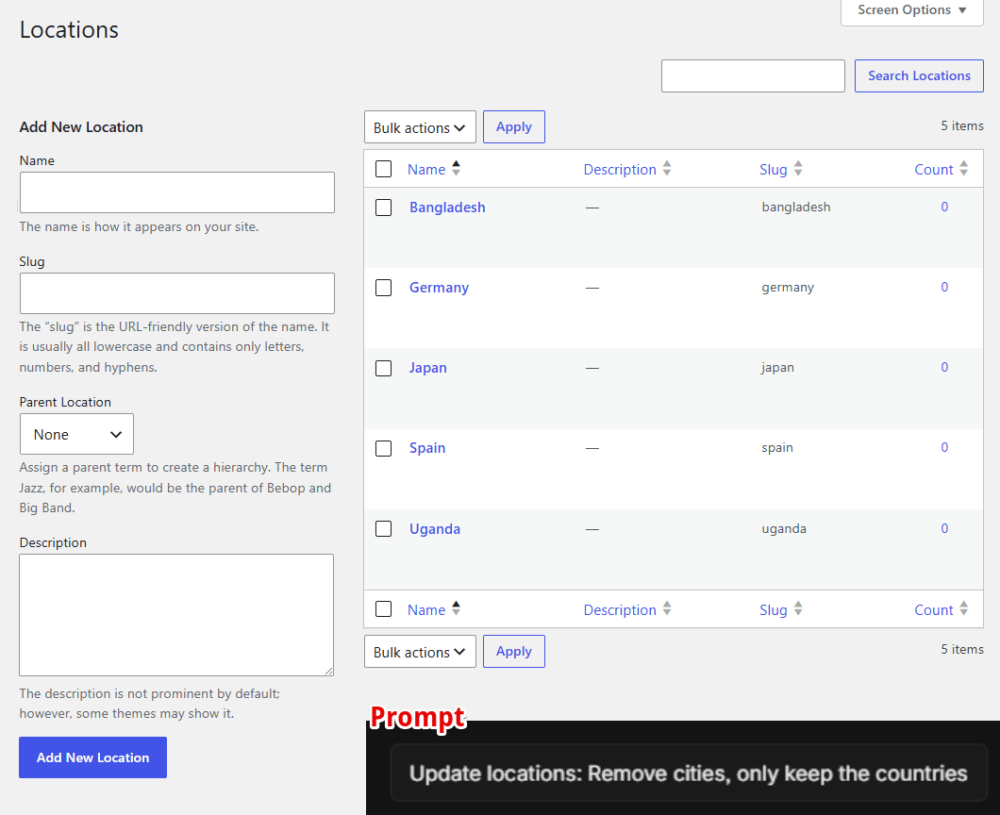
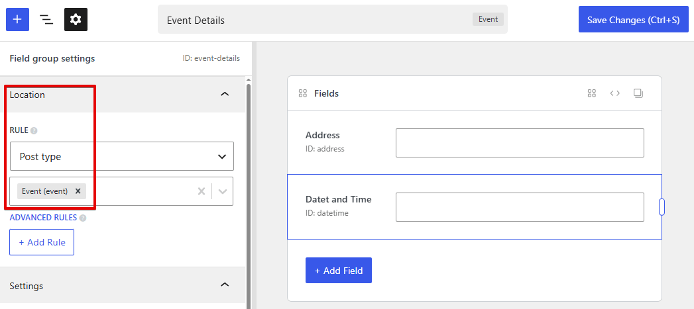
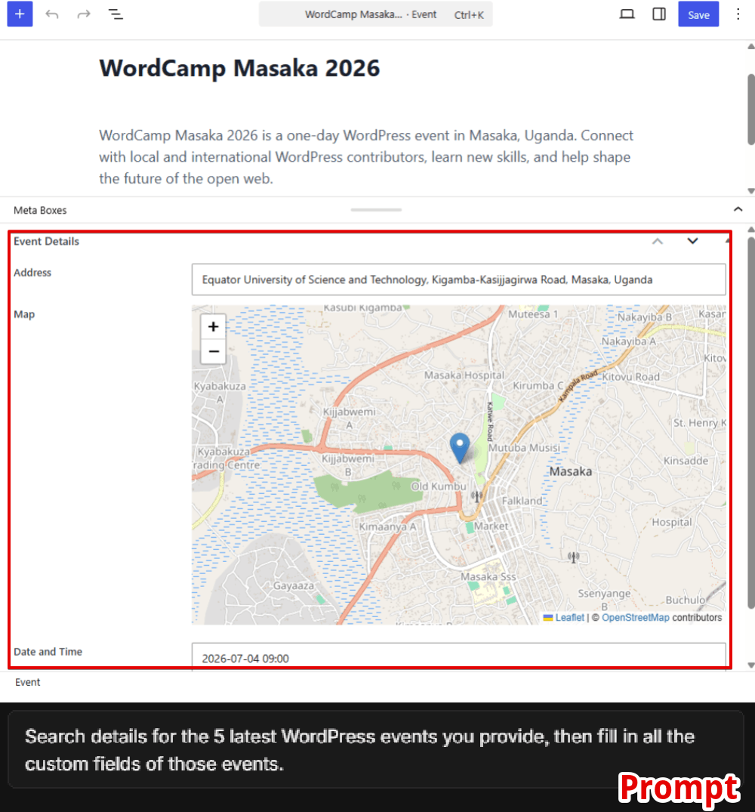

The Abilities API exposes a set of abilities that compatible AI agents, such as Cursor and OpenCode, can invoke to perform actions on supported WordPress objects.

Depending on the enabled abilities, AI agents can retrieve, create, update, or delete custom post types, taxonomies, posts, terms, field groups, custom fields, and field values.

Before using the Abilities API, make sure your WordPress site is connected to a compatible AI agent.

Abilities are configured separately for each supported object, allowing you to control which operations AI agents can perform.

## Post type abilities

### Creating and managing custom post types

To create a new custom post type, simply describe the structure you want in natural language. For example:

Within seconds, you have the expected post type:

### Abilities for posts

To enable abilities for posts of a custom post type, go to the Features tab when creating or editing a post type, then turn on Enable abilities. They include:

You can enable or disable each ability independently. Once enabled, compatible AI agents can invoke these abilities through the Abilities API.

For example, after creating an Event Post Type, you can ask the AI agent to generate posts for it:

“Find 5 latest WordPress events in the world. They’re posts of the event post type”

Then, you have 5 posts as expected without creating them manually:

## Taxonomy abilities

Abilities API also allows you to create, update, and delete custom taxonomies, as well as manage the terms within them.

Taxonomy abilities are configured in the same way as post type abilities. 

Then, you can retrieve, create, edit, or delete terms. For example:

## Field group abilities

Field group abilities allow AI agents to manage field groups and custom fields. They are built into Meta Box and are available by default. You don't need to enable them before using them with compatible AI agents.

With these abilities, AI agents can:

* Create field groups
* Update (edit) field groups
* Delete field groups
* Add or remove custom fields
* Update field settings, such as labels, IDs, types, etc.

For instance, to create a field group for the `event` post type, you can use a prompt like this:

“ Create a field group Event Details for the event post type. That field group includes 2 fields:
- Address (type: text, ID: address)
- Date and Time (type: Datetime, ID: datetime)"

And this is the result:

If you're not sure which Custom Fields to add, AI agents can suggest suitable ones based on your requirements.

## Field value abilities

Similar to other objects, with the Abilities API, you can:

* Get field values
* Input data to custom fields
* Edit field values
* Delete field values

This is particularly useful when importing structured data from external sources.

This is an example:

