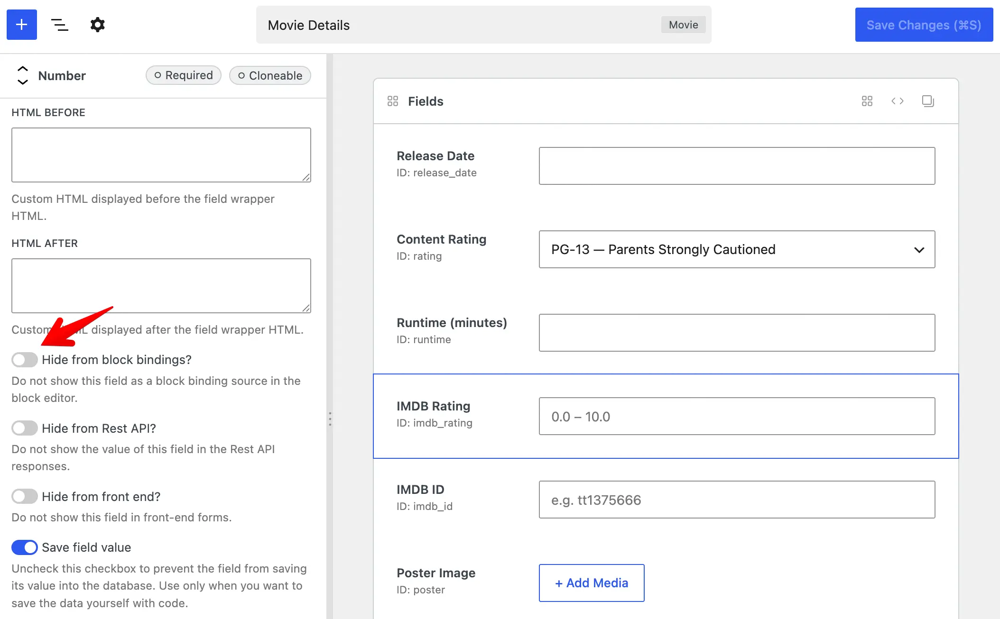
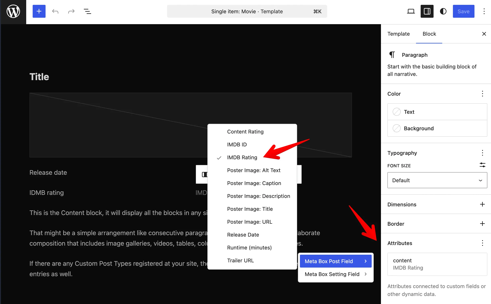

Custom fields store structured data - event dates, subtitles, cover images, prices - but that data does not appear on the front end by itself. You still need a way to [display it](/custom-fields/#displaying-fields).

[Block bindings](https://developer.wordpress.org/block-editor/reference-guides/block-api/block-bindings/) do that in Gutenberg. Like **dynamic data** in page builders, they connect a Meta Box field to a core block - a Paragraph shows your subtitle, an Image block shows your cover photo. Meta Box registers your fields as block binding sources by default, so you can use them in Gutenberg without PHP templates or a custom block.

## Why use block bindings?

Block bindings bring Meta Box field data into Gutenberg - connect fields from posts, terms, users, or settings pages to Paragraph, Heading, Image, Button, and other core blocks, right in the editor.

- **Like dynamic data, but for Gutenberg** - pick a field, and the block shows its value on the front end.
- **No extra code** - bind a Paragraph or Image block directly to a field.
- **Single source of truth** - update the field once; every bound block reflects the change.
- **Native block styling** - use core blocks with full typography, spacing, and layout controls.

They work in post content, block templates, and synced patterns - alongside [other ways to display fields](/custom-fields/#displaying-fields) when you need them.

This feature requires **WordPress 6.5+**. The **Attributes** panel in the block editor (to pick a field visually) requires **WordPress 6.9+**.

## Binding sources

Meta Box registers a separate source for each object type:

Source | Label | Available with
---|---|---
`meta-box/post-field` | **Meta Box Post Field** | Meta Box (posts and custom post types)
`meta-box/term-field` | **Meta Box Term Field** | [MB Term Meta](/extensions/mb-term-meta/)
`meta-box/user-field` | **Meta Box User Field** | [MB User Meta](/extensions/mb-user-meta/)
`meta-box/setting-field` | **Meta Box Setting Field** | [MB Settings Page](/extensions/mb-settings-page/)

In the block editor, pick the source that matches where your field is stored, then choose the field (or a field property for structured fields).

## Hiding a field from block bindings

By default, Meta Box makes fields available for block bindings. If you do not want a field to appear in the block editor bindings UI, you can hide it.

### Using MB Builder

1. Edit a field.
2. Open the **Advanced** tab in field settings panel.
3. Turn on **Hide from block bindings?**.



:::info

The instruction above uses [MB Builder](/extensions/meta-box-builder/), an extension providing the UI to create fields, and is already bundled in [Meta Box Lite](https://metabox.io/lite/) and [Meta Box AIO](https://metabox.io/aio/). If you prefer to use code, please see below.

:::

### Using code

Add `'hide_from_block_bindings' => true` to the [field settings](/creating-fields-with-code/#fields):

```php
add_filter( 'rwmb_meta_boxes', function ( $meta_boxes ) {
	$meta_boxes[] = [
		'title'      => 'Movie Details',
		'post_types' => 'movie',
		'fields'     => [
			[
				'name'                     => 'IMDB Rating',
				'id'                       => 'imdb_rating',
				'type'                     => 'number',
				'min'                      => 0,
				'max'                      => 10,
				'step'                     => 0.1,
				// highlight-next-line
				'hide_from_block_bindings' => true,
			],
		],
	];

	return $meta_boxes;
} );
```

## Binding a block to a field

1. Edit a post, template, or pattern in the block editor.
2. Select a block that supports bindings (for example Paragraph, Heading, Button, or Image).
3. In the block settings sidebar, open the **Attributes** panel.
4. Choose the attribute to bind (for example **Content** for a paragraph, or **URL** for an image).
5. Select the Meta Box source for your field type (for example **Meta Box Post Field**), then pick your field (or a field property for structured fields).

The bound attribute uses the field value when the content is rendered on the front end.



:::tip Binding without the UI

The **Attributes** panel is available from **WordPress 6.9** onward. On **WordPress 6.5 to 6.8**, you can still bind attributes in the **Code editor**. Example for a paragraph bound to an `imdb_rating` post field:

```html
<!-- wp:paragraph {
  "metadata":{
    "bindings":{
      "content":{
        "source":"meta-box/post-field",
        "args":{"id":"imdb_rating"}
      }
    }
  }
} -->
<p>Fallback text</p>
<!-- /wp:paragraph -->
```

Use `meta-box/term-field`, `meta-box/user-field`, or `meta-box/setting-field` for fields on terms, users, or settings pages.

:::

## Structured fields

Scalar fields ([text](/fields/text/), [number](/fields/number/), [email](/fields/email/), and similar) expose a single binding option: the field value as a string.

Structured fields expose **properties** you can bind separately. In the UI they appear as labels like `Poster Image: URL` or `Poster Image: Alt Text`. In code, pass a `key` in the binding args:

```html
<!-- wp:image {
  "metadata":{
    "bindings":{
      "url":{
        "source":"meta-box/post-field",
        "args":{"id":"poster","key":"url"}
      },
      "alt":{
        "source":"meta-box/post-field",
        "args":{"id":"poster","key":"alt"}
      }
    }
  }
} -->
<figure class="wp-block-image"></figure>
<!-- /wp:image -->
```

Supported properties by field type:

Field type | Properties (`key`)
---|---
`single_image`, `image`, `image_advanced`, `image_upload` | `url`, `alt`, `title`, `caption`, `description`
`file`, `file_advanced`, `file_upload` | `url`, `title`
`background` | `image`
`link` | `url`, `title`, `target`
`map`, `osm` | `latitude`, `longitude`
`post` | `post_title`, `post_excerpt`, `post_content`, `post_date`, `post_modified`, `post_author`, `url`
`taxonomy`, `taxonomy_advanced` | `name`, `slug`, `description`, `url`
`user` | `display_name`, `user_url`
`video` | `src`, `title`, `caption`, `description`
`fieldset_text` | Each option key from the field's `options`

If `key` is omitted, Meta Box falls back to the bound block attribute name (for example, an Image block's `url` attribute).

## Limitations

- **One value only.** If a field is [cloneable](/cloning-fields/) or stores multiple values (for example a multi-select or checkbox list), the binding uses only the **first** value.
- **Editor preview.** Bound attributes are resolved on the front end. The editor lists available fields for binding but does not show live field values in the canvas, and bound values are not editable from the block.
- **Access.** Bound values are only returned when the visitor can view the related object. For posts, that means password-protected or private content stays hidden from unauthorized visitors. For non-public taxonomies, term fields follow the same idea.
