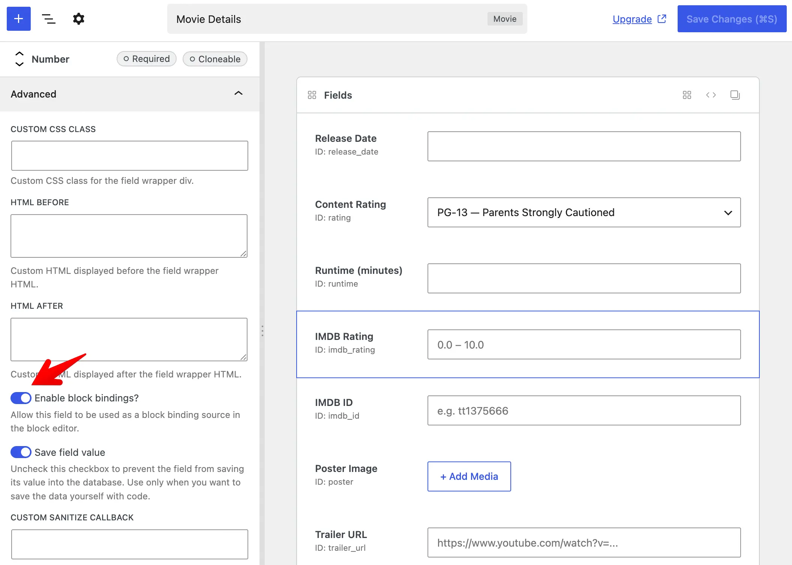

Custom fields store structured data - event dates, subtitles, cover images, prices - but that data does not appear on the front end by itself. You still need a way to [display it](/custom-fields/#displaying-fields).

[Block bindings](https://developer.wordpress.org/block-editor/reference-guides/block-api/block-bindings/) do that in Gutenberg. Like **dynamic data** in page builders, they connect a Meta Box field to a core block - a Paragraph shows your subtitle, an Image block shows your cover photo. Meta Box registers a custom source, **Meta Box Field** (`meta-box/field`), so you can set this up without PHP templates or a custom block.

## Why use block bindings?

Block bindings bring Meta Box field data into Gutenberg - connect any enabled post field to Paragraph, Heading, Image, Button, and other core blocks, right in the editor.

- **Like dynamic data, but for Gutenberg** - pick a field, and the block shows its value on the front end.
- **No extra code** - bind a Paragraph or Image block directly to a field.
- **Single source of truth** - update the field once; every bound block reflects the change.
- **Native block styling** - use core blocks with full typography, spacing, and layout controls.

They work in post content, block templates, and synced patterns - alongside [other ways to display fields](/custom-fields/#displaying-fields) when you need them.

This feature requires **WordPress 6.5+**. The **Attributes** panel in the block editor (to pick a field visually) requires **WordPress 6.9+**.

## Enabling block bindings for a field

Block bindings are **opt-in**. Only fields you enable appear in the block editor bindings UI.

### Using MB Builder

1. Edit a field in [MB Builder](/extensions/meta-box-builder/).
2. Open the **Advanced** tab in [field settings](/field-settings/).
3. Turn on **Enable block bindings?**.



:::info

The instruction above uses [MB Builder](/extensions/meta-box-builder/), an extension providing the UI to create fields, and is already bundled in [Meta Box Lite](https://metabox.io/lite/) and [Meta Box AIO](https://metabox.io/aio/). If you prefer to use code, please see below.

:::

### Using code

Add `'block_bindings' => true` to the [field settings](/creating-fields-with-code/#fields):

```php
add_filter( 'rwmb_meta_boxes', function ( $meta_boxes ) {
	$meta_boxes[] = [
		'title'      => 'Movie Details',
		'post_types' => 'movie',
		'fields'     => [
			[
				'name'           => 'IMDB Rating',
				'id'             => 'imdb_rating',
				'type'           => 'number',
				'min'            => 0,
				'max'            => 10,
				'step'           => 0.1,
				// highlight-next-line
				'block_bindings' => true,
			],
		],
	];

	return $meta_boxes;
} );
```

## Binding a block to a field

1. Edit a post (or a template that has post context) in the block editor.
2. Select a block that supports bindings (for example Paragraph, Heading, Button, or Image).
3. In the block settings sidebar, open the **Attributes** panel.
4. Choose the attribute to bind (for example **Content** for a paragraph, or **URL** for an image).
5. Select the **Meta Box Field** source, then pick your field (or a field property for structured fields).

The bound attribute uses the field value when the post is rendered on the front end.


:::tip Binding without the UI

The **Attributes** panel is available from **WordPress 6.9** onward. On **WordPress 6.5 to 6.8**, you can still bind attributes in the **Code editor**. Example for a paragraph bound to an `imdb_rating` field:

```html
<!-- wp:paragraph {
  "metadata":{
    "bindings":{
      "content":{
        "source":"meta-box/field",
        "args":{"id":"imdb_rating"}
      }
    }
  }
} -->
<p>Fallback text</p>
<!-- /wp:paragraph -->
```

:::

## Structured fields

Scalar fields ([text](/fields/text/), [number](/fields/number/), [email](/fields/email/), and similar) expose a single binding option: the field value as a string.

Structured fields expose **properties** you can bind separately. In the UI they appear as labels like `Poster Image: URL` or `Poster Image: Alt Text`. In code, pass a `key` in the binding args:

```html
<!-- wp:image {
  "metadata":{
    "bindings":{
      "url":{
        "source":"meta-box/field",
        "args":{"id":"poster","key":"url"}
      },
      "alt":{
        "source":"meta-box/field",
        "args":{"id":"poster","key":"alt"}
      }
    }
  }
} -->
<figure class="wp-block-image"></figure>
<!-- /wp:image -->
```

Supported properties by field type:

Field type | Properties (`key`)
---|---
`single_image`, `image`, `image_advanced`, `image_upload` | `url`, `alt`, `title`, `caption`, `description`
`file`, `file_advanced`, `file_upload` | `url`, `title`
`background` | `image`
`link` | `url`, `title`, `target`
`map`, `osm` | `latitude`, `longitude`
`post` | `post_title`, `post_excerpt`, `post_content`, `post_date`, `post_modified`, `post_author`, `url`
`taxonomy`, `taxonomy_advanced` | `name`, `slug`, `description`, `url`
`user` | `display_name`, `user_url`
`video` | `src`, `title`, `caption`, `description`
`fieldset_text` | Each option key from the field's `options`

If `key` is omitted, Meta Box falls back to the bound block attribute name (for example, an Image block's `url` attribute).

## Limitations

- **[Cloneable](/cloning-fields/) and multiple fields** use the **first** value only.
- **Editor preview.** Bound attributes are resolved on the front end. The editor lists available fields for binding but does not show live field values in the canvas, and bound values are not editable from the block.
- **Access.** Password-protected posts and posts the visitor cannot read do not expose bound values.
