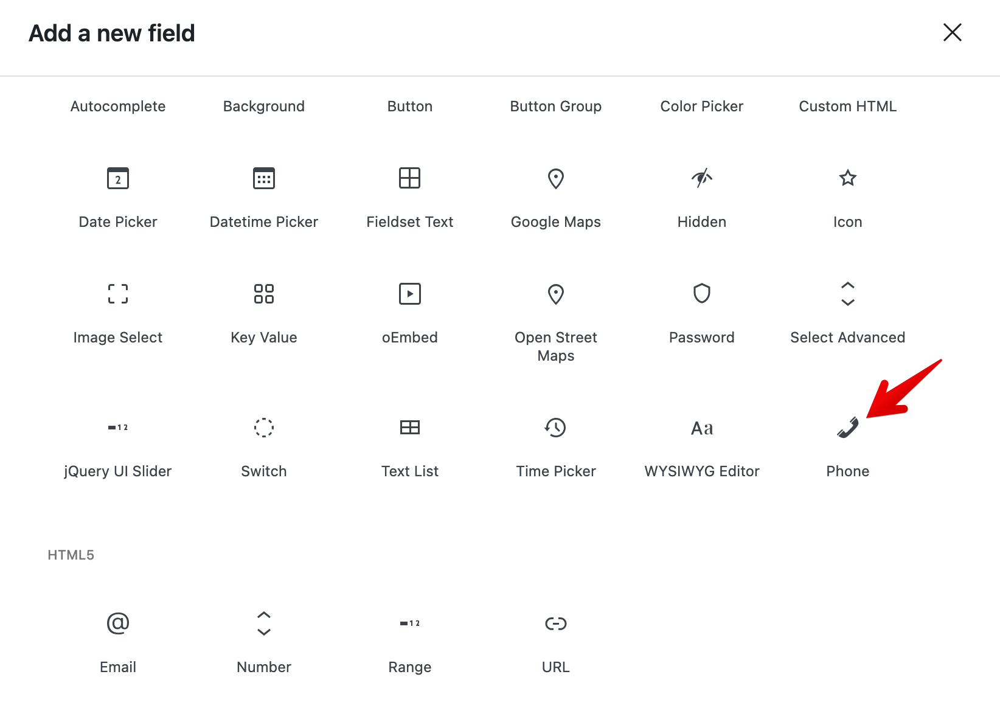

If the existing Meta Box field types don't quite fit your needs, you can create your own. In this guide, we'll walk through how to create a custom field type called `phone`, which only accepts phone numbers in the format `xxx-xxx-xxxx`.

## 1. Create a new field class

All custom fields in Meta Box are defined as classes. To create a new field type, define a class named `RWMB_{$field_type}_Field` that extends the base `RWMB_Field` class. For our `phone` field, the class name will be `RWMB_Phone_Field`.

```php
class RWMB_Phone_Field extends RWMB_Field {
    // Code for the field goese here
}
```

Save this class into a PHP file (for example: `field-phone.php`) and include it in your theme's `functions.php` file or in your custom plugin:

```php
add_action( 'init', function () {
    require 'path/to/field-phone.php';
} );
```

:::info Why use the `init` hook?

We hook into `init` to make sure all Meta Box files are fully loaded and the `RWMB_Field` class is available.

:::

## 2. Output the field HTML

To display the field so users can enter data, define the `html` method inside your field class:

```php
public static function html( $meta, $field ) {
    return sprintf(
        '<input type="text" name="%s" id="%s" class="rwmb-phone" value="%s" pattern="\d{3}-\d{3}-\d{4}">',
        $field['field_name'],
        $field['id'],
        $meta
    );
}
```

Here we're using the `pattern` attribute to ensure that users enter a phone number in the format `xxx-xxx-xxxx`.

:::info

Good news: you don't need to handle saving, retrieving, or enqueueing scripts/styles manually. Meta Box takes care of that automatically.

:::

Full class example:

```php
class RWMB_Phone_Field extends RWMB_Field {
    public static function html( $meta, $field ) {
        return sprintf(
            '<input type="text" name="%s" id="%s" class="rwmb-phone" value="%s" pattern="\d{3}-\d{3}-\d{4}">',
            $field['field_name'],
            $field['id'],
            $meta
        );
    }
}
```

:::info Inherited methods

This class inherits all methods from the `RWMB_Field` class. See the **method reference** below for details.

:::

## 3. Add the field to the builder (optional)

If you want to use your custom field in the [builder](/extensions/meta-box-builder/), you need to register it via the `mbb_field_types` filter:

```php
use MBB\Control;

add_filter( 'mbb_field_types', function ( $field_types ) {
	$field_types['phone'] = [
		'title'    => __( 'Phone', 'your-text-domain' ),
        'icon'     => 'phone',
		'category' => 'advanced',
		'controls' => [
			'name', 'id', 'type', 'label_description', 'desc',
			Control::Select( 'icon_type', [
				'label'   => __( 'Icon type', 'your-text-domain' ),
				'options' => [
					'dashicons'   => __( 'Dashicons', 'your-text-domain' ),
					'fontawesome' => __( 'Font Awesome', 'your-text-domain' ),
					'url'         => __( 'Custom URL', 'your-text-domain' ),
				],
			], 'dashicons' ),
			Control::Input( 'icon', [
				'label'      => __( 'Icon', 'your-text-domain' ),
				'dependency' => 'icon_type:dashicons',
			] ),
			Control::Input( 'icon_fa', [
				'label'      => '<a href="https://fontawesome.com/icons?d=gallery&m=free" target="_blank" rel="noopenner noreferrer">' . __( 'FontAwesome icon class', 'your-text-domain' ) . '</a>',
				'dependency' => 'icon_type:fontawesome',
			] ),
			Control::Input( 'icon_url', [
				'label'      => __( 'Icon URL', 'your-text-domain' ),
				'dependency' => 'icon_type:url',
			] ),
			'clone_settings',
			'before', 'after', 'class', 'save_field', 'sanitize_callback', 'attributes', 'custom_settings',
		],
	];

	return $field_types;
} );
```

This code registers a `phone` field type under the **Advanced** category with several available controls.

When you click **+ Add field** in the builder, it will appear like this:



**Field type parameters:**

The `mbb_field_types` filter filter accepts a single parameter: an associative array of field types. Each type supports these parameters:

- `title`: The field type’s display title.
- `icon`: The icon for the field (Dashicons only).
- `category`: The inserter popup category (options: `basic`, `advanced`, `html5`, `wordpress`, `upload`, `layout`).
- `controls`: The available controls in the builder. These can be:
    - Simple strings (`name`, `id`, `type`).
    - Control objects like `MBB\Control::Input` or `MBB\Control::Select`.

Each control has a specific type and several parameters:

1. Setting name
1. Control properties, which is an array:
    - `label`: Control label text.
    - `tooltip`: Helper text shown as a tooltip.
    - `options`: For select-type controls, in the format `'value' => 'label'`.
    - `dependency`: Show this control only when another control has a certain value (e.g. `{$other_control_setting_name}:{$value}`). Optional.
1. Default value. Optional.
1. Settings tab: `general` (default), `appearance`, or `advanced`. Optional.

In case your control has only `label` property, you can set the property as a string.

**Supported control types:**

| Control Type               | Description                                                                |
| -------------------------- | -------------------------------------------------------------------------- |
| `MBB\Control::Checkbox`    | A simple checkbox.                                                         |
| `MBB\Control::Input`       | A text input. Add `'type' => 'number'` to accept only numbers.             |
| `MBB\Control::Select`      | A single-select dropdown. Requires an `options` array.                     |
| `MBB\Control::ReactSelect` | A multi-select dropdown. Requires `options`, and default must be an array. |
| `MBB\Control::Textarea`    | A textarea input.                                                          |

## 4. Use the new field

Once registered, you can use the new `phone` field type like any other:

```php
add_filter( 'rwmb_meta_boxes', function ( $meta_boxes ) {
    $meta_boxes[] = [
        'title'      => 'Profile',
        'post_types' => 'speaker',
        'fields'     => [
            'Name',
            // highlight-start
            [
                'name' => 'Hotline',
                'id'   => 'hotline',
                'type' => 'phone',
            ],
            // highlight-end
        ],
    ];

    return $meta_boxes;
} );
```

When you edit a post, you'll see the new field:


:::info

For more complex fields, you can override additional methods from the `RWMB_Field` class. You may want to enqueue scripts, styles, or sanitize values before saving. See the **methods reference** below for details.

:::

:::caution Cloneable fields

If your field should support [cloning](/cloning-fields/), make sure your inputs have a CSS class starting with `rwmb`. The cloning script automatically detects these inputs and updates their `id` and `name` attributes correctly.

:::

## `RWMB_Field` Class Methods

All methods in `RWMB_Field` (and child classes) are **static**. This design improves performance by reusing the same code for all fields instead of creating new instances.

Here's a quick overview of the most important methods:

### `add_actions`

This method allows a field to add custom hooks for its needs. For example: callbacks for ajax call ([like `file`](https://github.com/wpmetabox/meta-box/blob/master/inc/fields/file.php#L36)), add hooks to output custom content in admin footer ([like `file_advanced`](https://github.com/wpmetabox/meta-box/blob/master/inc/fields/media.php#L51)), etc. This method is called when the meta box is loaded. You can also add custom code to this method or calls to other functions which need to run when code is loaded. This method doesn't have any arguments.

### `admin_enqueue_scripts`

This method allows you to enqueue scripts and styles for a field. This method doesn't have any arguments.

### `show`

This method outputs the field's HTML markup. Fields should **not** overwrite this method to output custom HTML. Instead of that, overwrite methods `html`, `begin_html`, `end_html` described below. This method has 2 arguments:

- `$field`: array of field arguments
- `$saved`: a param used to detect whether this meta box is saved into database or not
- `$post_id`: the current post ID

### `html`

This method returns (not echoes, only returns) field's HTML markup. This is the input controls of the field and is put inside `.rwmb-input` CSS class. Each field **must** overwrite this method to returns its HTML for inputs. This method has 2 arguments:

- `$meta`: field meta value
- `$field`: array of field arguments

### `begin_html`

This method returns the beginning HTML output of a field. The beginning HTML output contains field name and opening tag for inputs. By default it is:

```php
<div class="rwmb-label">
    <label for="{$field_id}">{$field_name}</label>
</div>
<div class="rwmb-input">
```

This method should **not** be overwritten by field's class, unless it's needed to do so ([like `heading` field](https://github.com/wpmetabox/meta-box/blob/master/inc/fields/heading.php#L27)). This method has 2 arguments:

- `$meta`: field meta value
- `$field`: array of field arguments

### `end_html`

This method returns the ending HTML output of a field. The ending HTML output contains clone button, field description and closing tag for inputs. By default it is:

```php
{$clone_button}
{$field_description}
</div> <!-- .rwmb-input -->
```

This method should **not** be overwritten by field's class, unless it's needed to do so ([like `heading` field](https://github.com/wpmetabox/meta-box/blob/master/inc/fields/heading.php#L40)). This method has 2 arguments:

- `$meta`: field meta value
- `$field`: array of field arguments

### `meta`

This method retrieves meta value for a field. In most cases, this method does all the job of retrieving meta value of a field. But in some cases, a descendant class may overwrite this method to retrieve meta value for more complicated logic. This method has 3 parameters:

- `$post_id`: current post ID, from which we retrieve meta value
- `$saved`: a param used to detect whether this meta box is saved into database or not
- `$field`: array of field arguments

### `value`

This method set field meta value before saving in database. By default it just returns the value from `$_POST`. Field class can overwrite this method to set meta value for more complicated logic ([like `taxonomy_advanced`](https://github.com/wpmetabox/meta-box/blob/master/inc/fields/taxonomy-advanced.php#L22)). This method has 4 parameters:

- `$new`: field meta value which will be saved in the database
- `$old`: old meta value of field
- `$post_id`: current post ID, from which we retrieve meta value
- `$field`: array of field arguments

### `save`

This method saves field meta value in database. In most cases, this method does all the job of saving meta value of a field to database. But in some cases, a descendant class may overwrite this method to handle saving itself ([like `taxonomy` field](https://github.com/wpmetabox/meta-box/blob/master/inc/fields/taxonomy.php#L194)). This method has 4 parameters:

- `$new`: field meta value which will be saved in the database
- `$old`: old meta value of field
- `$post_id`: current post ID, from which we retrieve meta value
- `$field`: array of field arguments

### `normalize_field`

This method normalizes field arguments, add missing arguments, add default value for fields, etc. Depends on field type, each field class can overwrite this method to define its own defaults value. This method has 1 parameter:

- `$field`: array of field arguments
