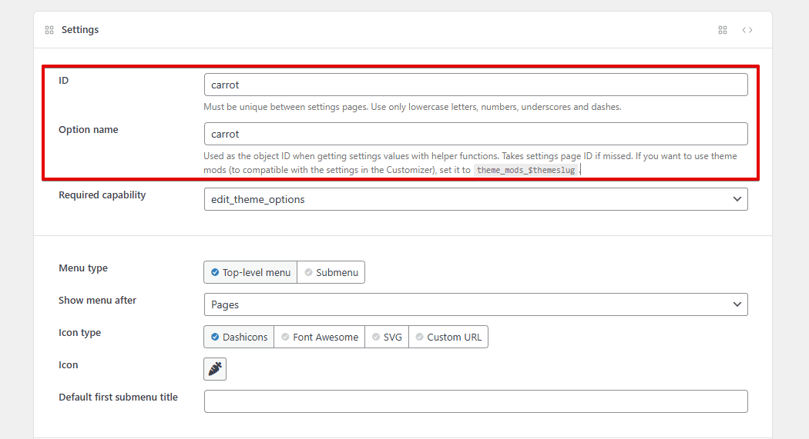

import Helpers from '../_parts/_helpers.md';
import LiteYouTubeEmbed from 'react-lite-youtube-embed';
import 'react-lite-youtube-embed/dist/LiteYouTubeEmbed.css';

MB Settings Page helps you create settings pages for your website. You can use it to create a theme options page, or a settings page for your plugin, or a custom settings page for clients' websites.

The plugins provide several styles for settings pages where you can have tabs or meta boxes. We try to keep the styles similar to the default WordPress UI as much as possible.

<div className="gallery">
    <div className="gallery_col1">
        <figure>
            
            <figcaption>Settings page with WordPress-native tabs</figcaption>
        </figure>
        <figure>
            
            <figcaption>Settings page with left tabs</figcaption>
        </figure>
    </div>
    <div className="gallery_col2">
        <figure>
            
            <figcaption>Settings page with meta boxes</figcaption>
        </figure>
    </div>
</div>

:::success

You can also combine styles, for example using tabs with meta boxes.

:::

## Creating settings pages

To create a settings page, go to **Meta Box » Settings Pages** and click **Add New**.


On the new screen, you'll see all details for the settings page.

:::info

The instruction above uses [MB Builder](/extensions/meta-box-builder/), an extension providing the UI to create fields, and is already bundled in [Meta Box Lite](https://metabox.io/lite/) and [Meta Box AIO](/extensions/meta-box-aio/). If you prefer to use code, please see below.

:::

### Settings

There are several settings for a settings page. All of them are self-explained. We also add some tooltips next to the setting title to give you more information if needed. Here is the list of the settings with the explanation:


Name | Description
---|---
Menu type | Whether to show the settings page as a top-level menu or a submenu of an existing menu. Depending on the menu type, several settings below will appear.
Show menu after | Select the position of the menu. Available only when menu type is Top-level menu.
Default first submenu title | If you create a top-level settings page with some sub-settings pages, you can set the default first submenu title here.
Icon type | What type of menu icon. Available only when menu type is Top-level menu. Supports Dashicons, Font Awesome, SVG, and custom URL.
Icon | The icon for the menu. Available only when the icon type is Dashicons or Font Awesome.
Icon SVG | The custom SVG icon for the menu. Available only when the icon type is SVG.
Icon URL | The URL for the custom icon. Available only when the icon type is Custom URL.
Parent menu | If you select menu type "Submenu", then you can select the parent menu for this sub-menu here.
Required capability | The required capability to access the settings page.
Custom CSS class | Custom CSS for the wrapper div in the settings page, so you can add your styling.
Style | How do you want to style the settings page? Supports "Boxes" which has same the style as normal WordPress meta boxes (like in the edit post screen with the classic editor) and "No boxes" which has the same style as WordPress settings pages.
Columns | The number of columns in the meta boxes. Can be 1 (the same as WordPress settings pages) or 2 (the same as the edit post screen).
Tabs | Array of tabs (key => label) for the settings page.
Tab style | Specify the tab style, which can be "Top" (WordPress-native style) or "Left".
Custom submit button | The custom text for submit button.
Custom message | The custom message is displayed when saving options.
Help content | The content displayed when clicking on the "Help" button on the top right (near the "Screen Options" button) and is organized in tabs. Each tab has its own title and content.
Customizer | Whether to show the settings page in the Customizer as a panel. See the "Creating Customizer settings" section for details.
Customizer only | Whether to show only as a Customizer panel, no admin settings page.
Network | Make the settings page network-wide (in a multisite environment).

Each settings page also has its own ID and option that specifies which option in the database to store data into. By default, the plugin set the option name the same as the ID. You can change it if you want on the **Settings Page** on the top of the settings page:



:::info ID vs. option name

ID is for internal use for Meta Box, like the settings page URL or reference in the field group definition. The option name is for storing and getting data from the database. They can be the same (works in most cases) or different.

:::

:::success

If you want to use make the data of the settings page compatible with Customizer settings for the current theme, e.g. using theme mods to store the data, then set the option name to `theme_mods_$themeslug`.

:::

You can create as many settings pages as you want. You can also create a top-level settings page and several sub-settings pages.

## Using code

If you're a developer and prefer using code to create settings pages, use the filter `mb_settings_pages`. This is a sample code to create a theme options page under the Appearance menu:

```php
add_filter( 'mb_settings_pages', function ( $settings_pages ) {
    $settings_pages[] = [
        'id'          => 'theme-slug',
        'option_name' => 'theme_slug',
        'menu_title'  => 'Theme Options',
        'parent'      => 'themes.php',
    ];
    return $settings_pages;
} );
```

The `mb_settings_pages` filter takes an array of settings pages as the argument. The callback function must return an array of settings pages.

Each settings page is defined by an array of the following options, which is similar to the UI in the **MB Builder** extension above:

Name|Description
---|---
`id`|Settings page ID. Required.
`option_name`|Option name where settings data is saved to. Optional. Takes `id` if missed. If you want to use theme mods, then set this to `theme_mods_$themeslug`.
`class`|Custom CSS for the wrapper div.
`menu_title`|Menu title. Optional. Takes `page_title` if missed.
`page_title`|Page title. Optional. Takes `menu_title` if missed. Note: either `menu_title` or `page_title` (or both) must have value.
`capability`|Required capability to access the settings page. Optional. Default `edit_theme_options`.
`icon_url`|The icon for the menu. Supports [Dashicons](https://developer.wordpress.org/resource/dashicons/) (`dashicons-icon-name`), [FontAwesome free](https://fontawesome.com/search?o=r&m=free) (`fa fa-home`), SVG (`data:image/svg+xml;base64...`) and custom URL.
`position`|Menu position (number). See below for the list of default WordPress menu positions.
`parent`|The ID of the parent page, if you want the settings page to be a submenu. Optional. Can be a WordPress menu or custom settings page menu. See below for the list of WordPress page IDs.
`submenu_title`|Set this to the default submenu title (first submenu) if the settings page is a top-level menu. Optional.
`help_tabs`|The content is displayed when clicking on the Help button on the top right (near the Screen Options button). See below for details.
`style`|How do you want to style the settings page? Supports `boxes` which has same the style as normal WordPress meta boxes (like in the edit post screen) and `no-boxes` which has the same style as WordPress settings pages. In `no-boxes` style, each meta box is a section of the settings page.
`columns`| The number of columns in the meta boxes. Can be 1 (the same as WordPress settings pages) or 2 (the same as the edit post screen).
`tabs`|Array of tabs for the settings page. See the "Tabs" section for more details.
`tab_style`|Specify the tab style, which can be `default` (WordPress-native style) or `left` (tabs are put on the left of the settings page). See the "Tabs" section below for details.
`submit_button`|The custom text for submit button. Optional.
`message`|The custom message displayed when saving options. Optional.
`customizer`|Whether to show the settings page in the Customizer as a panel. `true` or `false` (default). Optional. See below for details.
`customizer_only`|Whether to show only as a Customizer panel, no admin settings page. `true` or `false` (default). Optional.
`network`|Make the settings page network-wide (in a multisite environment). `true` or `false` (default). Optional.

### WordPress menus

This is the list of default WordPress menus with their ID (used for the `parent` parameter) and position (used for the `position` parameter):

Menu|ID|Position
---|---|---
Dashboard|`index.php`|2
Posts|`edit.php`|5
Media|`upload.php`|10
Links|`link-manager.php`|15
Pages|`edit.php?post_type=page`|20
Comments|`edit-comments.php`|25
Appearance|`themes.php`|60
Plugins|`plugins.php`|65
Uses|`users.php`|70
Tools|`tools.php`|75
Settings|`options-general.php`|80

### Tabs

The list of tabs is defined in the `tabs` parameter. A tab can have or doesn't have an icon and can be set like this:

```php
'tabs'        => [
    'general' => 'General Settings',         // No icon
    'design'  => [                           // With icon
        'label' => 'Design Customization',
        'icon'  => 'dashicons-admin-customizer',
    ],
],
```

The `icon` parameter can be a [Dashicons](https://developer.wordpress.org/resource/dashicons/) icon or the URL of your custom icon. You can also use another icon library like FontAwesome by specifying its class (e.g. `fa fa-home`), but in that case, you have to enqueue the font yourself.

This screenshot shows the left tab navigation with icons:


### Help tabs

WordPress has a nice feature that allows us to define instructions, and guidelines in the "Help" section of each admin screen. To see the help content, click the "Help" button on the top right, near the "Screen Options" button.


The content is organized into tabs and you can set it in the MB Builder's UI or with code.

If you use code, set the help tabs as follows:

```php
'help_tabs' => [
    [
        'title'   => 'General',
        'content' => '<p>This tab displays the general information about the theme.</p>',
    ],
    [
        'title'   => 'Homepage',
        'callback' => 'my_custom_function',
        'priority' => 10,
    ],
],
```

Each tab has the following parameters:

Parameter|Description
---|---
`title`|The tab title.
`content`|The tab content.
`callback`|Custom callback to render the tab content. Optional.
`priority`|The priority of the tab, used for ordering. Optional. Default 10.

## Settings fields

After creating a settings page, you need to create settings fields for it. Creating settings fields for settings pages is [similar as for posts](/custom-fields/#how-to-create-custom-fields). You can do it [with UI using MB Builder](/extensions/meta-box-builder/#creating-custom-fields) or [with code](/creating-fields-with-code/).

If you use MB Builder to create fields, make sure to select the correct settings page in the Location settings:


If you use code, then you need to hook to `rwmb_meta_boxes` and set a param `settings_pages` to the settings page(s) you want to add to, like this:

```php
add_filter( 'rwmb_meta_boxes', function ( $meta_boxes ) {
    $meta_boxes[] = [
        'id'             => 'general',
        'title'          => 'General',
        'context'        => 'normal',
        // highlight-start
        'settings_pages' => 'theme-slug',
        'tab'            => 'general',
        // highlight-end
        'fields'         => [
            [
                'name' => 'Logo',
                'id'   => 'logo',
                'type' => 'file_input',
            ],
        ],
    ];
    return $meta_boxes;
} );
```

:::caution

When using tabs, you must define the `tab` parameter for all meta boxes to make them appear in corresponding tabs. Missing the `tab` parameter makes the meta boxes hidden.

:::

Note:

- If you want to add the meta box to 2 or more settings pages, set it to an array of settings pages' IDs.
- If you set the settings page to have 2 columns, then the value for `context` accepts `normal` for the main content area and `side` for the right sidebar.

## Customizer

**MB Settings Pages** allows you to create settings panels & sections for the Customizer. Using Customizer gives users a better experience because they can preview the settings in real time.

### Panels & sections

When creating Customizer settings, it's important to understand that:

- A settings page is mapped to a Customizer panel
- Each meta box in the settings page is mapped to a Customizer section

To bring a settings page to the Customizer, turn on the **Customizer** settings when you create the settings page as follows:


Then go to the **Appearance » Customize** and you'll see the settings page is available as follows:

<div className="gallery">
    <div className="gallery_col1">
        <figure>
            
            <figcaption>A new panel in the Customizer</figcaption>
        </figure>
    </div>
    <div className="gallery_col2">
        <figure>
            
            <figcaption>Meta boxes become Customize sections</figcaption>
        </figure>
    </div>
</div>

By default, the settings page is available in the both Customizer as well as in the admin area. If you don't want it in the admin area, choose the **Customizer only**.

If you use code, use the following code:


```php
add_filter( 'mb_settings_pages', function ( $settings_pages ) {
    $settings_pages[] = [
        'id'          => 'rubik',
        'option_name' => 'theme_mods_justread',
        'menu_title'  => 'Theme Options',
        'parent'      => 'themes.php',
        // highlight-start
        'customizer'  => true,
        'customizer_only'  => true,
        // highlight-end
    ];

    return $settings_pages;
} );
```

This is a quick video that demonstrates how to use MB Settings Page to create custom panels, sections, and fields in the Customizer with code:

<LiteYouTubeEmbed id='LeV0CsiTe74' />

### Top-level sections

Sometimes you don't want the top-level panel that creates too much hierarchy (panel → sections → fields). You just want top-level sections (sections → fields). That will help users to navigate to your settings in the Customizer faster and easier.

:::caution

This can be done with code only.

:::

In that case, you need to do 2 steps:

**Step 1:** Remove the code that registers settings pages as you don't need settings pages anymore. If you use MB Builder, delete the settings page entry.

**Step 2:** In each meta box, replace the parameter `'settings_pages' => 'rubik'` with `'panel' => ''`, like this:

```php
add_filter( 'rwmb_meta_boxes', function ( $meta_boxes ) {
    $meta_boxes[] = [
        'id'             => 'general',
        'title'          => 'General',
        // highlight-next-line
        'panel'          => '',
        'fields'         => [
            [
                'name' => 'Logo',
                'id'   => 'logo',
                'type' => 'file_input',
            ],
        ],
    ];
    return $meta_boxes;
} );
```

And you'll see the section on the Customizer like this:


What if you want the _section to be inside another panel_? Like inside another plugin's panel? Set the `panel` parameter to ID of the target panel: `'panel' => 'panel_id'`.

### Compatibility

At the moment, all Meta Box fields are supported in the Customizer, except [file](/fields/file/) and [image](/fields/image/) field types. These field types will be converted to the [file_advanced](/fields/file-advanced/) and [image_advanced](/fields/image-advanced/) automatically to avoid any problems. Other upload field types such as [file_advanced](/fields/file-advanced/), [file_upload](/fields/file-upload/), [image_advanced](/fields/image-advanced/), [image_upload](/fields/image-upload/), [single_image](/fields/single-image/) still work well.

The good news is all the extensions such as [MB Conditional Logic](/extensions/meta-box-conditional-logic/), [MB Tabs](/extensions/meta-box-tabs/) are supported. That will help you create much better experiences for your users.

:::caution postMessage transport

The `postMessage` transport for the Customizer is not supported yet, which means changes are updated by refreshing the whole page instead of updating only the needed part of the page.

:::

## Network settings pages

A network settings page is a settings page that provides settings for all the websites in the network (multisite environment). For example, you might want to enter a Google Maps API key for all the websites or set the contact phone number for all of them.


Using _MB Settings Page_, you’re now able to do that easily. If you use MB Builder to create the settings page, simply switch on the **Network** option.


If you use code, add `'network' => true` to the settings pages args, like this:

```php
add_filter( 'mb_settings_pages', function ( $settings_pages ) {
    $settings_pages[] = [
        'id'          => 'custom-options',
        'option_name' => 'custom_options',
        'menu_title'  => 'Custom Options',
        'icon_url'    => 'dashicons-welcome-widgets-menus',
        // highlight-next-line
        'network'     => true,
    ];

    return $settings_pages;
} );
```

Don't forget to _network activate_ Meta Box and MB Settings Pages. And now, when you go to the network admin area, you'll see a settings page like the screenshot above.

## Backup & restore settings

Backup is a **special field type** added by the plugin that allows you to back up and restore the settings.

If you use MB Builder to create fields, please add a normal textarea field, go to tab Advanced of the field settings, and add a custom settings with the key "type" and value "backup" as follows:


If you use code, you need to create a special field with `'type' => 'backup'`, like this:

```php
$meta_boxes[] = [
    'id'             => 'colors',
    'title'          => 'Colors',
    'settings_pages' => 'theme-slug',
    'fields'         => [
        [
            'name' => 'Text Color',
            'id'   => 'text-color',
            'type' => 'color',
        ],
        [
            'name' => 'Backup',
            // highlight-next-line
            'type' => 'backup',
        ],
    ],
];
```

It will show a textarea field in your settings page like this:


When you add it to your settings page, it will show all of your settings in JSON. And you can just copy it and save it to a file to back up the settings. To restore the settings, just paste the JSON again and click the Save Settings button.

The backup field inherits from [`textarea`](/fields/textarea/) so you can customize it the way you want: change the field name, description, input size, etc. This field doesn't require an `ID`. And of course, you should have only one backup field on your settings page.

:::caution

The backup field only works if it is a top field. It does not work if it is a subfield in a group.

:::

## Hooks

**`mb_settings_page_load` action**

This action fires when a settings page is loaded. It's used internally to:

- Register meta boxes and custom fields in the settings page, and
- Save the submitted data.

These actions use the default priority `10`. So you can hook to this action to do something *after* the data is saved with a higher priority (like `20`):

```php
add_action( 'mb_settings_page_load', function ( $args ) {
    if ( $args['id'] === 'YOUR SETTINGS PAGE ID' ) {
        // Do something
    }
}, 20 );
```

**`mb_settings_page_after_title` action**

This action fires after outputting the page title. You can use it to output anything like instructions to users.

**`mb_settings_page_submit_buttons` action**

This action fires after the submit button is rendered, which allows you to add more custom buttons next to the submit button.

## Data

By using Settings API, all the fields' values will be saved as an array in a single option in the WordPress options table with the option name is `option_name` in the settings page configuration. Each field is an element of the array with the corresponding key (field ID). It's the recommended way by WordPress that doesn't make your options table bloat.

## Getting field value

You're able to use helper function [rwmb_meta()](/functions/rwmb-meta/) to get field value as follows:

```php
$value = rwmb_meta( $field_id, ['object_type' => 'setting'], $option_name );
echo $value;
```

For network settings, please use the following code:

```php
$value = rwmb_meta( $field_id, ['object_type' => 'network_setting'], $option_name );
echo $value;
```

Notes:

- In the 2nd parameter, you need to pass `'object_type' => 'setting'` or `'object_type' => 'network_setting'`
- In the last parameter, you need to pass the option name for the settings page

Other parameters are the same as for posts. Please see [this documentation](/displaying-fields-with-code/) for details.

:::caution

It requires the extension version 1.2+ to use the helper function. If you're using an older version, please [update now](/updates/).

:::
