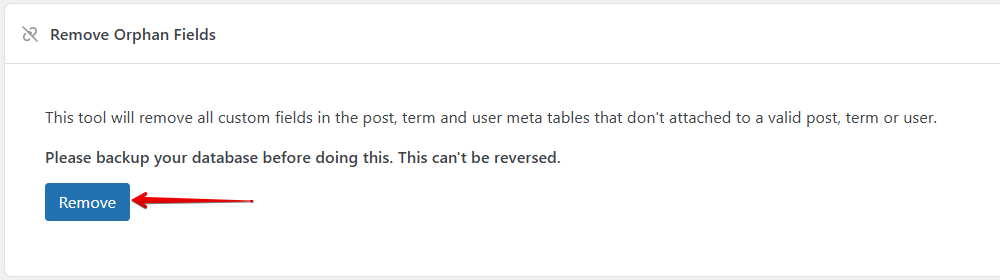

Meta Box AIO is a special plugin that contains all the extensions. It allows you to install only one plugin and have everything, so you can have the plugin list short and clean.

Meta Box AIO includes the Meta Box framework, so you don't have to install it separately.

## Settings page

The plugin has a settings page under *Meta Box &rarr; Extensions*, where you can enable/disable the extensions you need/don't need.


Check/uncheck the checkbox to enable/disable the corresponding extensions. Then click **Save Changes**.

## Filters

While the settings page and the notification to install free extensions are great for users, developers might want to hide them from normal users. To do that, Meta Box AIO provides some filters:

### `mb_aio_show_settings`

This filter is used to show/hide the settings page. The callback function should return `true` to show the settings page, or `false` to hide it.

To hide the settings page, use the following code:

```
add_filter( 'mb_aio_show_settings', '__return_false' );
```

### `mb_aio_extensions`

This filter allows you to change the list of enabled premium extensions. Thus, enable/disable modules by just coding.

This filter takes a list of enabled extensions (their slugs), and returns the filtered list.

For example, the code below enables only the [MB Builder](/extensions/meta-box-builder/) extension:

```php
add_filter( 'mb_aio_extensions', function( $extensions ) {
    $extensions = ['meta-box-builder'];

    // You can also do
    // $extensions[] = 'meta-box-builder';

    return $extensions;
} );
```

## Tools

These are the Meta Box tools for managing custom fields and custom post types. They help you clean up and optimize your WordPress database.

This set of tools is only available in **Meta Box AIO**. To use it, go to **Meta Box** > **Tools**:


:::caution Important

Please back up your database before using any of these tools. This can't be reversed.

:::

### Remove orphan fields

This tool removes all custom fields that are not attached to a valid post, term, or user.

Just click on the **Remove** button, then Meta Box will notify you of the number of custom fields that have been deleted for each object.



### Remove custom fields

Use this tool to remove the specific fields via their field ID.

Simply enter the meta key and choose the object type (post, term, user or all of them).


### Change custom field key

This is useful when you want to change the custom field key without losing existing data. Meta Box allows you to select the meta key from the suggestion list.


After that, you can check the update meta key in the database.


### Change post type

This tool is to change the slug of a post type, page, or media. For the post type, its posts will be converted to the new one.


## Notes

When an extension is enabled in Meta Box AIO and is activated as an individual plugin, the individual plugin will has higher priority and will be used. The version bundled inside Meta Box AIO will not be used.

This behavior is expected and has a good benefit: whenever we release a new version for individual extensions, you can try them first on your website to ensure compatibility before updating the whole Meta Box AIO package.
