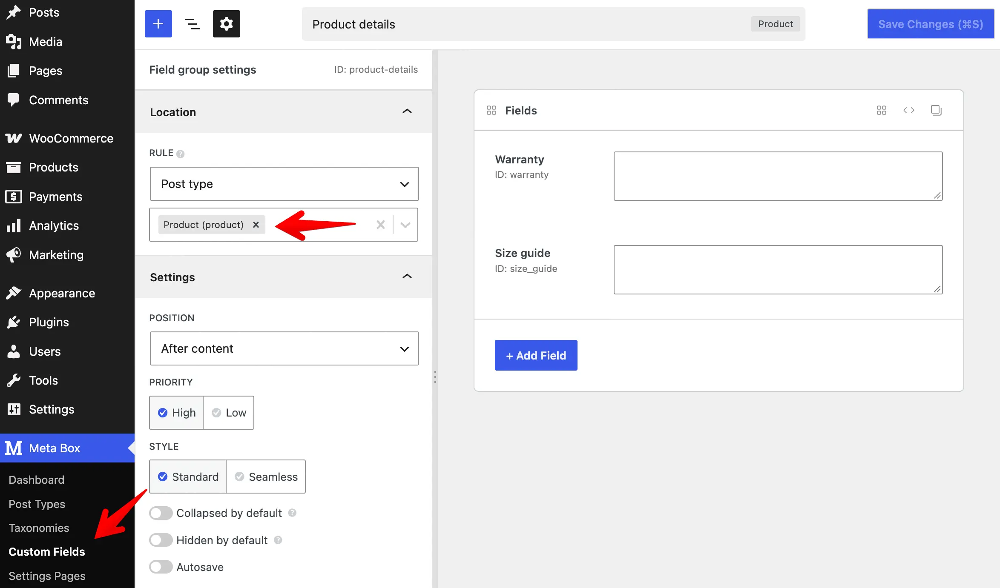
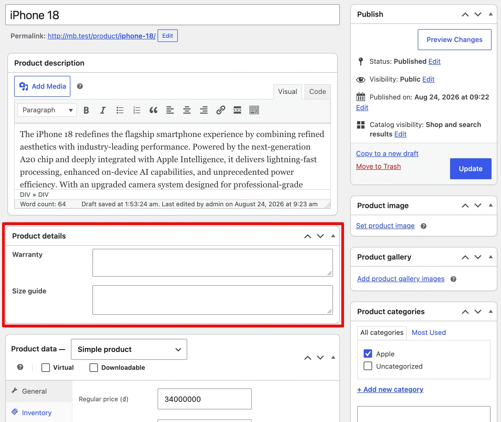
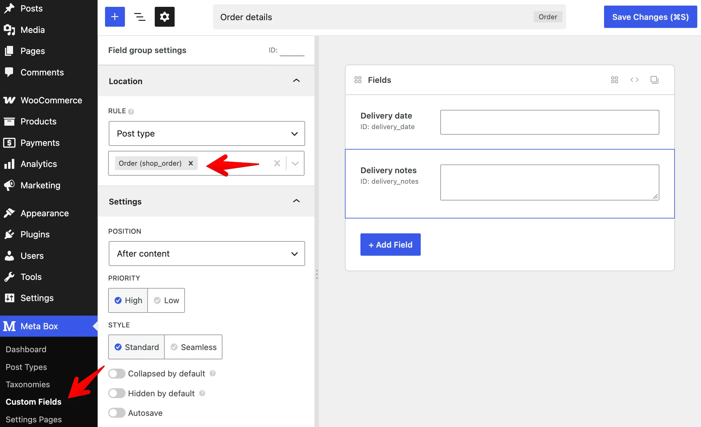
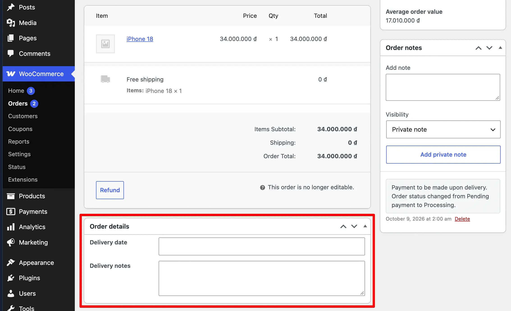

Meta Box integrates with WooCommerce so you can add custom fields to products, orders, and subscriptions. You create field groups the same way you do for posts. Meta Box shows the fields on the WooCommerce edit screens and stores the values with the correct WooCommerce data.

You can use this integration to:

- Add custom fields to products (`product`) and show the values on the product page.
- Add custom fields to orders (`shop_order`) in both legacy post storage and High-Performance Order Storage (HPOS).
- Add custom fields to WooCommerce Subscriptions (`shop_subscription`).
- Read field values on the frontend with helper functions such as [`rwmb_meta()`](/functions/rwmb-meta/).
- Save product or order fields to a custom database table with [MB Custom Table](/extensions/mb-custom-table/), in legacy mode or in HPOS mode.

Meta Box detects the HPOS state automatically. It declares HPOS compatibility with WooCommerce and saves order field values to the HPOS order meta table when HPOS is on. You do not need extra configuration for basic order fields.

## Adding custom fields to products

Products use the `product` post type. You add custom fields to products the same way you add custom fields to any post type.

In the builder:



Or with code:

```php
add_filter( 'rwmb_meta_boxes', function ( $meta_boxes ) {
    $meta_boxes[] = [
        'title'      => 'Product details',
        // highlight-next-line
        'post_types' => 'product',
        'fields'     => [
            [
                'name' => 'Warranty',
                'id'   => 'warranty',
                'type' => 'textarea',
            ],
            [
                'name' => 'Size guide',
                'id'   => 'size_guide',
                'type' => 'textarea',
            ],
        ],
    ];

    return $meta_boxes;
} );
```

The field group then appears on the product edit screen. Meta Box saves the field values as product meta when you save the product.



To show the field values on the frontend, use the [helper functions](/displaying-fields-with-code/) such as [`rwmb_meta()`](/functions/rwmb-meta/) with the product ID:

```php
$product_id = 123;
$warranty   = rwmb_meta( 'warranty', '', $product_id );
$size_guide = rwmb_meta( 'size_guide', '', $product_id );
```

## Adding custom fields to orders

WooCommerce stores orders in different ways by storage mode. From WooCommerce 8.2, you can enable **High-Performance Order Storage (HPOS)** to store order data in dedicated custom tables instead of the default posts and post meta tables.

Meta Box supports both storage modes. To add custom fields to orders, register a field group with the `shop_order` post type in the builder:



Or with code:

```php
add_filter( 'rwmb_meta_boxes', function ( $meta_boxes ) {
    $meta_boxes[] = [
        'title'      => 'Order details',
        // highlight-next-line
        'post_types' => 'shop_order',
        'fields'     => [
            [
                'name' => 'Delivery date',
                'id'   => 'delivery_date',
                'type' => 'date',
            ],
            [
                'name' => 'Delivery notes',
                'id'   => 'delivery_notes',
                'type' => 'textarea',
            ],
        ],
    ];

    return $meta_boxes;
} );
```

The field group then appears on the order edit screen. Meta Box saves the field values when you save the order.



### Support for WooCommerce Subscriptions

Meta Box also supports the [WooCommerce Subscriptions](https://woocommerce.com/products/woocommerce-subscriptions/) extension. To add custom fields to subscription edit screens, set `post_types` to `shop_subscription`:

```php
add_filter( 'rwmb_meta_boxes', function ( $meta_boxes ) {
    $meta_boxes[] = [
        'title'      => 'Subscription details',
        // highlight-next-line
        'post_types' => 'shop_subscription',
        'fields'     => [
            [
                'name' => 'Notes',
                'id'   => 'subscription_notes',
                'type' => 'textarea',
            ],
        ],
    ];

    return $meta_boxes;
} );
```

### Showing order field values

To show the order field values on the frontend, use the [helper functions](/displaying-fields-with-code/) such as [`rwmb_meta()`](/functions/rwmb-meta/) with the order ID:

```php
$order_id = 123;
$date     = rwmb_meta( 'delivery_date', '', $order_id );
$notes    = rwmb_meta( 'delivery_notes', '', $order_id );
```

## High-Performance Order Storage (HPOS)

### Compatibility

Meta Box includes a built-in integration with WooCommerce HPOS. When HPOS is on, WooCommerce shows orders on a custom screen (`WooCommerce > Orders`) instead of the post editor. WooCommerce stores order data in the `wc_orders` and `wc_orders_meta` tables instead of `posts` and `postmeta`.

Meta Box detects the HPOS state and does the following automatically:

- Declares compatibility with the HPOS feature. This hides the incompatible plugin notice in WooCommerce settings.
- Saves custom field values to the order meta table (`wc_orders_meta`) with the WooCommerce API. This stores the data in the HPOS tables correctly.

### Using custom tables

MB Custom Table also works with orders. You can save custom fields to custom tables for orders in legacy mode and in HPOS mode.

To do this, set `storage_type` and `table` in the field group settings. Use the same settings you use for posts:

```php
add_filter( 'rwmb_meta_boxes', function ( $meta_boxes ) {
    $meta_boxes[] = [
        'title'        => 'Order details',
        'post_types'   => 'shop_order',
        // highlight-start
        'storage_type' => 'custom_table',
        'table'        => 'my_order_table',
        // highlight-end
        'fields'       => [
            [
                'name' => 'Delivery date',
                'id'   => 'delivery_date',
                'type' => 'date',
            ],
            [
                'name' => 'Delivery notes',
                'id'   => 'delivery_notes',
                'type' => 'textarea',
            ],
        ],
    ];

    return $meta_boxes;
} );
```

For details on creating custom tables and connecting them to field groups, see the [MB Custom Table documentation](/extensions/mb-custom-table/).

### Limitations

With HPOS, custom columns added by [MB Admin Columns](/extensions/mb-admin-columns/) still show on the orders screen. In HPOS mode, you cannot search or sort orders by custom field values. The meta queries for these features do not work with the HPOS order list screen.
