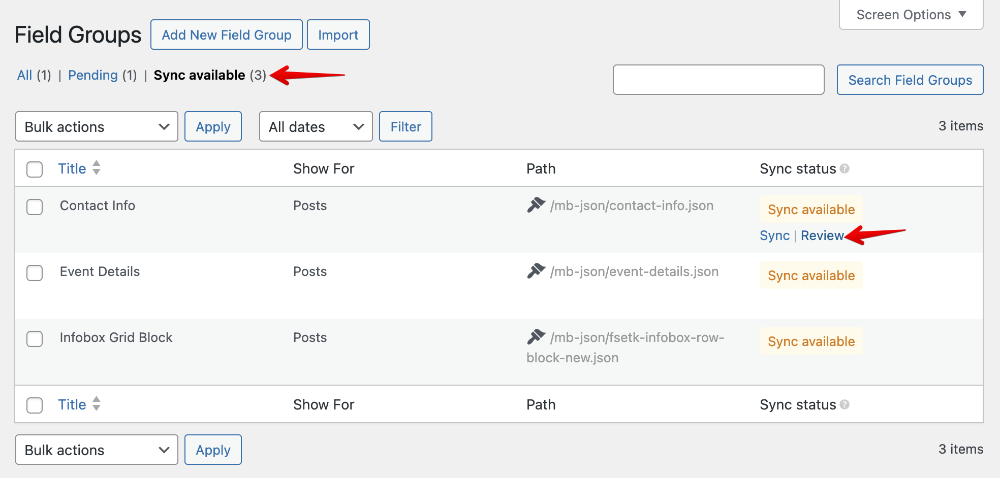
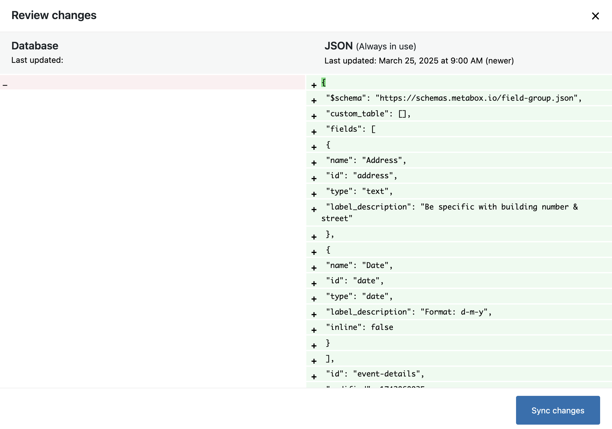
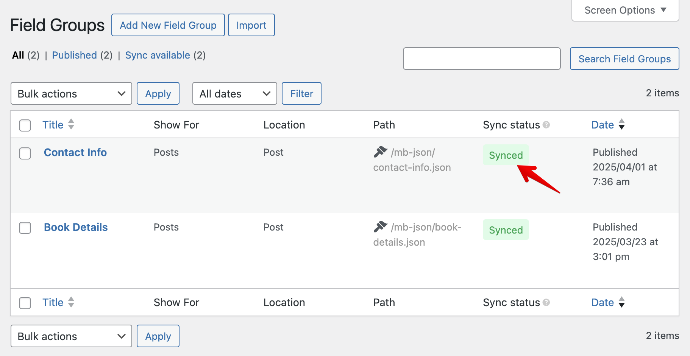

Beside [creating fields with PHP](/creating-fields-with-code/), you can also register custom fields with JSON. This way is more convenient and easier to manage the fields since you can put them in a separate file, use version control (Git), leverage caching, and better code editor support with JSON schema.

This feature is available in the [Meta Box Builder](https://metabox.io/plugins/meta-box-builder/) extension and is included in both [Meta Box Lite](https://metabox.io/lite/) and [Meta Box AIO](https://metabox.io/aio/).

## How it works

To use local JSON to register custom fields, you need to create a new folder called `mb-json` field in your theme that is writable by the web server.
After that, you can put the JSON files in the folder and Meta Box will automatically load the JSON files and register the fields, no more database queries.

## JSON format

The JSON format is the same as when you export a field group and is very similar to the [PHP version](/creating-fields-with-code/) when you creating a field group, except the `$schema` and `modified` attributes:

```json
{
  "$schema": "https://schemas.metabox.io/field-group.json",
  "title": "Event details",
  "post_types": "event",
  "fields": [
    {
      "name": "Date and time",
      "id": "datetime",
      "type": "datetime"
    },
    {
      "name": "Location",
      "id": "location",
      "type": "text"
    },
    {
      "name": "Map",
      "id": "map",
      "type": "osm",
      "address_field": "location"
    }
  ],
  "modified": 1739955432
}
```

We use a **JSON schema** so you can take advantage of the code editor's auto-completion feature (like in VSCode). In the JSON file, you need to set the `$schema` attribute as follows:

```json
https://schemas.metabox.io/field-group.json
```

## Syncing changes

Meta Box will automatically discover **new** or **updated** JSON files in the `mb-json` folder and display them in the **Sync available** tab, showing the status of the JSON files, where you can sync JSON to the database, so you can edit the fields visually, and then sync back to the JSON file.



Before syncing, you can also review the changes by clicking on the **Review** link.



:::info Detecting changes

When you change the content of a JSON file, and want Meta Box to detect the change to show the **Sync available** status, you have to **increase the `modified` attribute** in the JSON file. This attribute stores the last update time in timestamp.

:::

After syncing, you'll see the field group in the admin list like this:



Then you can change the field group, add more fields or edit existing fields. You can save changes to the JSON file just by saving the field group in the WordPress admin. The JSON file will be updated automatically. Please note that deleting a field group in the admin will also delete the JSON file.

:::caution Purpose

Syncing from JSON to the database has only one purpose: to edit fields visually, and then sync back to JSON files (or export to JSON file to save somewhere else). Meta Box will **NOT** load fields from the database (to avoid making unnessary queries), and use JSON files only.

:::


## Adding custom folders

By default, the plugin will look for the JSON files in the `mb-json` folder in the active theme. You can add custom folders to load JSON files by using the `mb_json_paths` filter. Here is an example:

```php
add_filter( 'mb_json_paths', function( $paths ) {
    $paths[] = '/path/to/your/folder';
    $paths[] = '/path/to/your/folder2'; // Another folder

    return $paths;
} );
```

## Security

It's a good practice to hide the JSON files from the public. The easiest way to do that is adding `index.php` file to the folder. This way, when people try to access the folder, they'll see a blank page.

```php
<?php
// Silence is golden.
```
