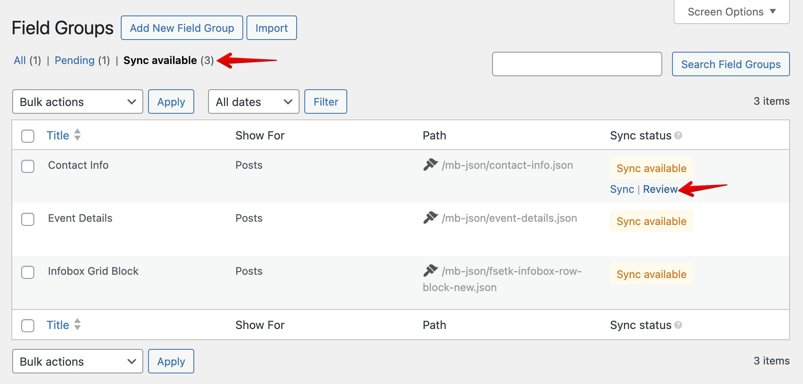
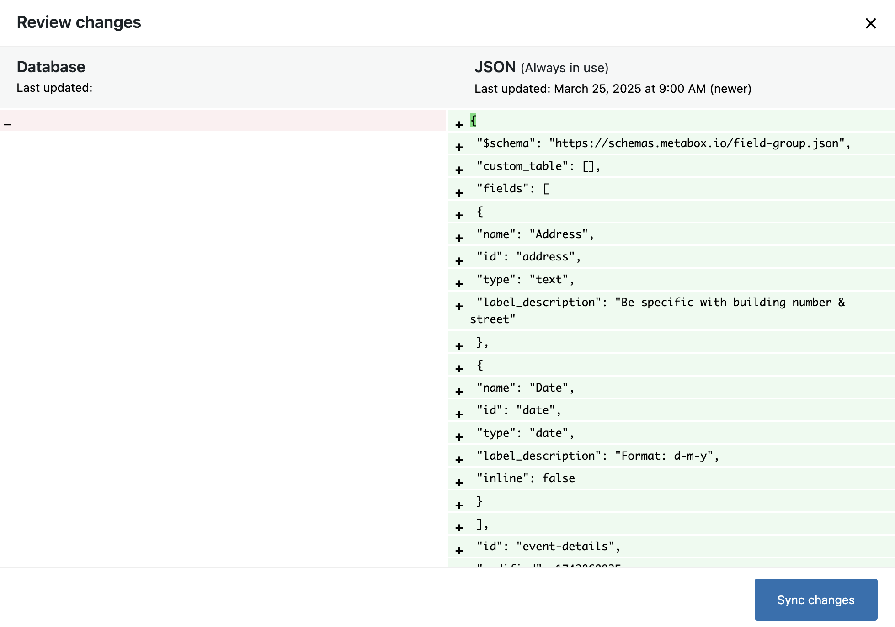
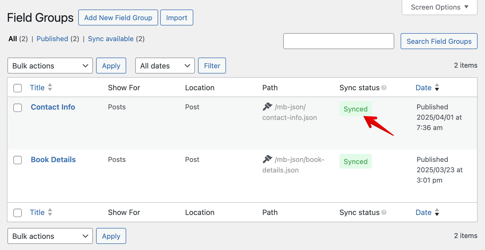

You can register field groups, settings pages, relationships, and custom models with JSON, not only with [PHP](/creating-fields-with-code/). JSON files sit in a separate folder. You can track them with Git, cache them, and use JSON schema for editor auto-completion.

Local JSON is part of [Meta Box Builder](https://metabox.io/plugins/meta-box-builder/). It is included in [Meta Box Lite](https://metabox.io/lite/) and [Meta Box AIO](https://metabox.io/aio/).

## How it works

1. Create an `mb-json` folder in your theme.
2. Make sure the web server can write to that folder.
3. Put JSON files in the folder.

Meta Box reads those files and registers the items. It does not query the database for them.

Local JSON supports:

- Field groups ([Custom Fields](https://metabox.io/plugins/meta-box-builder/))
- [Settings pages](/extensions/mb-settings-page/)
- [Relationships](/extensions/mb-relationships/)
- [Custom models](/extensions/mb-custom-table/#custom-models)

## JSON format

The JSON format matches a Builder export. It is close to the PHP version. The extra attributes are `$schema`, `modified`, and optional `private`.

Set `$schema` so the editor can offer auto-completion. Use the URL for the item type:

| Type | `$schema` |
| --- | --- |
| Field group | `https://schemas.metabox.io/field-group.json` |
| Settings page | `https://schemas.metabox.io/settings-page.json` |
| Relationship | `https://schemas.metabox.io/relationships.json` |
| Custom model | `https://schemas.metabox.io/custom-model.json` |

### Field group

```json
{
  "$schema": "https://schemas.metabox.io/field-group.json",
  "title": "Event details",
  "post_types": "event",
  "fields": [
    {
      "name": "Date and time",
      "id": "datetime",
      "type": "datetime"
    },
    {
      "name": "Location",
      "id": "location",
      "type": "text"
    },
    {
      "name": "Map",
      "id": "map",
      "type": "osm",
      "address_field": "location"
    }
  ],
  "modified": 1739955432
}
```

See [creating fields with code](/creating-fields-with-code/) for the full field group structure.

### Settings page

```json
{
  "$schema": "https://schemas.metabox.io/settings-page.json",
  "id": "theme-slug",
  "option_name": "theme_slug",
  "menu_title": "Theme Options",
  "parent": "themes.php",
  "modified": 1739955432
}
```

The keys match the [settings page code API](/extensions/mb-settings-page/#using-code). To add fields to the page, use a field group JSON file (or the Builder) and set `settings_pages` to this page ID.

### Relationship

```json
{
  "$schema": "https://schemas.metabox.io/relationships.json",
  "id": "posts_to_pages",
  "from": "post",
  "to": "page",
  "modified": 1739955432
}
```

The keys match the [relationships code API](/extensions/mb-relationships/#using-code). For `from` and `to`, use a string or an object.

### Custom model

```json
{
  "$schema": "https://schemas.metabox.io/custom-model.json",
  "id": "transaction",
  "table": "transactions",
  "labels": {
    "name": "Transactions",
    "singular_name": "Transaction"
  },
  "modified": 1739955432
}
```

See [custom models](/extensions/mb-custom-table/#custom-models) for the full structure.

## Sync changes

Meta Box finds **new** or **updated** JSON files in the `mb-json` folder. It shows them in the **Sync available** tab on the matching admin list:

- **Meta Box** → **Custom Fields** for field groups
- **Meta Box** → **Settings Pages** for settings pages
- **Meta Box** → **Relationships** for relationships
- **Meta Box** → **Custom Models** for custom models

From that tab, sync JSON to the database, edit in the UI, then save to update the JSON file.



Before you sync, click **Review** to compare the database and the JSON file.



:::info Detect changes

If you edit a JSON file by hand and want Meta Box to show **Sync available**, increase the `modified` attribute. That value is a Unix timestamp for the last update.

:::

After sync, the item appears in the admin list:



Edit the item in the WordPress admin. A save writes the JSON file again. If you delete the item in the admin, Meta Box also deletes its JSON file.

:::warning Purpose

Sync from JSON to the database has one purpose: edit in the UI, then write back to JSON (or export JSON to store elsewhere). When Local JSON is on, Meta Box loads field groups, settings pages, relationships, and custom models from the JSON files. It does **not** load those items from the database.

:::

## Hide files from Sync

If you ship JSON files in a theme or plugin and do not want them in **Sync available**, set `"private": true` in the file:

```json
{
  "$schema": "https://schemas.metabox.io/field-group.json",
  // highlight-next-line
  "private": true,
  "title": "Theme fields",
  "post_types": "post",
  "fields": [
    {
      "name": "Subtitle",
      "id": "subtitle",
      "type": "text"
    }
  ],
  "modified": 1739955432
}
```

Meta Box still loads and registers the item from that file. The Sync UI does not list it, so users cannot sync it to the database by mistake.

The same `private` attribute works for settings pages, relationships, and custom models.

## Add custom folders

By default, Meta Box looks in the `mb-json` folder in the active theme. To load JSON files from other folders, use the `mb_json_paths` filter:

```php
add_filter( 'mb_json_paths', function( $paths ) {
    $paths[] = '/path/to/your/folder';
    $paths[] = '/path/to/your/folder2'; // Another folder

    return $paths;
} );
```

## Security

Hide the JSON files from the public. Add an `index.php` file to the folder. Visitors who open the folder see a blank page.

```php
<?php
// Silence is golden.
```
