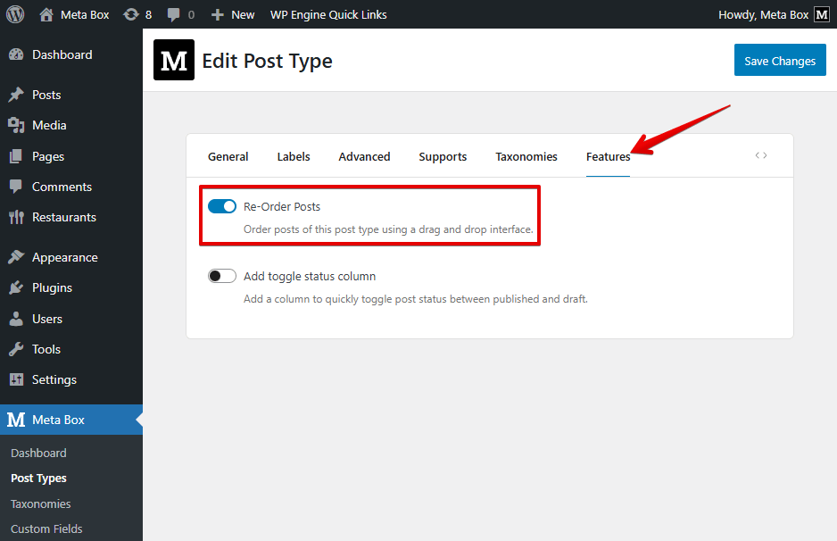
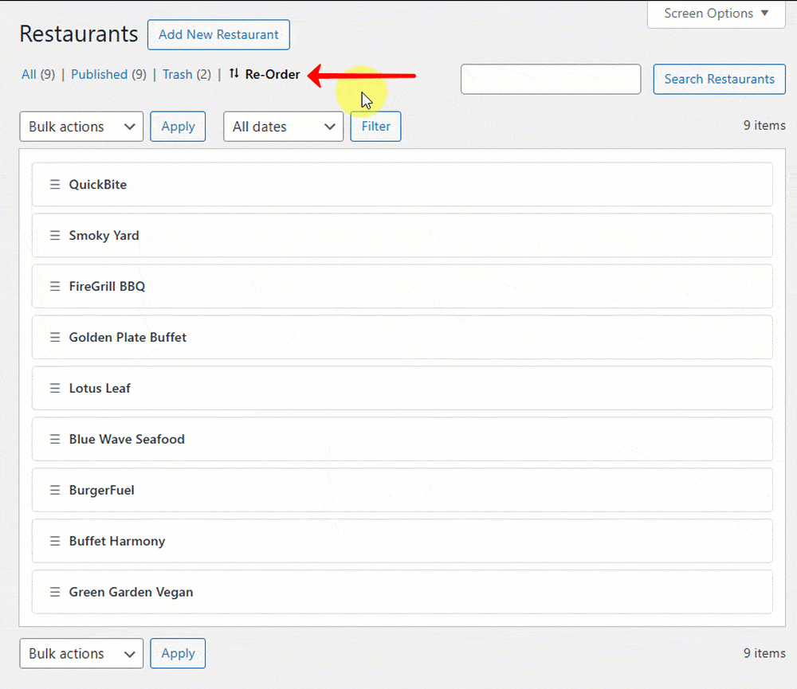
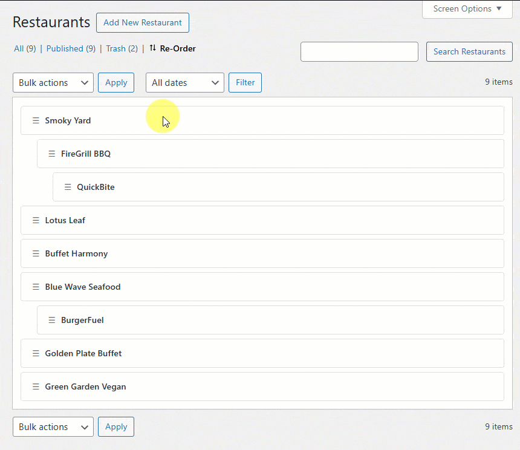
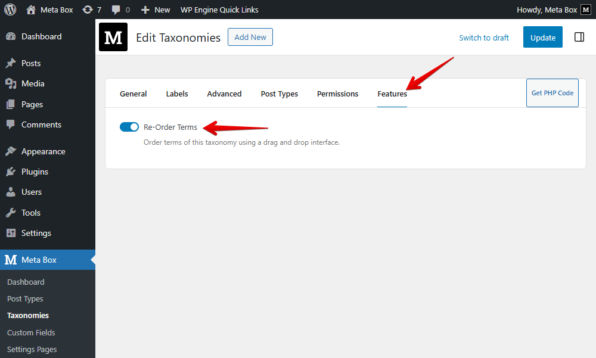
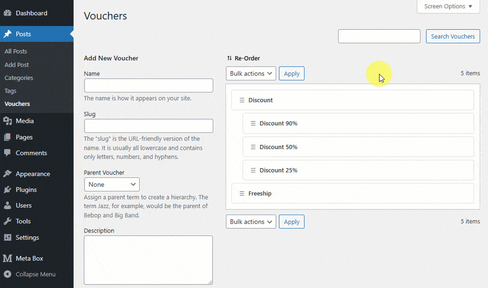

This feature lets you **drag and drop** posts (from any custom post type) or terms (from any custom taxonomy) to rearrange their order right inside the WordPress admin. It's perfect when you need a custom order that doesn't follow the default publish date or alphabetical sorting.

This functionality is included in the **[MB Custom Post Types & Custom Taxonomies](/extensions/mb-custom-post-type/)** extension - completely free to use.

## Reordering posts

To enable this feature, open your custom post type settings, switch to the **Features** tab, and turn on the **Re-Order Posts** option:



If you're registering the post type via code, simply add:

```php
'order' => true,
```

Once enabled, you'll see a new **Re-Order** tab in the post type's admin menu. Click it and rearrange your posts using drag‑and‑drop.



### Hierarchical post type support

Reordering works smoothly with hierarchical post types. When you move a parent post, all of its child posts automatically follow - similar to how fields in a group move together.



### Frontend display

Your custom order is applied automatically on all archive pages or anywhere you query that post type.


### Reorder posts of other post types

By default, the plugin supports reordering posts of the post types created by Meta Box. If you want to apply this feature to other post types that are built-in WordPress (like `post` or `page`) or created by other plugins or themes, use this snippet:

```php
add_filter( 'mbcpt_post_type_reorderable', function( $enable, $post_type ) {
	if ( $post_type = 'your-post-type' ) {
		return true;
	}
	return $enable;
}, 10, 2 );
```

## Reordering terms

To reorder taxonomy terms, go to **Meta Box → Taxonomies**, open your taxonomy settings, and enable the feature in the **Features** tab:



Or enable it via code:

```php
'order' => true,
```

After that, visit the taxonomy screen and click the **Re-Order** button to sort terms using drag‑and‑drop - including **hierarchical terms**.



Ordered terms also appear exactly in the same sequence in the post editor:


### Reorder terms of other taxonomies

By default, the plugin supports reordering terms of the taxonomies created by Meta Box. If you want to apply this feature to other taxonomies that are built-in WordPress (like `category` or `tag`) or created by other plugins or themes, use this snippet:

```php
add_filter( 'mbcpt_taxonomy_reorderable', function( $enable, $taxonomy ) {
	if ( $taxonomy = 'your-taxonomy' ) {
		return true;
	}
	return $enable;
}, 10, 2 );
```