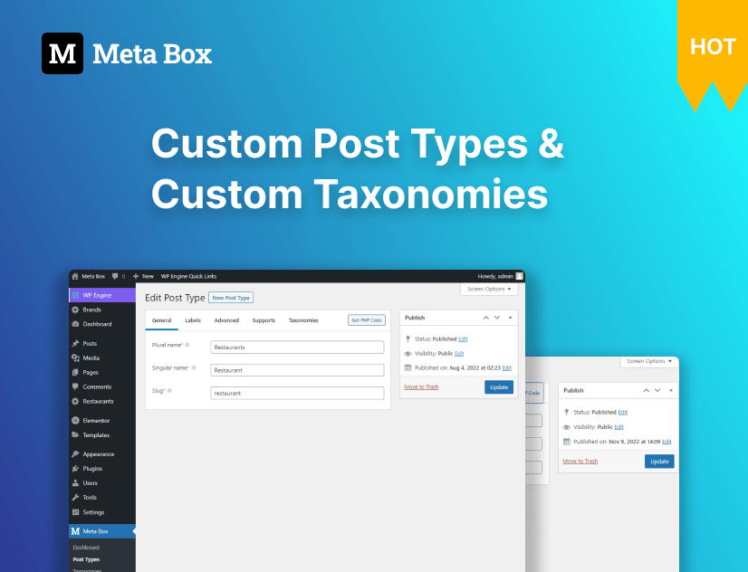
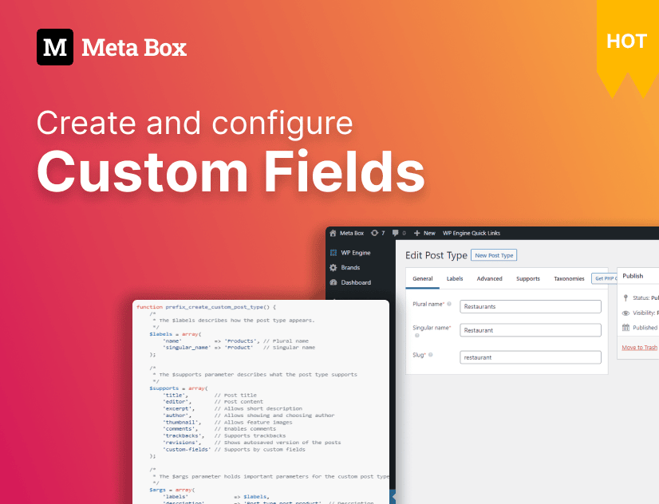
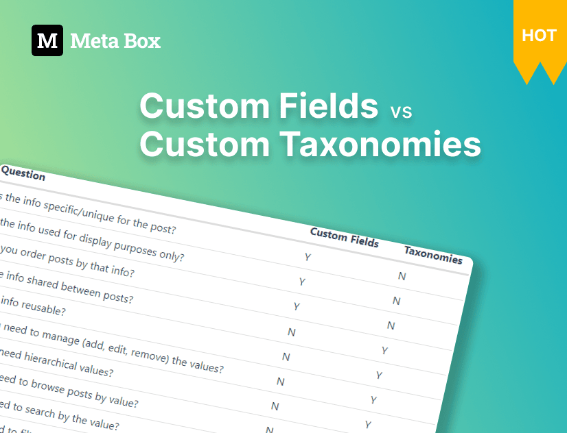
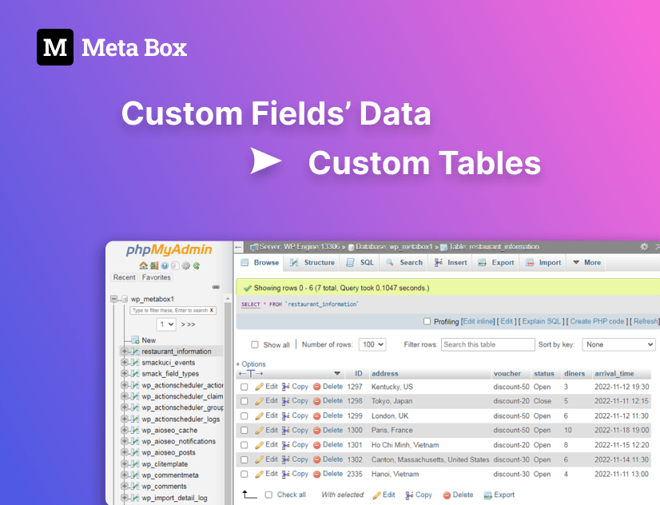
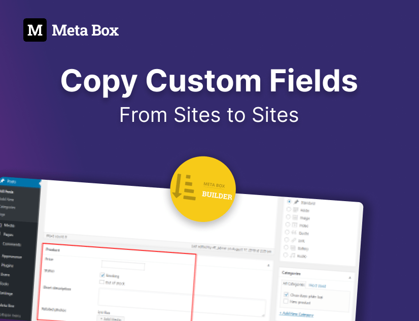
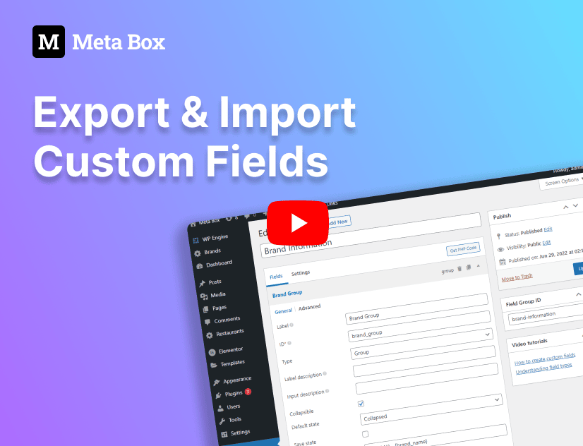
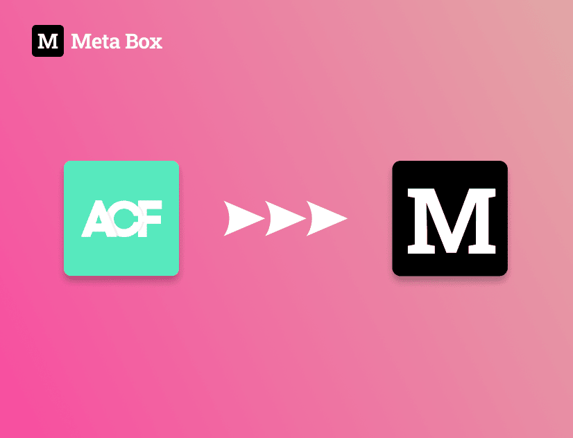
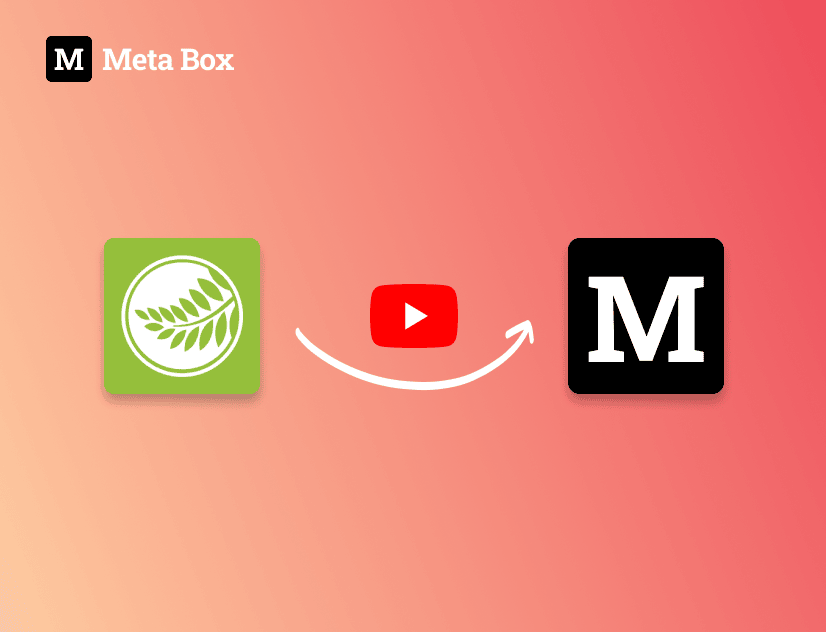
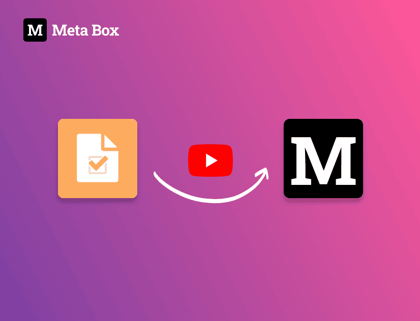
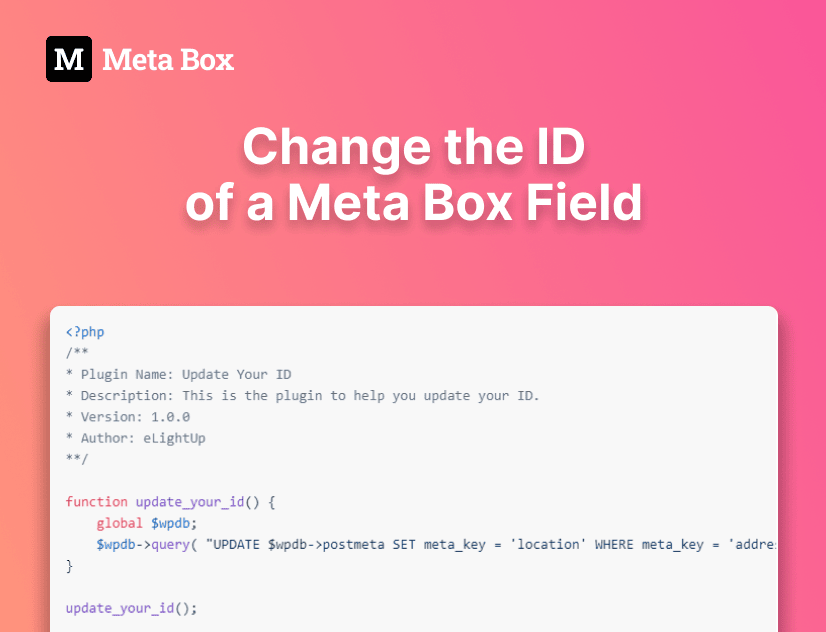

Let’s start with some basic practices with Meta Box.

[ <h3 class="items_titles">Creating post types and taxonomies</h3>](/tutorials/create-custom-post-types-taxonomies/)

[ <h3 class="items_titles">Creating and configure custom fields</h3>](/tutorials/create-custom-fields/)

[ <h3 class="items_titles">Custom fields vs custom taxonomies</h3>](/tutorials/custom-fields-vs-taxonomies/)

[ <h3 class="items_titles">Moving fields’ data to custom tables</h3>](/tutorials/move-data-to-custom-tables/)

[ <h3 class="items_titles">Copying custom fields from sites to sites</h3>](/tutorials/copy-custom-fields/)

[ <h3 class="items_titles">Exporting and importing custom fields</h3>](/tutorials/export-import-custom-fields-meta-box-builder/)

[ <h3 class="items_titles">Migrating from ACF to Meta Box</h3>](/tutorials/migrate-data-acf-to-meta-box/)

[ <h3 class="items_titles">Migrating from Pods to Meta Box</h3>](/tutorials/migrate-pods-to-meta-box/)

[ <h3 class="items_titles">Migrating from CPT UI to Meta Box</h3>](/tutorials/cpt-ui-to-meta-box/)

[ <h3 class="items_titles">Changing the ID of a Meta Box field</h3>](/tutorials/change-id-meta-box-field/)

