See how to use Meta Box in the real case studies with comprehensive tutorials.

	

		

			<h2>Category Featured Images</h2>

<ul>
	<li><a href="/tutorials/category-thumbnails/">Creating category thumbnails & featured Images</a></li>
	<li><a href="/tutorials/create-taxonomy-thumbnails-featured-images-with-bricks/">Using Meta Box + Bricks</a></li>
	<li><a href="/tutorials/create-taxonomy-thumbnails-featured-images/">Using Meta Box + Oxygen</a></li>
 	<li><a href="/tutorials/create-taxonomy-thumbnails-featured-images-mb-views/">Using MB Views</a></li>

</ul>
		

		

			<h2>Simple Listing</h2>

[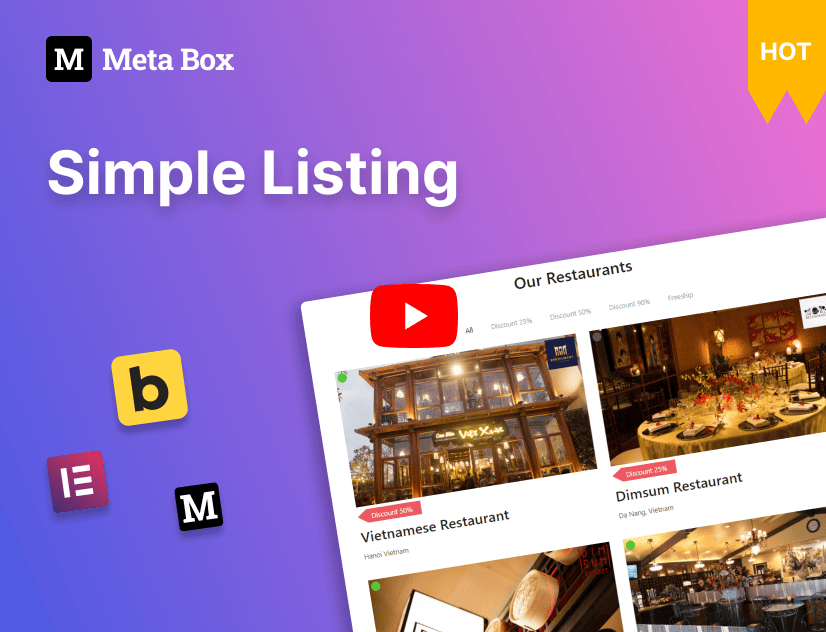](/tutorials/create-simple-listing-meta-box-bricks/)
<ul>
	<li><a href="/tutorials/create-simple-listing-meta-box-bricks/">Using Meta Box + Bricks</a></li>
	<li><a href="/tutorials/create-simple-listing-with-elementor/">Using Meta Box + Elementor</a></li>
	<li><a href="/tutorials/create-simple-listing-with-breakdance/">Using Meta Box + Breakdance</a></li>
	<li><a href="/tutorials/create-simple-listing-with-kadence/">Using Meta Box + Kadence</a></li>
	<li><a href="/tutorials/create-simple-listing-meta-box-wp-grid-builder/">Using Meta Box + WP Grid Builder</a></li>
	<li><a href="/tutorials/create-simple-listing-mb-views">Using MB Views</a></li>
</ul>
		

		

			<h2>Most Viewed Posts</h2>

[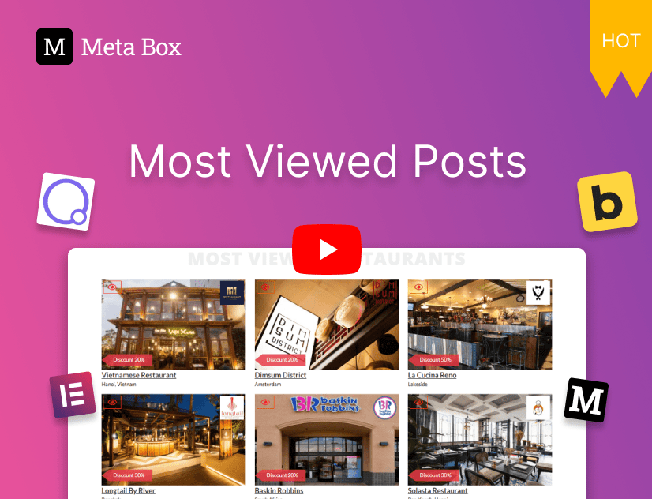](/tutorials/display-most-viewed-posts-with-bricks/)
<ul>
	<li><a href="/tutorials/display-most-viewed-posts-with-bricks/">Using Meta Box + Bricks</a></li>
	<li><a href="/tutorials/display-most-viewed-posts-oxygen/">Using Meta Box + Oxygen</a></li>
	<li><a href="/tutorials/display-most-viewed-posts-with-elementor/">Using Meta Box + Elementor</a></li>
	<li><a href="/tutorials/display-most-viewed-posts-mb-views">Using MB Views</a></li>
</ul>
		

		 

			<h2>Buttons with Dynamic Link</h2>

<ul>
	<li><a href="/tutorials/create-buttons-dynamic-links/">Creating buttons with dynamic link</a></li>
</ul>
		

		

			<h2>Video Gallery Page</h2>

<ul>
	<li><a href="/tutorials/create-video-gallery-page-bricks/">Using Meta Box + Bricks</a></li>
	<li><a href="/tutorials/create-video-gallery-page-meta-box-oxygen/">Using Meta Box + Oxygen</a></li>
	<li><a href="/tutorials/create-video-gallery-page-with-elementor/">Using Meta Box + Elementor</a></li>
	<li><a href="/tutorials/create-video-gallery-page-with-zion/">Using Meta Box + Zion</a></li>
	<li><a href="/tutorials/create-video-gallery-page-meta-box-breakdance/">Using Meta Box + Breakdance</a></li>
	<li><a href="/tutorials/create-video-gallery-page-with-kadence/">Using Meta Box + Kadence</a></li>
	<li><a href="/tutorials/create-video-gallery-page-mb-views/">Using MB Views</a></li>
</ul>
		

		

			<h2>User Profile Page</h2>

[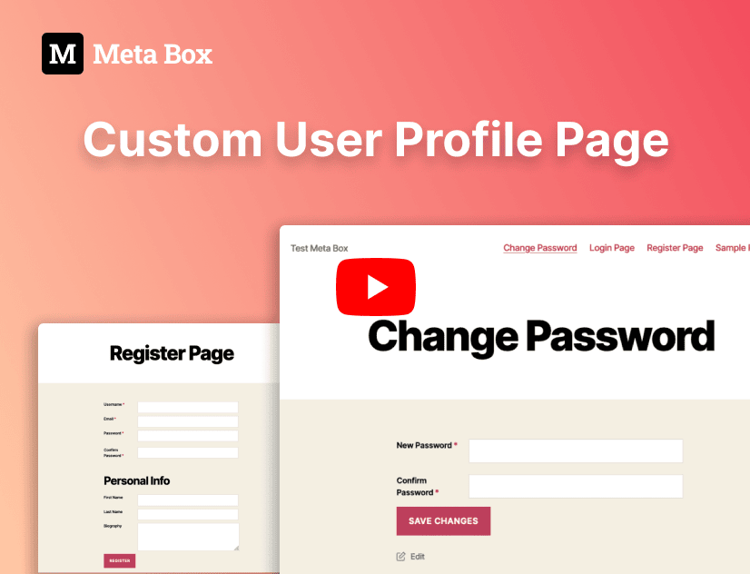](/tutorials/create-user-profile-page/)
<ul>
	<li><a href="/tutorials/create-user-profile-page/">Creating custom user profile page on frontend</a></li>
</ul>
		

		

			<h2>Recipe</h2>

[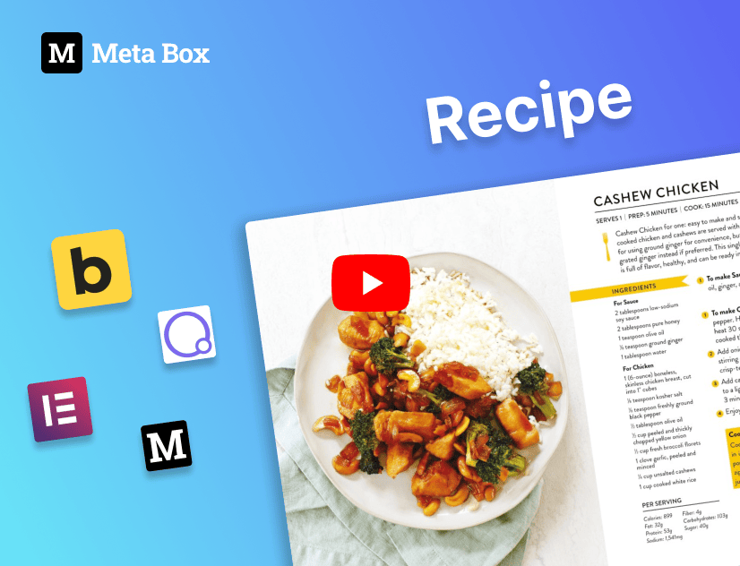](/tutorials/create-recipes-meta-box-bricks/)
<ul>
	<li><a href="/tutorials/create-recipes-meta-box-bricks/">Using Meta Box + Bricks</a></li>
	<li><a href="/tutorials/create-recipe-meta-box-oxygen/">Using Meta Box + Oxygen</a></li>
	<li><a href="/tutorials/create-recipe-meta-box-elementor/">Using Meta Box + Elementor</a></li>
	<li><a href="/tutorials/create-recipes-meta-box-zion/">Using Meta Box + Zion</a></li>
	<li><a href="/tutorials/create-a-recipe-brizy/">Using Meta Box + Brizy</a></li>
	<li><a href="/tutorials/create-recipe-breakdance/">Using Meta Box + Breakdance</a></li>
	<li><a href="/tutorials/create-recipe-with-kadence/">Using Meta Box + Kadence</a></li>
	<li><a href="/tutorials/create-recipe-with-divi/">Using Meta Box + Divi</a></li>
	<li><a href="/tutorials/create-recipe-mb-views/">Using MB Views</a></li>
</ul>
		

		

			<h2>Products on Sale</h2>

<ul>
	<li><a href="/tutorials/show-posts-with-specific-criteria-bricks/">Using Meta Box + Bricks</a></li>
	<li><a href="/tutorials/show-posts-specific-criteria-oxygen/">Using Meta Box + Oxygen</a></li>
	<li><a href="/tutorials/show-posts-specific-criteria-with-elementor/">Using Meta Box + Elementor</a></li>
	<li><a href="/tutorials/show-posts-specific-criteria-with-zion/">Using Meta Box + Zion</a></li>
	<li><a href="/tutorials/show-posts-specific-criteria-meta-box-breakdance/">Using Meta Box + Breakdance</a></li>
	<li><a href="/tutorials/show-posts-specific-criteria-mb-views/">Using MB Views</a></li>

</ul>
		

		

			<h2>FAQs Page</h2>

[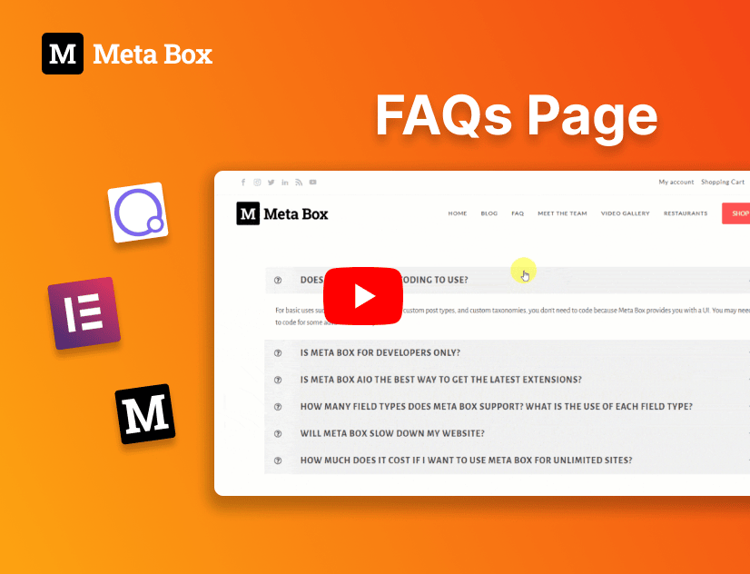](/tutorials/create-faqs-page-meta-box-bricks/)
<ul>
	<li><a href="/tutorials/create-faqs-page-meta-box-bricks/">Using Meta Box + Bricks</a></li>
	<li><a href="/tutorials/create-faqs-page-meta-box-oxygen/">Using Meta Box + Oxygen</a></li>
	<li><a href="/tutorials/create-faqs-page-meta-box-elementor/">Using Meta Box + Elementor</a></li>
	<li><a href="/tutorials/create-faqs-page-with-breakdance/">Using Meta Box + Breakdance</a></li>
	<li><a href="/tutorials/create-faqs-page-meta-box-kadence/">Using Meta Box + Kadence</a></li>
	<li><a href="/tutorials/create-faqs-page-meta-box-divi/">Using Meta Box + Divi</a></li>
	<li><a href="/tutorials/create-faqs-page-mb-blocks/">Using MB Blocks</a></li>
	<li><a href="/tutorials/create-faqs-page-mb-views/">Using MB Views</a></li>

</ul>
		

		

			<h2>Featured Products</h2>

<ul>
	<li><a href="/tutorials/displaying-featured-posts-with-wp-grid-builder/">Using Elementor + WP Grid Builder</a></li>
	<li><a href="/tutorials/show-featured-restaurants-bricks/">Using Meta Box + Bricks</a></li>
	<li><a href="/tutorials/show-featured-restaurants-oxygen/">Using Meta Box + Oxygen</a></li>
	<li><a href="/tutorials/show-featured-restaurants-with-elementor/">Using Meta Box + Elementor</a></li>
	<li><a href="/tutorials/show-featured-restaurants-with-zion/">Using Meta Box + Zion</a></li>
	<li><a href="/tutorials/show-featured-restaurants-with-breakdance">Using Meta Box + Breakdance</a></li>
	<li><a href="/tutorials/show-featured-restaurants-mb-views/">Using MB Views</a></li>
</ul>
		

		

			<h2>Brand Logos</h2>

[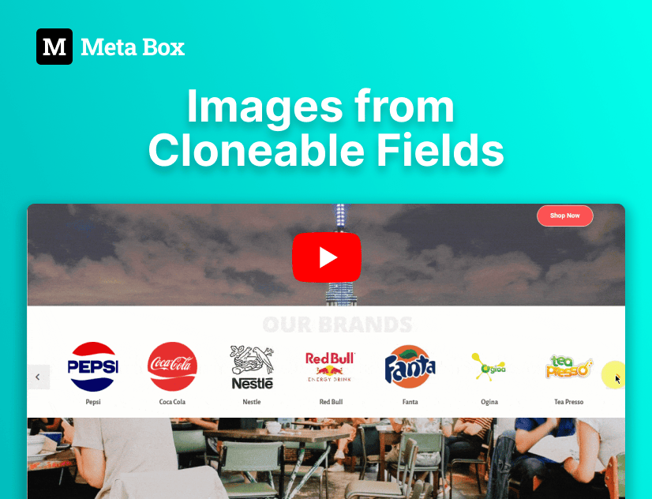](/tutorials/display-images-from-cloneable-fields-meta-box-oxygen/)
<ul>
	<li><a href="/tutorials/display-images-from-cloneable-fields-meta-box-oxygen/">Using Meta Box + Oxygen</a></li>
	<li><a href="/tutorials/display-images-from-cloneable-fields-meta-box-elementor/">Using Meta Box + Elementor</a></li>
	<li><a href="/tutorials/display-images-from-cloneable-fields-bricks/">Using Meta Box + Bricks</a></li>
	<li><a href="/tutorials/display-images-cloneable-fields-mb-views/">Using MB Views</a></li>
</ul>
		

		

			<h2>Team Members Page</h2>

<ul>
	<li><a href="/tutorials/create-team-members-page-meta-box-bricks/">Using Meta Box + Bricks</a></li>
	<li><a href="/tutorials/create-team-members-page-meta-box-oxygen/">Using Meta Box + Oxygen</a></li>
	<li><a href="/tutorials/create-team-members-page-meta-box-elementor/">Using Meta Box + Elementor</a></li>
	<li><a href="/tutorials/create-team-members-page-breakdance/">Using Meta Box + Breakdance</a></li>
	<li><a href="/tutorials/create-team-members-page-with-kadence/">Using Meta Box + Kadence</a></li>
	<li><a href="/tutorials/create-team-members-page-mb-views/">Using MB Views</a></li>
</ul>
		

		

			<h2>Product Variations</h2>

[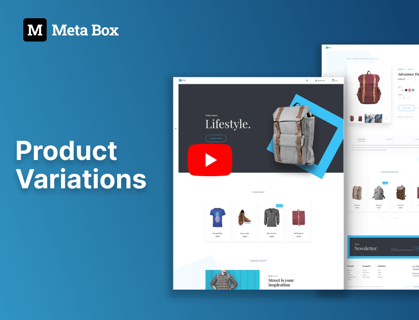](/tutorials/display-product-variations-meta-box-bricks/)
<ul>
	<li><a href="/tutorials/display-product-variations-meta-box-bricks/">Using Meta Box + Bricks</a></li>
	<li><a href="/tutorials/display-product-variations-meta-box-oxygen/">Using Meta Box + Oxygen</a></li>
	<li><a href="/tutorials/display-product-variations-mb-views/">Using MB Views</a></li>
</ul>
		

		

			<h2>Opening Hours</h2>

[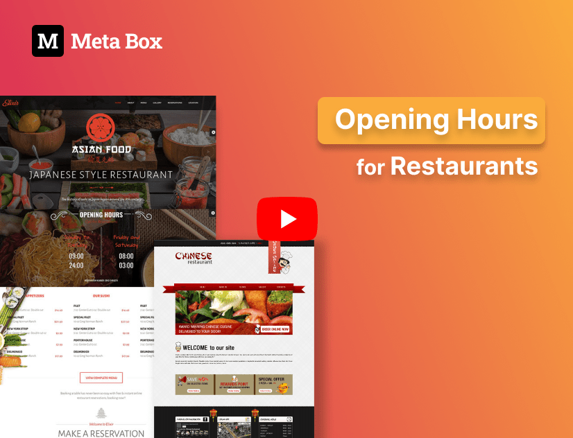](/tutorials/display-opening-hours-restaurant-with-bricks/)
<ul>
	<li><a href="/tutorials/display-opening-hours-restaurant-with-bricks/">Using Meta Box + Bricks</a></li>
	<li><a href="/tutorials/display-opening-hours-restaurants-oxygen/">Using Meta Box + Oxygen</a></li>
	<li><a href="/tutorials/display-opening-hours-restaurant-mb-views/">Using MB Views</a></li>
</ul>
		

		

			<h2>Latest Products</h2>

[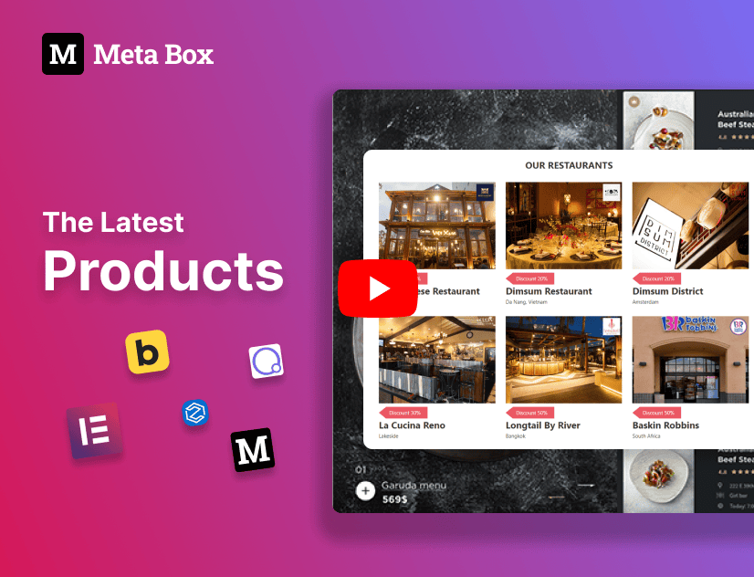](/tutorials/display-latest-product-meta-box-bricks/)
<ul>
	<li><a href="/tutorials/display-latest-product-meta-box-bricks/">Using Meta Box + Bricks</a></li>
	<li><a href="/tutorials/display-latest-product-meta-box-oxygen/">Using Meta Box + Oxygen</a></li>
	<li><a href="/tutorials/display-latest-product-meta-box-elementor/">Using Meta Box + Elementor</a></li>
	<li><a href="/tutorials/display-latest-products-meta-box-zion/">Using Meta Box + Zion</a></li>
	<li><a href="/tutorials/display-latest-product-breakdance/">Using Meta Box + Breakdance</a></li>
 	<li><a href="/tutorials/display-latest-products-with-kadence/">Using Meta Box + Kadence</a></li>
	<li><a href="/tutorials/display-latest-products-mb-views/">Using MB Views</a></li>
</ul>
		

		

			<h2>Product Page</h2>

<ul>
	<li><a href="/tutorials/create-product-page-meta-box-bricks/">Using Meta Box + Bricks</a></li>
	<li><a href="/tutorials/create-product-page-meta-box-oxygen/">Using Meta Box + Oxygen</a></li>
	<li><a href="/tutorials/create-product-page/">Using Meta Box + Gutenberg</a></li>
	<li><a href="/tutorials/create-product-page-elementor/">Using Meta Box + Elementor</a></li>
 	<li><a href="/tutorials/create-product-page-with-brizy/">Using Meta Box + Brizy</a></li>
	<li><a href="/tutorials/create-product-page-meta-box-breakdance/">Using Meta Box + Breakdance</a></li>
	<li><a href="/tutorials/create-product-page-with-kadence/">Using Meta Box + Kadence</a></li>
	<li><a href="/tutorials/create-product-page-divi/">Using Meta Box + Divi</a></li>
	<li><a href="/tutorials/add-custom-fields-to-products-in-woocommerce-meta-box-bricks/">Using Meta Box + Bricks + WooCommerce</a></li>
	<li><a href="/tutorials/create-product-pages-mb-views/">Using MB Views</a></li>
</ul>
		

		

			<h2>Menus for Restaurants</h2>

[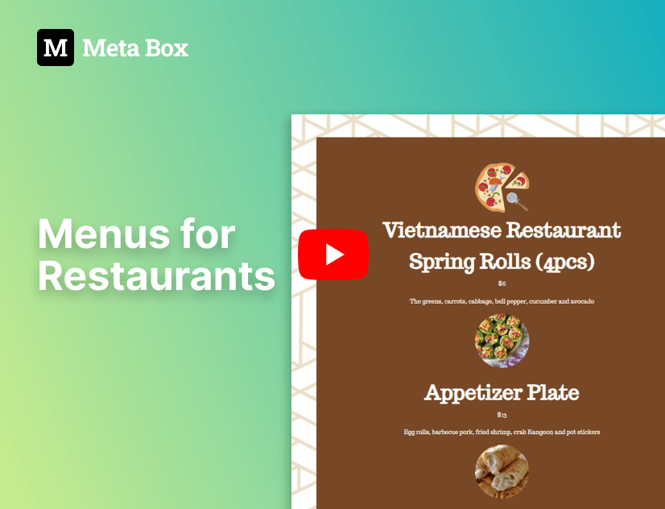](/tutorials/create-menu-restaurants-meta-box-elementor/)
<ul>
	<li><a href="/tutorials/create-menu-restaurants-meta-box-elementor/">Using Meta Box + Elementor</a></li>
	<li><a href="/tutorials/create-menu-restaurants-bricks/">Using Meta Box + Bricks</a></li>
</ul>
		

		

			<h2>Download Buttons</h2>

[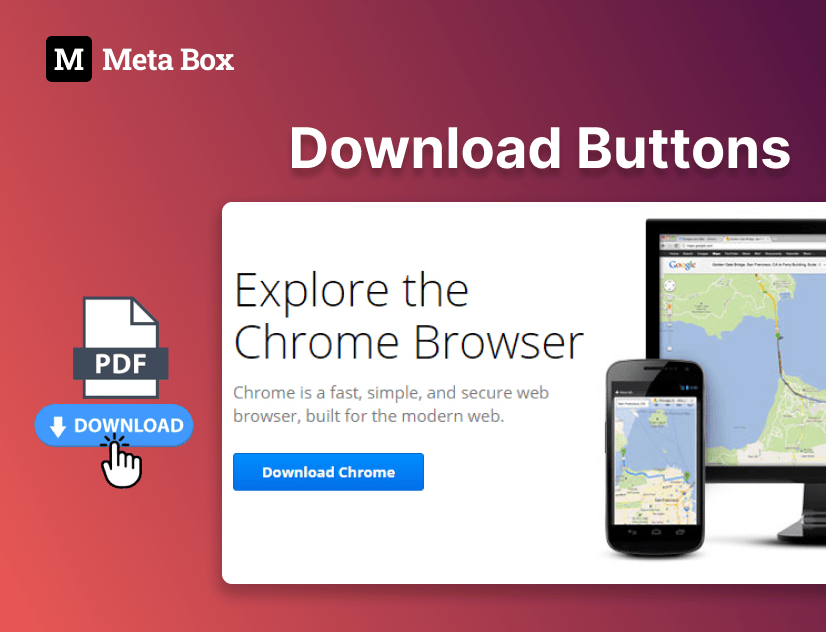](/tutorials/create-download-button/)
<ul>
	<li><a href="/tutorials/create-download-button/">Creating Download buttons</a></li>
</ul>
		

		

			<h2>Create Relationships</h2>

[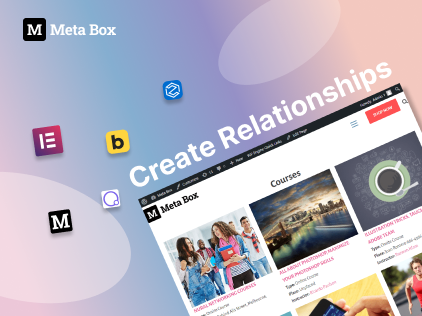](/tutorials/create-relationships-with-bricks/)
<ul>
	<li><a href="/tutorials/create-relationships-with-bricks/">Using Meta Box + Bricks</a></li>
	<li><a href="/tutorials/create-relationships-with-oxygen/">Using Meta Box + Oxygen</a></li>
	<li><a href="/tutorials/create-relationships-with-breakdance/">Using Meta Box + Breakdance</a></li>
	<li><a href="/tutorials/create-relationships-mb-views/">Using MB Views</a></li>
</ul>
		

		

			<h2>Dynamic Landing Page</h2>

<ul>
	<li><a href="/tutorials/create-dynamic-landing-page-with-bricks/">Using Meta Box + Bricks</a></li>
	<li><a href="/tutorials/create-dynamic-landing-page-with-elementor/">Using Meta Box + Elementor</a></li>
	<li><a href="/tutorials/create-dynamic-landing-page/">Using MB Views</a></li>
</ul>
		

		

			<h2>Add-to-calendar Buttons</h2>

[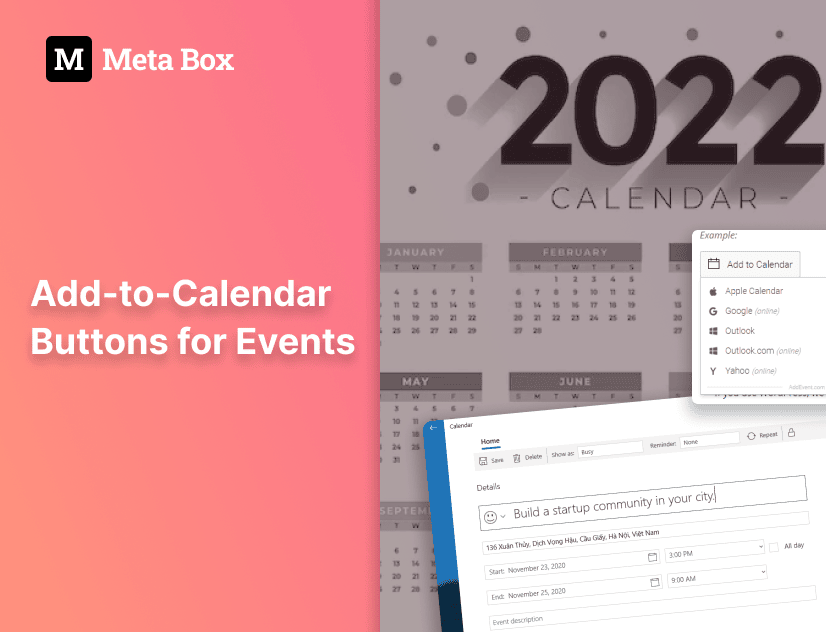](/tutorials/create-add-to-calendar-buttons/)
<ul>
	<li><a href="/tutorials/create-add-to-calendar-buttons/">Creating Add-to-calendar buttons for your events</a></li>
</ul>
		

		

			<h2>Listings On A Map</h2>

[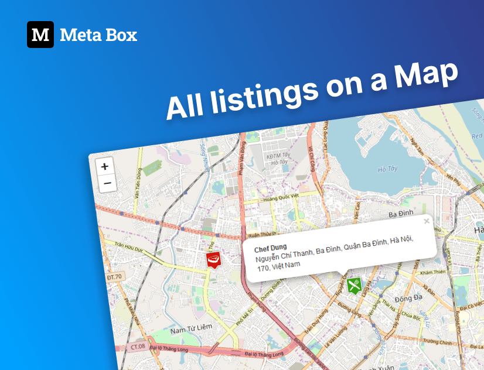](/tutorials/display-listings-on-map/)
<ul>
	<li><a href="/tutorials/display-listings-on-map/">Displaying all listings on a map</a></li>
</ul>
		

		

			<h2>Search Posts</h2>

<ul>
	<li><a href="/tutorials/search-posts-by-taxonomy/">Searching posts by taxonomy</a></li>
</ul>
		

		

			<h2>Add Guest Author and Posts</h2>

[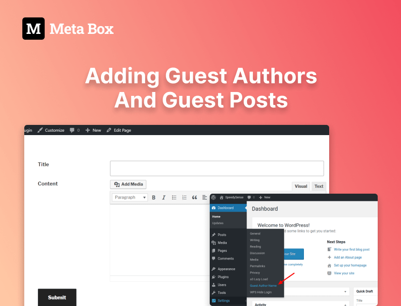](/tutorials/add-guest-authors/)
<ul>
	<li><a href="/tutorials/add-guest-authors/">Adding guest authors and guest posts</a></li>
</ul>
		

		

			<h2>Online Admission Form</h2>

<ul>
	<li><a href="/tutorials/create-online-admission-form/">Creating online admission form</a></li>
</ul>
		

		

			<h2>Custom Avatar</h2>

[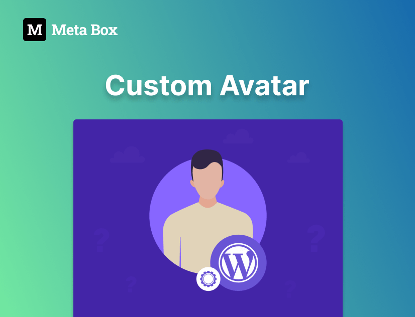](/tutorials/create-custom-avatar/)
<ul>
	<li><a href="/tutorials/create-custom-avatar/">Creating a custom avatar for user</a></li>
</ul>
		

		

			<h2>RSS Content / Title</h2>

[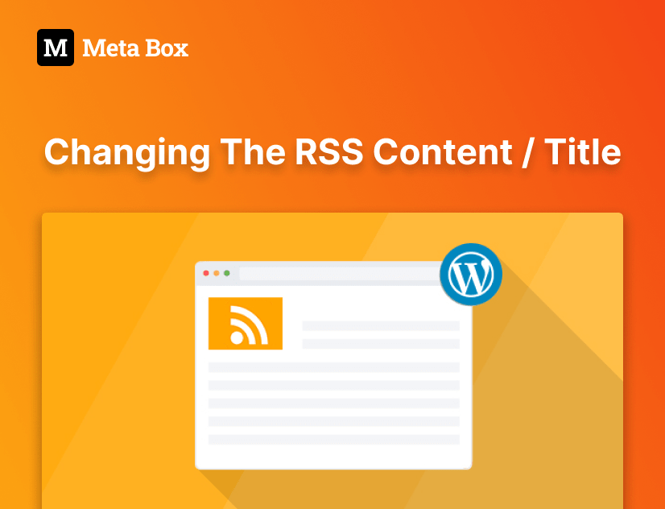](/tutorials/change-rss-content/)
<ul>
	<li><a href="/tutorials/change-rss-content/">Changing the RSS content / title</a></li>
</ul>
		

		

			<h2>Dynamic Banners</h2>

<ul>
	<li><a href="/tutorials/display-dynamic-banners-meta-box-with-bricks/">Using Meta Box + Bricks</a></li>
	<li><a href="/tutorials/create-dynamic-banners/">Using MB Views</a></li>
</ul>
		

		

			<h2>Configure Homepage</h2>

<ul>
	<li><a href="/tutorials/configure-homepage/">Configure homepage</a></li>
</ul>
		

		

			<h2>Online Reservation Form</h2>

[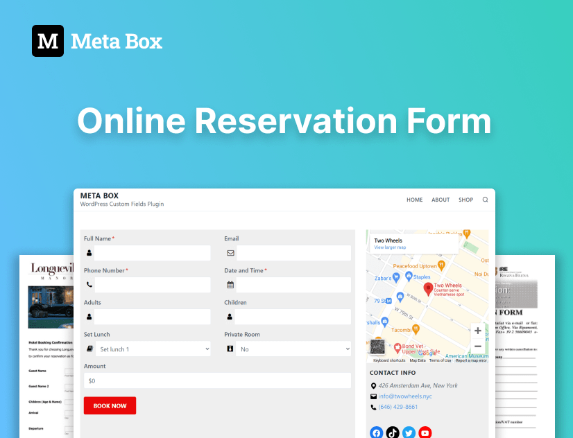](/tutorials/create-online-reservation-forms/)
<ul>
	<li><a href="/tutorials/create-online-reservation-forms/">Creating online reservation form</a></li>
</ul>
		

		

			<h2>Styling Posts</h2>

[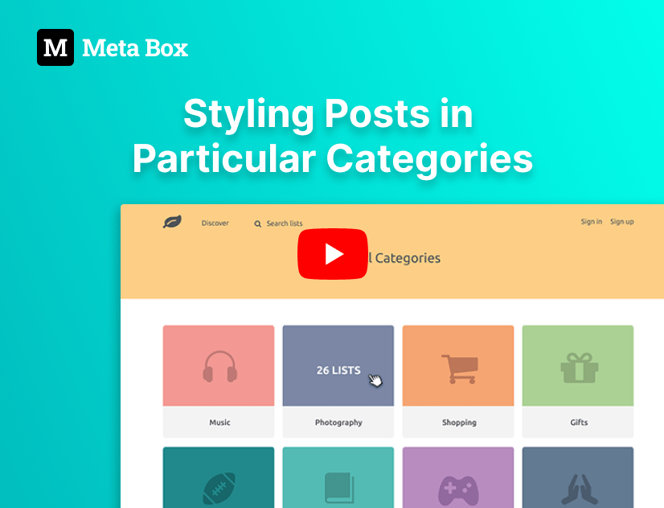](/tutorials/style-posts-different-categories/)
<ul>
	<li><a href="/tutorials/style-posts-different-categories/">Styling posts in different categories</a></li>
</ul>
		

  		

			<h2>Download and Preview Buttons</h2>

[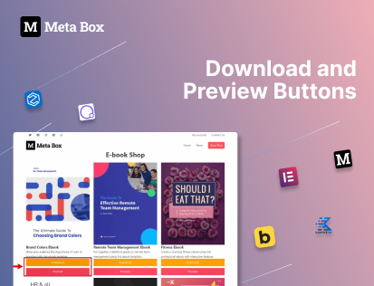](/tutorials/create-download-preview-buttons-with-bricks/)
<ul>
	<li><a href="/tutorials/create-download-preview-buttons-with-bricks/">Using Meta Box + Bricks</a></li>
	<li><a href="/tutorials/create-download-preview-buttons-with-oxygen/">Using Meta Box + Oxygen</a></li>
	<li><a href="/tutorials/create-download-preview-buttons-with-kadence/">Using Meta Box + Kadence</a></li>
	<li><a href="/tutorials/create-download-preview-buttons-with-zion/">Using Meta Box + Zion</a></li>
	<li><a href="/tutorials/create-download-preview-buttons-mb-views/">Using MB Views</a></li>
</ul>
		

		

			<h2>Youtube Video Timestamps</h2>

<ul>
	<li><a href="/tutorials/create-youtube-video-timestamps-mb-views/">Using MB Views</a></li>
</ul>
		

		

			<h2>Display Author Bio</h2>

[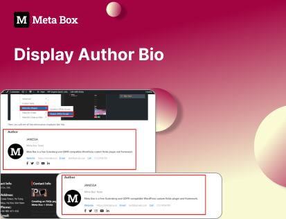](/tutorials/display-author-bio-in-wordpress-with-bricks/)
<ul>
	<li><a href="/tutorials/display-author-bio-in-wordpress-with-bricks/">Using Meta Box + Bricks</a></li>
	<li><a href="/tutorials/display-author-bio-in-wordpress-mb-views/">Using MB Views</a></li>
</ul>
		

		

			<h2>Random Hero Image</h2>

[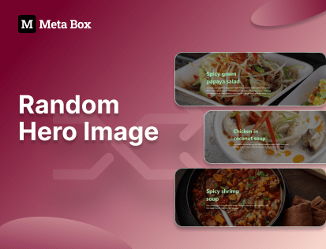](/tutorials/randomize-hero-image-mb-views/)
<ul>
	<li><a href="/tutorials/randomize-hero-image-mb-views/">Using MB Views</a></li>
</ul>
		

		

			<h2>Show Upcoming Events</h2>

[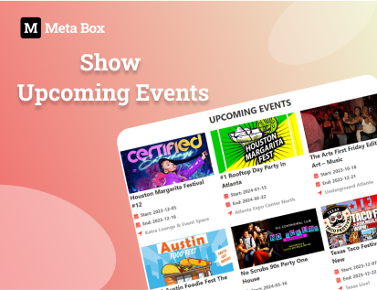](/tutorials/show-upcoming-events-with-elementor/)
<ul>
	<li><a href="/tutorials/show-upcoming-events-with-elementor/">Using Meta Box + Elementor</a></li>
	<li><a href="/tutorials/show-upcoming-events-with-bricks/">Using Meta Box + Bricks</a></li>
	<li><a href="/tutorials/show-upcoming-events-with-oxygen/">Using Meta Box + Oxygen</a></li>
	<li><a href="/tutorials/show-upcoming-events-with-breakdance/">Using Meta Box + Kadence</a></li>
	<li><a href="/tutorials/show-upcoming-events-with-mb-views/">Using MB Views</a></li>
</ul>
		

		

			<h2>Custom 404 Page</h2>

[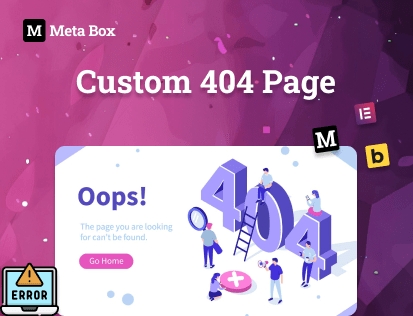](/tutorials/create-custom-404-page-with-bricks/)
<ul>
	<li><a href="/tutorials/create-custom-404-page-with-bricks/">Using Meta Box + Bricks</a></li>
	<li><a href="/tutorials/create-custom-404-page-with-elementor/">Using Meta Box + Elementor</a></li>
	<li><a href="/tutorials/create-custom-404-page-with-oxygen/">Using Meta Box + Oxygen</a></li>
	<li><a href="/tutorials/create-custom-404-page-with-breakdance/">Using Meta Box + Breakdance</a></li>
	<li><a href="/tutorials/create-custom-404-page-mb-views/">Using MB Views</a></li>
</ul>
		

		

			<h2>Make Timeline</h2>

[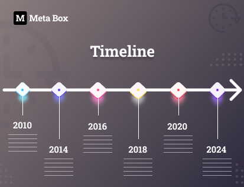](/tutorials/create-timeline-with-bricks/)
<ul>
	<li><a href="/tutorials/create-timeline-with-bricks/">Using Meta Box + Bricks</a></li>
	<li><a href="/tutorials/create-timeline-mb-views/">Using MB Views</a></li>
</ul>
		

		

			<h2>Coming Soon Page</h2>

[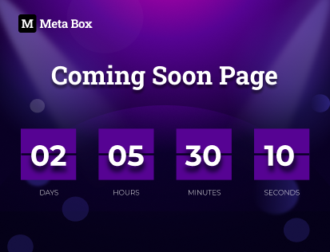](/tutorials/create-coming-soon-page-with-countdown-mb-views/)
<ul>
	<li><a href="/tutorials/create-coming-soon-page-with-countdown-mb-views/">Using MB Views</a></li>
</ul>
		

		

			<h2>Pricing Table Page</h2>

[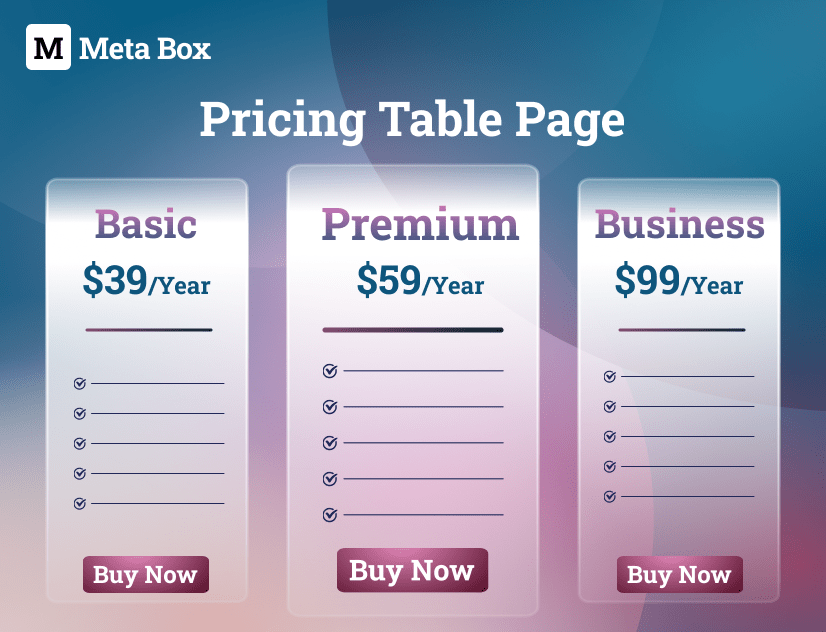](/tutorials/create-pricing-table-page-with-bricks/)
<ul>
	<li><a href="/tutorials/create-pricing-table-page-with-bricks/">Using Meta Box + Bricks</a></li>
	<li><a href="/tutorials/create-pricing-table-page-with-elementor/">Using Meta Box + Elementor</a></li>
	<li><a href="/tutorials/create-pricing-table-page-with-breakdance/">Using Meta Box + Breakdance</a></li>
	<li><a href="/tutorials/create-pricing-table-page-with-mb-views/">Using MB Views</a></li>
</ul>
		

		

			<h2>Displaying related</h2>

[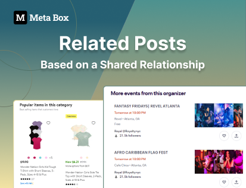](/tutorials/display-related-posts-based-on-shared-relationship/)
<ul>
	<li><a href="/tutorials/display-related-posts-based-on-shared-relationship/">Displaying related posts by shared relationship</a></li>
	<li><a href="/tutorials/display-related-posts-based-on-shared-relationship-mb-views/">Using MB Views</a></li>
</ul>
		

		

			<h2>Building a Hotel Booking</h2>

[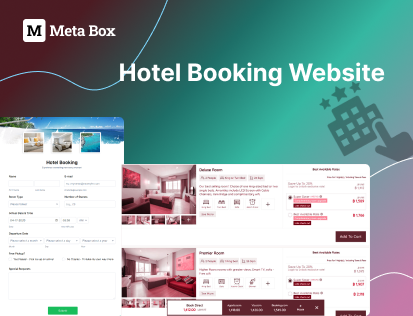](/tutorials/build-hotel-booking-website-p1/)
<ul>
	<li><a href="/tutorials/build-hotel-booking-website-p1/">Room archive page</a></li>
	<li><a href="/tutorials/build-hotel-booking-website-p2-backend/">Booking page in backend</a></li>
</ul>
		

		

			<h2>Filter Posts by Relationships</h2>

[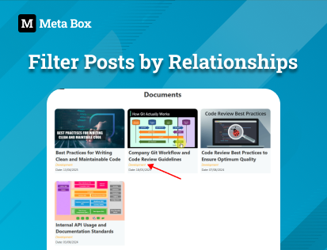](/tutorials/role-based-access-control-with-bricks/)
<ul>
	<li><a href="/tutorials/role-based-access-control-with-bricks/">Using Meta Box + Bricks</a></li>
	<li><a href="/tutorials/filter-posts-by-relationtion-mb-views/">Using MB Views</a></li>
	<li><a href="/tutorials/filter-posts-by-relationships-with-oxygen/">Using Meta Box + Oxygen</a></li>
	
</ul>
			

	

