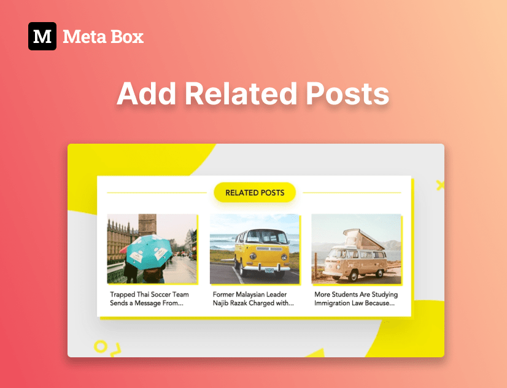

See how to use Meta box in common tasks.

[ <h3 class="items_titles">Filtering posts by custom fields & taxonomies</h3>](/tutorials/filter-posts-by-custom-fields-taxonomies/)

[ <h3 class="items_titles">Adding custom fields to Yoast SEO meta tags</h3>](/tutorials/add-custom-fields-to-yoast-seo/)

[ <h3 class="items_titles">Moving custom fields’ data to custom tables</h3>](/tutorials/move-data-to-custom-tables/)

[ <h3 class="items_titles">Displaying a user list on the frontend</h3>](/tutorials/display-users-list/)

[ <h3 class="items_titles">Getting posts by custom fields</h3>](/tutorials/get-posts-by-custom-fields/)

[ <h3 class="items_titles">Changing the ID of a Meta Box field</h3>](/tutorials/change-id-meta-box-field/)

[ <h3 class="items_titles">Adding star rating fields to Meta Box</h3>](/tutorials/add-star-rating-fields/)

[ <h3 class="items_titles">Creating Download buttons</h3>](/tutorials/create-download-button/)

[ <h3 class="items_titles">Displaying images as a gallery</h3>](/tutorials/display-images-as-gallery/)

[ <h3 class="items_titles">Displaying all listings on a map</h3>](/tutorials/display-listings-on-map/)

[ <h3 class="items_titles">Reordering posts manually</h3>](/tutorials/reorder-posts-manually-by-custom-fields/)

[ <h3 class="items_titles">Adding custom fields for WooCommerce</h3>](/tutorials/add-custom-fields-woocommerce/)

[ <h3 class="items_titles">Creating dynamic favicon</h3>](/tutorials/create-dynamic-favicon/)

[ <h3 class="items_titles">Inserting Google Maps</h3>](/tutorials/insert-google-maps/)

[ <h3 class="items_titles">Searching posts by taxonomy</h3>](/tutorials/search-posts-by-taxonomy/)

[ <h3 class="items_titles">Creating subscription form connecting to Mailchimp</h3>](/tutorials/create-subscription-form-connect-to-mailchimp/)

[ <h3 class="items_titles">Using custom HTML field to output or custom CSS</h3>](/tutorials/create-notification-custom-html-field/)

[ <h3 class="items_titles">Adding paginations & search boxes to custom fields </h3>](/tutorials/add-paginations-search-boxes/)

[ <h3 class="items_titles">Analyzing content in custom fields for SEO - Rank Math</h3>](/tutorials/analyze-content-seo-rank-math/)

[ <h3 class="items_titles">Analyzing content in custom fields for SEO - Yoast SEO</h3>](/tutorials/analyze-content-yoast-seo/)

[ <h3 class="items_titles">Storing cloneable fields in multiple rows in the database</h3>](/tutorials/store-cloneable-fields/)

[ <h3 class="items_titles">Adding testimonials</h3>](/tutorials/add-testimonials/)

[ <h3 class="items_titles">Adding related posts</h3>](/tutorials/add-related-posts/)

[ <h3 class="items_titles">Changing the RSS content / title</h3>](/tutorials/change-rss-content/)

[ <h3 class="items_titles">Creating reusable template parts - MB Views</h3>](/tutorials/create-reusable-template-parts/)

[ <h3 class="items_titles">Creating dynamic banners</h3>](/tutorials/create-dynamic-banners/)

[ <h3 class="items_titles">Adding custom JavaScript actions</h3>](/tutorials/add-javascript-actions-button-field/)

[ <h3 class="items_titles">Adding icons to title of custom fields</h3>](/tutorials/add-icons-title-custom-fields/)

[ <h3 class="items_titles">Bundling Meta Box into another plugin</h3>](/tutorials/bundle-meta-box-into-another-plugin/)

[ <h3 class="items_titles">Adding a favorite button</h3>](/tutorials/add-favorite-button/)

[ <h3 class="items_titles">Importing data into Meta Box custom fields</h3>](/tutorials/import-data-meta-box-custom-fields/)

[ <h3 class="items_titles">Importing all Meta Box custom fields</h3>](/tutorials/import-all-meta-box-custom-fields/)

[ <h3 class="items_titles">Rendering blocks with views</h3>](/tutorials/render-block-with-view/)

[ <h3 class="items_titles">Displaying related posts by shared relationship</h3>](/tutorials/display-related-posts-based-on-shared-relationship/)

[ <h3 class="items_titles">Real-time opening status automatically</h3>](/tutorials/realtime-opening-status-automatically/)

[ <h3 class="items_titles">Displaying events group by month and year</h3>](/tutorials/display-events-group-by-month-year/)

[ <h3 class="items_titles">Translating user meta and term meta</h3>](/tutorials/translate-meta-box-custom-field-values-for-users-taxonomies-wpml/)

[ <h3 class="items_titles">Displaying before after image</h3>](/tutorials/display-before-after-images/)

[ <h3 class="items_titles">Filtering posts by taxonomy in the admin dashboard</h3>](/tutorials/filter-posts-by-taxonomy-in-admin-dashboard/)

[ <h3 class="items_titles">Full-width dashboard widget</h3>](/tutorials/create-full-width-wordpress-dashboard-widget/)

[ <h3 class="items_titles">Counting the number of related posts</h3>](/tutorials/count-related-posts-mb-views/)

[ <h3 class="items_titles">Displaying personalized data for users</h3>](/tutorials/display-personalized-data-for-users/)

