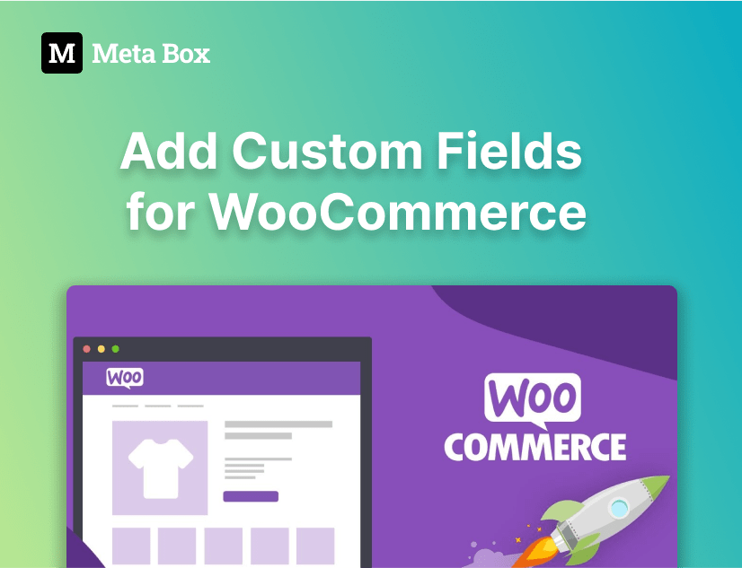
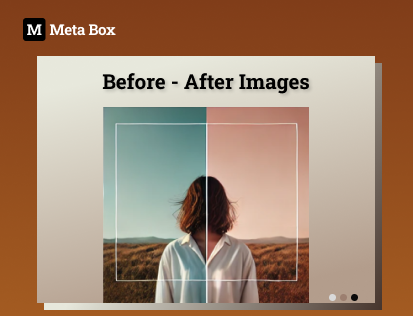
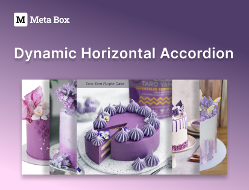

Build front-end templates for WordPress without touching theme files. Support Twig and all field types.

[ <h3 class="items_titles">Create category thumbnails</h3>](/tutorials/category-thumbnails/)

[ <h3 class="items_titles">Creating buttons with dynamic link</h3>](/tutorials/create-buttons-dynamic-links/)

[ <h3 class="items_titles">Creating user profile page on frontend</h3>](/tutorials/create-user-profile-page/)

[ <h3 class="items_titles">Displaying most viewed posts</h3>](/tutorials/display-most-viewed-posts-mb-views)

[ <h3 class="items_titles">Creating a dynamic landing page</h3>](/tutorials/create-dynamic-landing-page/)

[ <h3 class="items_titles">Creating a team members page</h3>](/tutorials/create-team-members-page-mb-views/)

[ <h3 class="items_titles">Creating a recipe</h3>](/tutorials/create-recipe-mb-views/)

[ <h3 class="items_titles">Displaying the latest products</h3>](/tutorials/display-latest-products-mb-views/)

[ <h3 class="items_titles">Displaying images from cloneable fields</h3>](/tutorials/display-images-cloneable-fields-mb-views/)

[ <h3 class="items_titles">Creating a product page</h3>](/tutorials/create-product-pages-mb-views/)

[ <h3 class="items_titles">Creating online admission form</h3>](/tutorials/create-online-admission-form/)

[ <h3 class="items_titles">Configuring homepage</h3>](/tutorials/configure-homepage/)

[ <h3 class="items_titles">Creating an auto-updated cheat sheet</h3>](/tutorials/create-auto-updated-cheat-sheet/)

[ <h3 class="items_titles">Displaying opening hours for restaurants</h3>](/tutorials/display-opening-hours-restaurant-mb-views/)

[ <h3 class="items_titles">Displaying product variations</h3>](/tutorials/display-product-variations-mb-views/)

[ <h3 class="items_titles">Creating an FAQs page</h3>](/tutorials/create-faqs-page-mb-views/)

[ <h3 class="items_titles">Creating dynamic banners</h3>](/tutorials/create-dynamic-banners/)

[ <h3 class="items_titles">Showing the featured restaurants</h3>](/tutorials/show-featured-restaurants-mb-views/)

[ <h3 class="items_titles">Showing post with specific criteria</h3>](/tutorials/show-posts-specific-criteria-mb-views/)

[ <h3 class="items_titles">Creating relationships</h3>](/tutorials/create-relationships-mb-views/)

[ <h3 class="items_titles">Creating a video gallery page</h3>](/tutorials/create-video-gallery-page-mb-views/)

[ <h3 class="items_titles">Adding custom fields for WooCommerce</h3>](/tutorials/add-custom-fields-woocommerce-mb-views/)

[ <h3 class="items_titles">Download and preview buttons</h3>](/tutorials/create-download-preview-buttons-mb-views/)

[ <h3 class="items_titles">Youtube video timestamps</h3>](/tutorials/create-youtube-video-timestamps-mb-views/)

[ <h3 class="items_titles">Creating taxonomy thumbnails</h3>](/tutorials/create-taxonomy-thumbnails-featured-images-mb-views/)

[ <h3 class="items_titles">Random hero image</h3>](/tutorials/randomize-hero-image-mb-views/)

[ <h3 class="items_titles">Display author bio</h3>](/tutorials/display-author-bio-in-wordpress-mb-views/)

[ <h3 class="items_titles">Video playlist</h3>](/tutorials/display-video-playlist-mb-views/)

[ <h3 class="items_titles">Reading progress bar on post</h3>](/tutorials/create-reading-progress-bar-wordpress-posts-mb-views/)

[ <h3 class="items_titles">Create reading time to posts</h3>](/tutorials/create-reading-time-to-wordpress-mb-views/)

[ <h3 class="items_titles">Adding code to header and footer</h3>](/tutorials/add-code-to-wordpress-header-footer-mb-views/)

[ <h3 class="items_titles">Showing upcoming events</h3>](/tutorials/show-upcoming-events-with-mb-views/)

[ <h3 class="items_titles">Creating a timeline page</h3>](/tutorials/create-timeline-mb-views/)

[ <h3 class="items_titles">Real-time opening status automatically</h3>](/tutorials/realtime-opening-status-automatically/)

[ <h3 class="items_titles">Display before after image</h3>](/tutorials/display-before-after-images/)

[ <h3 class="items_titles">Creating a coming soon page</h3>](/tutorials/create-coming-soon-page-with-countdown-mb-views/)

[ <h3 class="items_titles">Creating charts in posts</h3>](/tutorials/create-charts-in-posts-mb-views/)

[ <h3 class="items_titles">Show event to calendar</h3>](/tutorials/show-event-on-calendar-mb-views/)

[ <h3 class="items_titles">Create pricing table page</h3>](/tutorials/create-pricing-table-page-with-mb-views/)

[ <h3 class="items_titles">Create load more button</h3>](/tutorials/create-load-more-button/)

[ <h3 class="items_titles">Create filters of job listing</h3>](/tutorials/create-filters-job-listing-mb-views/)

[ <h3 class="items_titles">Create horizontal post accordion</h3>](/tutorials/create-horizontal-accordion-mb-views/)

