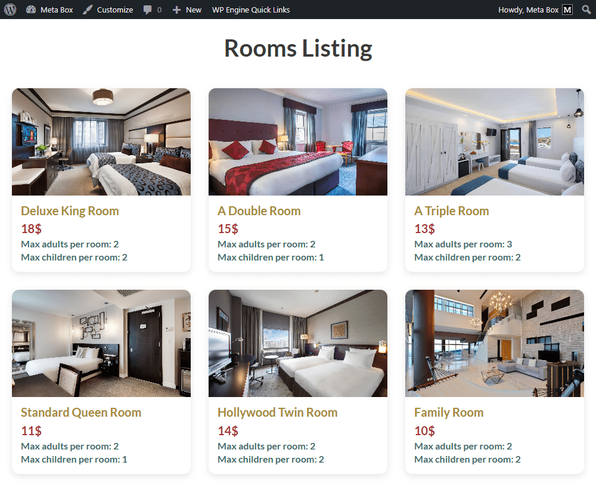

import LiteYouTubeEmbed from 'react-lite-youtube-embed';
import 'react-lite-youtube-embed/dist/LiteYouTubeEmbed.css';

A website for hotel booking usually has 4 common pages:

1. The archive page for all the rooms, along with their information.
2. The Booking page in the backend for your internal use.
3. A front-end page that allows customers to book a room.
4. The booking management page in the backend.

In this first guide, we'll create a room page. Other functionality will be covered in the next tutorials in this series.

This is my page of rooms as an example:



## Video version

<LiteYouTubeEmbed id='vbzCmmGXt3Y' />

## Preparation

Each room is a post of a custom post type. It usually has information about name, image, price, and other information that will be saved in custom fields. As well as, I use custom taxonomy to store types of rooms.

So, we highly recommend you use [**Meta Box AIO**](https://metabox.io/aio/) to have a framework to create a custom post type, a custom taxonomy, and custom fields. Also, it includes all the Meta Box extensions that you need for your creation.

These are extensions you may need:

* [MB Custom Post Types and Custom Taxonomies](https://metabox.io/plugins/custom-post-type/): to create a custom post type for the room, and a custom taxonomy for the room types.
* [MB Builder](https://metabox.io/plugins/meta-box-builder/): to have a UI on the backend to create the custom field visually and efficiently.
* [MB Views](https://metabox.io/plugins/mb-views/): to create a template for displaying rooms.

Let’s start now!

## 1. Creating a new custom post type

Go to Meta Box > Post Types, and create a new one for the room.


In the **Supports** tab, you can disable the **Editor** option to skip it in the post editor. All the information about the rooms will be added through custom fields.


After publishing, a new menu will appear right here. It’s your post type.


## 2. Creating custom fields for the room information

As I said above, we’ll create custom fields to store extra information about rooms.

Go to **Custom Fields** in **Meta Box** and create a new field group.


These are some fields I created:


They are the basic fields and no special settings. In the case that you want to add more information, just choose the corresponding [field type](https://docs.metabox.io/fields/) provided with Meta Box.

After having all the fields, click to the **Settings** panel, set the **Location** as **Post type**, and choose the **Room** to apply the fields to this post type.


Now, go to the post editor, and you can see all the fields displayed look like the live preview in the field creation screen.


Just enter the data for each room.

## 3. Creating a custom taxonomy

We need taxonomy to save the room type. So, let’s create it.

Go to **Meta Box** > **Taxonomies**.


In the **Advanced** tab, you can enable the setting I highlight in the image below to show the taxonomy as a column in the admin dashboard. It’s available only when you activate the [MB Admin Columns](https://metabox.io/plugins/mb-admin-columns/) extension.


Next, move to the **Post Types** tab, select the **Room** to apply the taxonomy to it.


Then, you can navigate to the taxonomy to create some terms. 


In the post editor, you can see a section that allows you to select the term. Then, they will be in a column like this:


## 4. Displaying rooms on the frontend

To display rooms and their information on the frontend, you can use any page builder you're familiar with, or MB Views. In this practice, I will use MB Views. We have had many tutorials about how to display posts using MB Views, along with different functionalities such as filtering and searching. You can refer to them.

On the Meta Box, click on the **Create a view** button to have a new template for the archive page of rooms.


In the Template tab, you can add code directly or insert a field to get the data you want.

First, I add this code:

```





```


In there:

* ``: is to declare that we’ll get posts from the `room` post type.
* `mb.get_posts()`:  is a Meta Box function to get the posts.
* `...`: is a loop we use to get all the posts, since there are various rooms.

Inside the loop, we’ll get data for each room.

For the image, we’ll get the first one in the room gallery. So, I add this part:

```

    
    

```


To display other information, I use the **Insert Field** button and choose the field from the right panel.

When you click on a field, the code will be generated in the **Template** tab.


Just insert the field you want to get and display data.


I added some **`div`** tags and classes, as well as modified the code a little bit.


After that, scroll down to the **Settings** tab to set the location of this template. I set the **Type** as **Archive** and select **Room Archive** to apply the template for the archive page of rooms.


On the frontend, all the data is displayed. But it needs to be made more beautiful.


Back to the created template, move to the **CSS** tab, and add some code to style the page.


Now, our page is better with the room information.


I uploaded the code to [GitHub](https://github.com/wpmetabox/tutorials/tree/master/how-to-build-hotel-booking/p1), you can refer to it.
