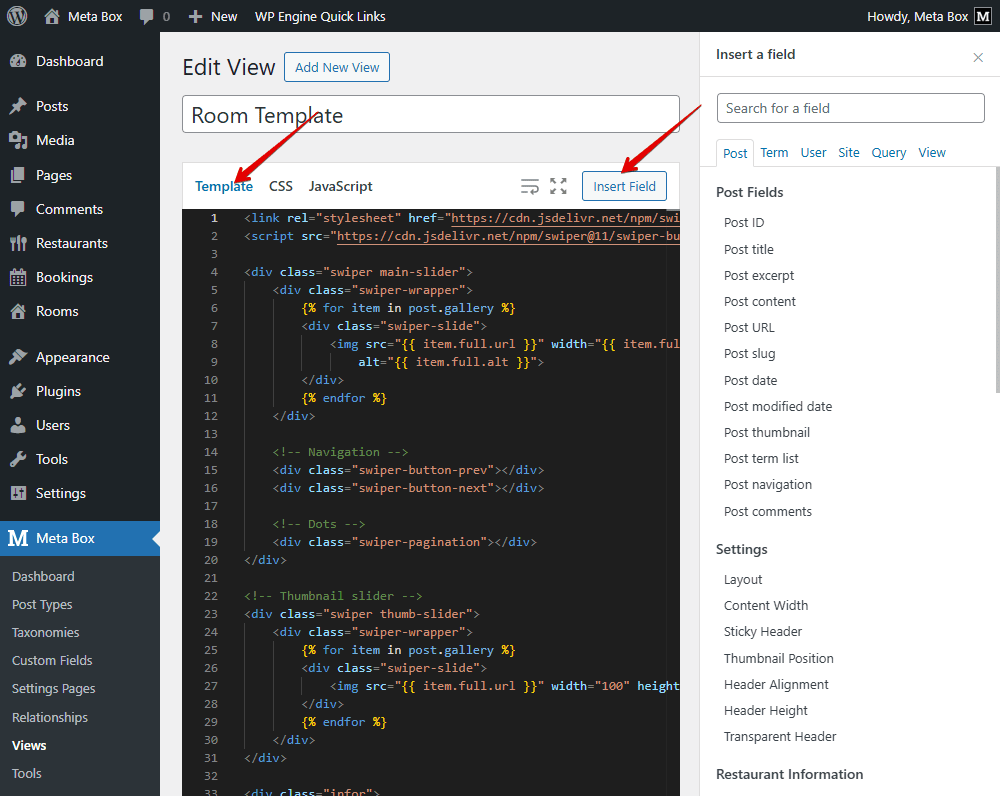

import LiteYouTubeEmbed from 'react-lite-youtube-embed';
import 'react-lite-youtube-embed/dist/LiteYouTubeEmbed.css';

In this part, we are adding a booking form to the Room’s page, which shows all the room’s information. This form allows your customers to submit a booking from the frontend easily.


This booking form has some different things from the one we created in part 2, mainly the functionality of fields. Let’s see how.

## Video version

<LiteYouTubeEmbed id='VplE6Ujboi8' />

## Preparation

In this part, we’ll create a custom booking form anywhere you want, inside a room detail, or even in a popup. The submitted data will still be saved in the Booking post type we created earlier in part 2. And of course, we’ll use custom fields to collect all the booking information.

So, we need many basic and advanced features. So, we highly recommend you use [Meta Box AIO](https://metabox.io/aio/) to have a framework to have everything. Also, it includes all the Meta Box extensions that you need for your creation.

In this part, we especially use [MB Frontend Submission](https://metabox.io/plugins/mb-frontend-submission/), which creates editorial forms so users can submit blog posts on the front end. And, [MB Views](https://metabox.io/plugins/mb-views/) to create a template for a single room page to display the booking form on the frontend.

## Creating a single room

I already have some rooms created in [part 1](https://metabox.io/build-hotel-booking-web-use-meta-box-p1/) of this series.


Now, let’s create a new **php** file for the single room. Add the following code:

```php
<?php get_header(); ?>
<main class="main" role="main">
    <?php
    while ( have_posts() ) { 
        the_post();
        get_template_part( 'template-parts/content/post' );    
    }
    ?>
</main>
<?php get_footer(); ?>
```
This code helps to create a single room page to show the room details, just like a normal single post.

Next, to display the room information more nicely, I’ll use **MB Views** to build a template.


Now, you can insert custom fields from the room group field or directly write code in the **Template** section.



```php
<link rel="stylesheet" href="https://cdn.jsdelivr.net/npm/swiper@11/swiper-bundle.min.css" />
<script src="https://cdn.jsdelivr.net/npm/swiper@11/swiper-bundle.min.js"></script>
<div class="swiper main-slider">
    <div class="swiper-wrapper">
        
        <div class="swiper-slide">
            
        </div>
        
    </div>

    <!-- Navigation -->
    <div class="swiper-button-prev"></div>
    <div class="swiper-button-next"></div>

    <!-- Dots -->
    <div class="swiper-pagination"></div>
</div>

<!-- Thumbnail slider -->
<div class="swiper thumb-slider">
    <div class="swiper-wrapper">
        
        <div class="swiper-slide">
            
        </div>
        
    </div>
</div>

<div class="infor">
    <div class="regular_price">Price Regular: {{ post.price }}$ </div>
    <ul class="number_of_adults max_children_per_room">
        <li>Number of Adults: {{ post.number_of_adults }}</li>
        <li>Max Children per room: {{ post.max_children_per_room }} </li>
    </ul>
    <div class="additional_information">{{ post.additional_information }} </div>
</div>
```
**Explanation**:

I add code to include CSS and JS from the Swiper library.

```php
<link rel="stylesheet" href="https://cdn.jsdelivr.net/npm/swiper@11/swiper-bundle.min.css" />
<script src="https://cdn.jsdelivr.net/npm/swiper@11/swiper-bundle.min.js"></script>
```
We build two sliders. The first one is for the main slider, showing large room images.

```php
<div class="swiper main-slider">
    <div class="swiper-wrapper">
        
        <div class="swiper-slide">
            
        </div>
        
    </div>

    <!-- Navigation -->
    <div class="swiper-button-prev"></div>
    <div class="swiper-button-next"></div>

    <!-- Dots -->
    <div class="swiper-pagination"></div>
</div>
```
In there, we use a loop to get all images from the advanced image field with the `gallery` ID.

The second one is for thumbnail slider, showing smaller preview images. It also loops through the same gallery field.
```php
<!-- Thumbnail slider -->
<div class="swiper thumb-slider">
    <div class="swiper-wrapper">
        
        <div class="swiper-slide">
            
        </div>
        
    </div>
</div>
```
And this part of the code retrieves all room information, such as price, maximum children, adults, and more.

```php
<div class="infor">
    <div class="regular_price">Price Regular: {{ post.price }}$ </div>
    <ul class="number_of_adults max_children_per_room">
        <li>Number of Adults: {{ post.number_of_adults }}</li>
        <li>Max Children per room: {{ post.max_children_per_room }} </li>
    </ul>
    <div class="additional_information">{{ post.additional_information }} </div>
</div>
```
Then, in the **CSS** tab, I’ll add styles for the layout:

```css
.regular_price {
    color: red;
    font-weight: bold;
    font-size: 22px;
}

.additional_information {
    color: #13acc7;
    font-size: 20px;
    font-weight: 500;
}

ul.number_of_adults.max_children_per_room {
    font-weight: bold;
    padding-top: 15px;
}

.infor {
    border-top: 2px solid #919191;
    margin-top: 20px;
    padding-top: 20px;
}

.thumb-slider img {
    height: 85px !important;
}

.main-slider {
    width: 100%;
    /* max-width: 800px; */
    margin: 0 auto 20px;
}

.thumb-slider {
    width: 100%;
    max-width: 800px;
    margin: 0 auto;
}

.swiper-pagination.swiper-pagination-clickable.swiper-pagination-bullets.swiper-pagination-horizontal {
    position: static;
}

.thumb-slider .swiper-slide {
    width: auto;
    opacity: 0.4;
    cursor: pointer;
    transition: opacity 0.3s ease;
}

.thumb-slider .swiper-slide-thumb-active {
    opacity: 1;
    border: 2px solid #007aff;
}

.swiper-slide img {
    width: 100%;
    height: auto;
    object-fit: cover;
    display: block;
}

.swiper-button-next,
.swiper-button-prev {
    color: #007aff;
}

.swiper-pagination {
    text-align: center;
    margin-top: 10px;
}

.thumb-slider .swiper-slide {
    width: auto;
    cursor: pointer;
    transition: border 0.3s ease;
    opacity: 1;
 }

.thumb-slider .swiper-slide-thumb-active {
    border: 2px solid #007aff;
}
```
And in the **JavaScript** tab, I’ll initialize the slider.
```js
const thumbSlider = new Swiper('.thumb-slider', {
    spaceBetween: 10,
    freeMode: true,
    watchSlidesProgress: true,
    breakpoints: {
        0: { slidesPerView: 3 },
        640: { slidesPerView: 4 },
        768: { slidesPerView: 4 },
        1024: { slidesPerView: 5 }
    }
});

const mainSlider = new Swiper('.main-slider', {
    spaceBetween: 10,
    autoHeight: true,
    navigation: {
        nextEl: '.swiper-button-next',
        prevEl: '.swiper-button-prev',
    },
    pagination: {
        el: '.swiper-pagination',
        clickable: true,
    },
    thumbs: {
        swiper: thumbSlider,
    },
});
```
**In particular**:

```js
const thumbSlider = new Swiper('.thumb-slider', {
    spaceBetween: 10,
    freeMode: true,
    watchSlidesProgress: true,
    breakpoints: {
        0: { slidesPerView: 3 },
        640: { slidesPerView: 4 },
        768: { slidesPerView: 4 },
        1024: { slidesPerView: 5 }
    }
});
```
This part declares and creates the thumbnail slider below the main slider, using the properties of Swiper JS.

The next part declares and creates the main slider, also based on the properties of Swiper JS.

```js
const mainSlider = new Swiper('.main-slider', {
    spaceBetween: 10,
    autoHeight: true,
    navigation: {
        nextEl: '.swiper-button-next',
        prevEl: '.swiper-button-prev',
    },
    pagination: {
        el: '.swiper-pagination',
        clickable: true,
    },
    thumbs: {
        swiper: thumbSlider,
    },
});
```

Scroll down to the settings section, choose the type of this template as singular. Then, choose the location as the room and set the position for it.


Now you can see that the single room page displays all the room’s information.


## Adding booking form in single room

Now, let’s add the booking form to the single room page. First, go back to the **PHP** file you created for the single room.

At the position where you want the booking form to appear, insert this code to execute the shortcode and display its output.

```php
echo do_shortcode( '[mb_frontend_form id="booking-fields"]' );
```

You can get the form’s shortcode (`'[mb_frontend_form id="booking-fields"]'`) directly from the field group settings created with **MB Frontend Submission**. Since we don’t need the post title or content for bookings, we simply removed them.

You can see the booking form on the single page.


However, some fields are unnecessary for customers, so we can add **CSS classes** to hide those fields.


Then, in the theme’s **Customizer**, add CSS to hide any fields you don’t need. We can also hide the “**Add more**” button to make sure each submission corresponds to only one booking.

```css
.hide-frontend {
    display: none !important;
}

.rwmb-button.add-clone {
    display: none !important;
}
```


Therefore, we already have the booking form we wanted. However, functions like automatic price calculation, date selection, and total nights calculation haven’t been implemented yet, so let’s move on to the next step.


## Adding extra functions to booking on the frontend

In this part, we’ll add extra functions so the form doesn’t just collect data but also works like a real booking system.

We’re going to:

* Automatically display the corresponding price of the booking room;
* Automatically show the valid booking dates;
* Automatically calculate the total nights of stay;
* Automatically calculate the total amount.

We’ll need to write quite a bit of code for this part. Let’s go!

Go to your theme folder, and open the `functions.php` file you created in Part 2. Add the following code.

```php
function enqueue_scripts() {
    // Register and enqueue script
    wp_enqueue_script( 'jquery-ui-datepicker' );
    wp_enqueue_script( 'booking-js', get_template_directory_uri() . '/js/booking.js', array( 'jquery', 'jquery-ui-datepicker' ), '1.0', true );

    // Pass data into JavaScript using wp_add_inline_script()
    $ajax_data = array(
        'ajax_url' => admin_url( 'admin-ajax.php' ),
        'nonce'    => wp_create_nonce( 'booking_nonce' ),
    );

    $inline_script = 'var booking_ajax = ' . wp_json_encode( $ajax_data ) . ';';
    wp_add_inline_script( 'booking-js', $inline_script, 'before' );

    // Passing room data into JavaScript
    $rooms = get_posts( array(
        'post_type'      => 'room',
        'posts_per_page' => -1,
    ) );

    $rooms_data = array();
    foreach ( $rooms as $room ) {
        // Get room rates from Meta Box
        $room_price = rwmb_get_value( 'price', array(), $room->ID );
        if ( ! $room_price ) {
            $room_price = 0;
        }

        $rooms_data[] = array(
            'id'    => $room->ID,
            'title' => $room->post_title,
            'price' => $room_price,
        );
    }

    $rooms_script = 'var rooms_data = ' . wp_json_encode( $rooms_data ) . ';';
    wp_add_inline_script( 'booking-js', $rooms_script, 'before' );

    // Pass current_room_id if available
    $current_room_id = get_the_ID();
    if ( $current_room_id ) {
        $current_room_script = 'var current_room_id = ' . wp_json_encode( $current_room_id ) . ';';
        wp_add_inline_script( 'booking-js', $current_room_script, 'before' );
    }
}
add_action( 'wp_enqueue_scripts', 'enqueue_scripts' );

// Function to get all days between 2 dates
function get_dates_between( $start_date, $end_date ) {
    $dates = array();
    $current = strtotime( $start_date );
    $end     = strtotime( $end_date );

    while ( $current <= $end ) {
        $dates[] = date( 'Y-m-d', $current );
        $current = strtotime( '+1 day', $current );
    }

    return $dates;
}

add_filter( 'rwmb_frontend_validate', function( $validate, $config ) {
    if ( 'booking-fields' !== $config['id'] ) {
        return $validate;
    }

    // Get all selected rooms in the form
    $selected_rooms = array();
    if ( isset( $_POST['group_booking'] ) && is_array( $_POST['group_booking'] ) ) {
        foreach ( $_POST['group_booking'] as $index => $room ) {
            if ( empty( $room['room'] ) || empty( $room['check_in'] ) || empty( $room['check_out'] ) ) {
                continue;
            }
            // Make sure room_id is an integer
            $room_id = is_array( $room['room'] ) ? $room['room'][0] : $room['room'];
            $selected_rooms[] = array(
                'room_id'   => (int) $room_id,
                'check_in'  => date( "Y-m-d", strtotime( $room['check_in'] ) ),
                'check_out' => date( "Y-m-d", strtotime( $room['check_out'] ) ),
            );
        }
    }

    // Check each selected room
    foreach ( $selected_rooms as $room ) {
        $room_id  = $room['room_id'];
        $check_in = $room['check_in'];
        $check_out = $room['check_out'];

        // Get a list of disabled days for this room
        $disabled_dates = dates_disable( $room_id );

        // Check check-in date
        if ( in_array( $check_in, $disabled_dates ) ) {
            $validate = false;
            break;
        }

        // Check check-out date
        if ( in_array( $check_out, $disabled_dates ) ) {
            $validate = false;
            break;
        }

        // Check the days between check-in and check-out
        $dates = get_dates_between( $check_in, $check_out );
        foreach ( $dates as $date ) {
            if ( in_array( $date, $disabled_dates ) ) {
                $validate = false;
                break 2;
            }
        }
    }

    return $validate;
}, 10, 2 );
```
**Explanation**:

```php
function enqueue_scripts() {
    // Register and enqueue script
    wp_enqueue_script( 'jquery-ui-datepicker' );
    wp_enqueue_script( 'booking-js', get_template_directory_uri() . '/js/booking.js', array( 'jquery', 'jquery-ui-datepicker' ), '1.0', true );

    // Pass data into JavaScript using wp_add_inline_script()
    $ajax_data = array(
        'ajax_url' => admin_url( 'admin-ajax.php' ),
        'nonce'    => wp_create_nonce( 'booking_nonce' ),
    );

    $inline_script = 'var booking_ajax = ' . wp_json_encode( $ajax_data ) . ';';
    wp_add_inline_script( 'booking-js', $inline_script, 'before' );

    // Passing room data into JavaScript
    $rooms = get_posts( array(
        'post_type'      => 'room',
        'posts_per_page' => -1,
    ) );

    $rooms_data = array();
    foreach ( $rooms as $room ) {
        // Get room rates from Meta Box
        $room_price = rwmb_get_value( 'price', array(), $room->ID );
        if ( ! $room_price ) {
            $room_price = 0;
        }

        $rooms_data[] = array(
            'id'    => $room->ID,
            'title' => $room->post_title,
            'price' => $room_price,
        );
    }

    $rooms_script = 'var rooms_data = ' . wp_json_encode( $rooms_data ) . ';';
    wp_add_inline_script( 'booking-js', $rooms_script, 'before' );

    // Pass current_room_id if available
    $current_room_id = get_the_ID();
    if ( $current_room_id ) {
        $current_room_script = 'var current_room_id = ' . wp_json_encode( $current_room_id ) . ';';
        wp_add_inline_script( 'booking-js', $current_room_script, 'before' );
    }
}
add_action( 'wp_enqueue_scripts', 'enqueue_scripts' );
```
These codes prepare everything the booking form needs on the frontend. They load the Java Script file, and pass important data like AJAX settings, room prices, and the current room ID. Thanks to that, the booking form can automatically handle pricing, dates, and calculations in real time.

**In here**:

```php
wp_enqueue_script( 'jquery-ui-datepicker' );
wp_enqueue_script( 'booking-js', get_template_directory_uri() . '/js/booking.js', array( 'jquery', 'jquery-ui-datepicker' ), '1.0', true );
```
This part loads the datepicker library and the custom booking.js file that handles booking calculations and interactions.

```php
$ajax_data = array(
    'ajax_url' => admin_url( 'admin-ajax.php' ),
    'nonce'    => wp_create_nonce( 'booking_nonce' ),
);

$inline_script = 'var booking_ajax = ' . wp_json_encode( $ajax_data ) . ';';
wp_add_inline_script( 'booking-js', $inline_script, 'before' );
```
This section sends AJAX settings to JavaScript, including the admin URL and a security nonce, so the script can safely request disabled dates.

We collect all rooms with their IDs, titles, and prices, then send them as `rooms_data` to JavaScript. This lets the booking form display the correct price when a room is selected.

```php
$rooms = get_posts( array(
    'post_type'      => 'room',
    'posts_per_page' => -1,
) );

$rooms_data = array();
foreach ( $rooms as $room ) {
    // Get room rates from Meta Box
    $room_price = rwmb_get_value( 'price', array(), $room->ID );
    if ( ! $room_price ) {
        $room_price = 0;
    }

    $rooms_data[] = array(
        'id'    => $room->ID,
        'title' => $room->post_title,
        'price' => $room_price,
    );
}

$rooms_script = 'var rooms_data = ' . wp_json_encode( $rooms_data ) . ';';
wp_add_inline_script( 'booking-js', $rooms_script, 'before' );

```
If we are on a single room page, this part below sends the current room ID to JavaScript, so the booking form will automatically pre-select that room.

```php
$current_room_id = get_the_ID();
if ( $current_room_id ) {
    $current_room_script = 'var current_room_id = ' . wp_json_encode( $current_room_id ) . ';';
    wp_add_inline_script( 'booking-js', $current_room_script, 'before' );
}
```
Next, we use the function that creates a list of dates between check-in and check-out. Each day is added one by one to check room availability.

```php
function get_dates_between( $start_date, $end_date ) {
    $dates  = array();
    $current = strtotime( $start_date );
    $end     = strtotime( $end_date );

    while ( $current <= $end ) {
        $dates[] = date( 'Y-m-d', $current );
        $current = strtotime( '+1 day', $current );
    }

    return $dates;
}
```

These following codes are used to validate booking data when users submit the booking form on the frontend. It makes sure no one can book a room on dates that are already disabled.

```php
add_filter( 'rwmb_frontend_validate', function( $validate, $config ) {
    if ( 'booking-fields' !== $config['id'] ) {
        return $validate;
    }

    // Get all selected rooms in the form
    $selected_rooms = array();
    if ( isset( $_POST['group_booking'] ) && is_array( $_POST['group_booking'] ) ) {
        foreach ( $_POST['group_booking'] as $index => $room ) {
            if ( empty( $room['room'] ) || empty( $room['check_in'] ) || empty( $room['check_out'] ) ) {
                continue;
            }
            // Make sure room_id is an integer
            $room_id = is_array( $room['room'] ) ? $room['room'][0] : $room['room'];
            $selected_rooms[] = array(
                'room_id'  => (int) $room_id,
                'check_in' => date( "Y-m-d", strtotime( $room['check_in'] ) ),
                'check_out' => date( "Y-m-d", strtotime( $room['check_out'] ) ),
            );
        }
    }

    // Check each selected room
    foreach ( $selected_rooms as $room ) {
        $room_id  = $room['room_id'];
        $check_in = $room['check_in'];
        $check_out = $room['check_out'];

        // Get a list of disabled days for this room
        $disabled_dates = dates_disable( $room_id );

        // Check check-in date
        if ( in_array( $check_in, $disabled_dates ) ) {
            $validate = false;
            break;
        }

        // Check check-out date
        if ( in_array( $check_out, $disabled_dates ) ) {
            $validate = false;
            break;
        }

        // Check the days between check-in and check-out
        $dates = get_dates_between( $check_in, $check_out );
        foreach ( $dates as $date ) {
            if ( in_array( $date, $disabled_dates ) ) {
                $validate = false;
                break 2;
            }
        }
    }

    return $validate;
}, 10, 2 );
```

**In particularly**:

```php
if ( 'booking-fields' !== $config['id'] ) {
    return $validate;
}
```
This part hooks into the Meta Box validation filter. It runs only for our booking form, identified by booking fields. 

```php
$selected_rooms = array();
if ( isset( $_POST['group_booking'] ) && is_array( $_POST['group_booking'] ) ) {
    foreach ( $_POST['group_booking'] as $index => $room ) {
        if ( empty( $room['room'] ) || empty( $room['check_in'] ) || empty( $room['check_out'] ) ) {
            continue;
        }
        // Make sure room_id is an integer
        $room_id = is_array( $room['room'] ) ? $room['room'][0] : $room['room'];
        $selected_rooms[] = array(
            'room_id'  => (int) $room_id,
            'check_in' => date( "Y-m-d", strtotime( $room['check_in'] ) ),
            'check_out' => date( "Y-m-d", strtotime( $room['check_out'] ) ),
        );
    }
}
```
This block collects all rooms that the user selected, along with their check-in and check-out dates, and formats them for validation. 

```php
foreach ( $selected_rooms as $room ) {
    $room_id  = $room['room_id'];
    $check_in = $room['check_in'];
    $check_out = $room['check_out'];

    // Get a list of disabled days for this room
    $disabled_dates = dates_disable( $room_id );

    // Check check-in date
    if ( in_array( $check_in, $disabled_dates ) ) {
        $validate = false;
        break;
    }

    // Check check-out date
    if ( in_array( $check_out, $disabled_dates ) ) {
        $validate = false;
        break;
    }

    // Check the days between check-in and check-out
    $dates = get_dates_between( $check_in, $check_out );
    foreach ( $dates as $date ) {
        if ( in_array( $date, $disabled_dates ) ) {
            $validate = false;
            break 2;
        }
    }
}
```
This part loads all disabled dates for each selected room, using the `dates_disable` function.

This one below is to check if either the check-in or check-out day is already booked. If yes, validation fails immediately.

```php
// Check check-in date
if ( in_array( $check_in, $disabled_dates ) ) {
    $validate = false;
    break;
}

// Check check-out date
if ( in_array( $check_out, $disabled_dates ) ) {
    $validate = false;
    break;
}
```
Finally, this section checks all the days between check-in and check-out. If any of them overlap with disabled dates, the booking is rejected. 

```php
$dates = get_dates_between( $check_in, $check_out );
foreach ( $dates as $date ) {
    if ( in_array( $date, $disabled_dates ) ) {
        $validate = false;
        break 2;
    }
}
```

That’s it for creating the functions. All the code has been uploaded to [GitHub](https://github.com/wpmetabox/tutorials/tree/master/how-to-build-hotel-booking/p3), so you can check it out there.

Now, let’s move to the frontend and test if those functions work properly. You can now make a booking successfully, and also verify it from the back end.


