import LiteYouTubeEmbed from 'react-lite-youtube-embed';
import 'react-lite-youtube-embed/dist/LiteYouTubeEmbed.css';

In this tutorial, we’ll show you how to **filter posts on the front end using a date picker custom field** with Meta Box. This is ideal for time-sensitive content such as events or movie schedules, allowing visitors to quickly find posts by a specific date or within a date range.

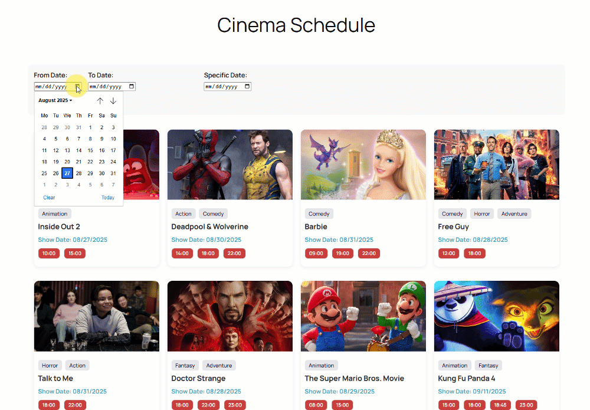

## Video Version

<LiteYouTubeEmbed id='65s3mcd8uXo' />

## Preparation

In this tutorial, we’ll create a custom post type to manage all the films in our cinema schedule. 
Each movie will have its own details, such as genres, show date, and showtimes, which we’ll store in custom fields created with Meta Box.

So I recommend using [Meta Box AIO](https://metabox.io/aio/), which includes the framework and all extensions.

## Creating a new custom post type

As I mentioned, we’ll start by creating a new custom post type called **Movies** to store the films. Each movie will be saved as a post in this post type.

Now, go to **Meta Box** > **Post Types** to create a new custom post type for the movies. After publishing, you’ll see the created custom post type in the dashboard’s menu.

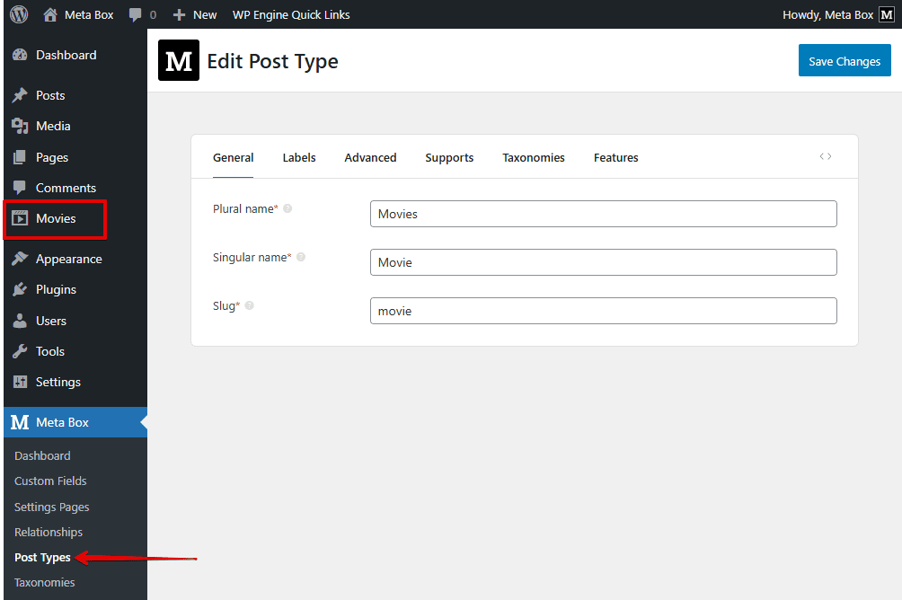

## Creating custom fields for movies

Now, we’ll create some custom fields to store information for each movie.

These fields will include details like genres, show dates, and showtimes, everything we need for the movie listings. We’ll make the movie schedule as a group to keep things more organized.

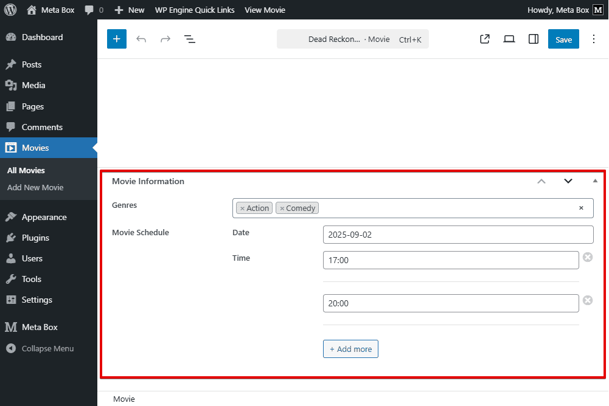

The most important one in this tutorial is the Date Picker field for the show date. This is what we’ll later use to filter movies on the front end.

Now, go to **Meta Box** > **Custom Fields** to create a new field group.


First, choose the **Select Advanced** field for movie genres. Add some choice in the **Choices** box. And you can also enable multiple selections so that each movie can belong to several genres at once.

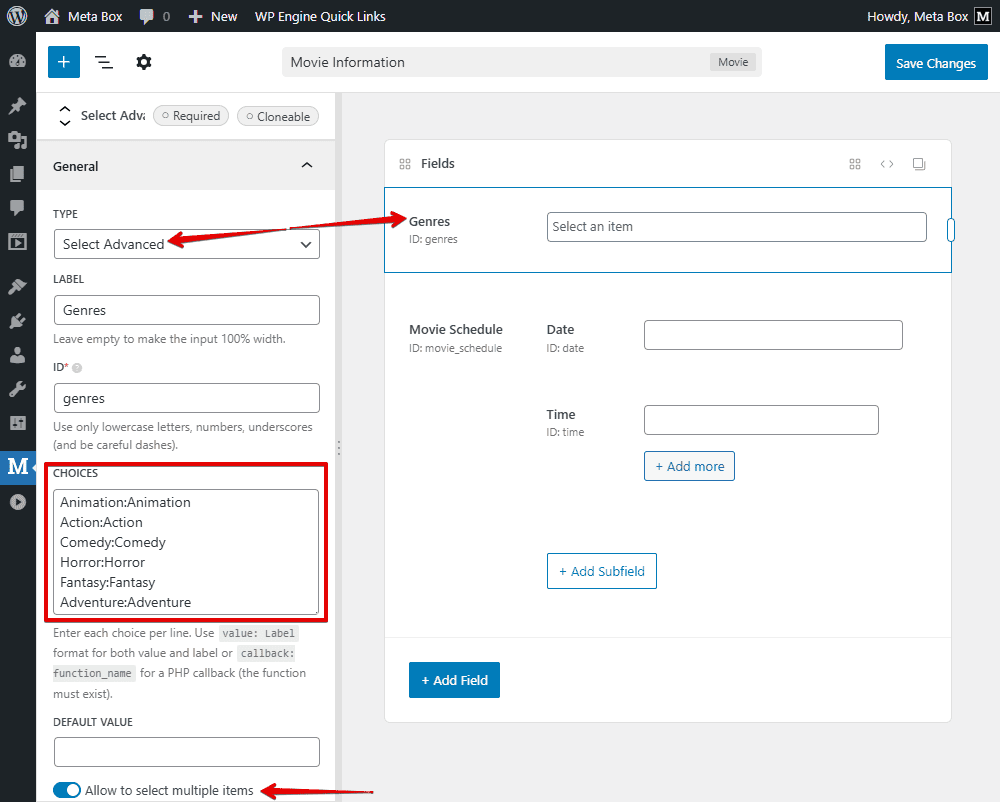

Next, create another field called Movie Schedule, which contains the date and time information. Here, we’ll use a **Group** field to keep related fields together. And turning on the **Admin column** for this group. It’s available when you have the **MB Admin Column** extension activated. Thus, I can quickly view movie schedules directly in the post list

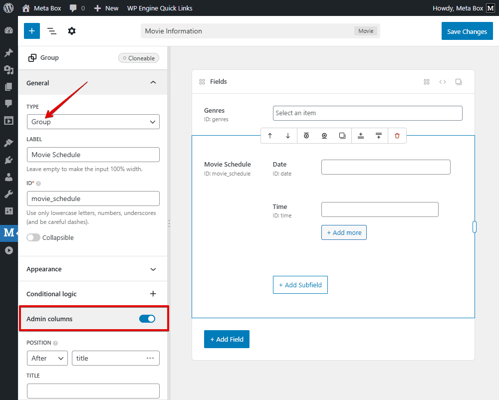

Inside this group, add a **Date Picker** field for the date. Then, go to the **Advanced** tab and set the **minDate** option to “**today**”. This way, you can’t select past dates.

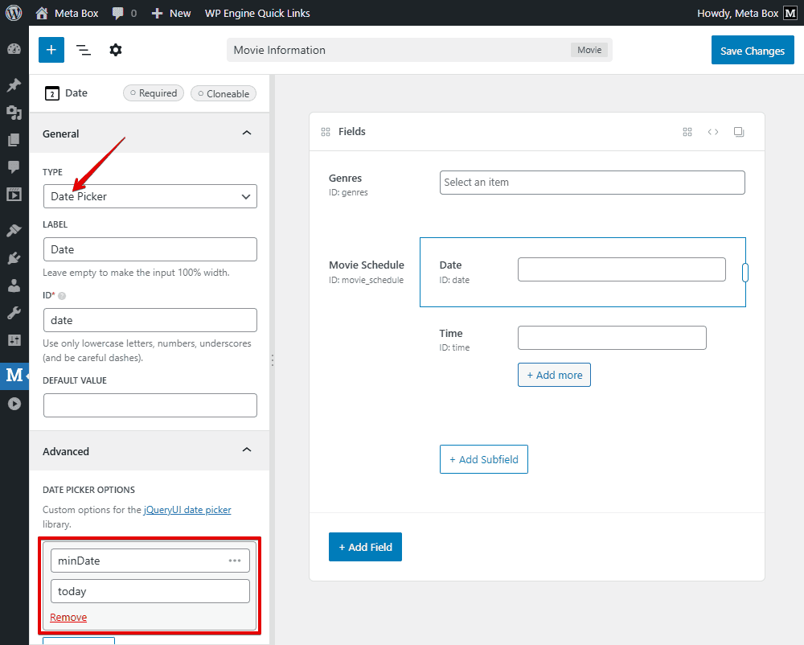

After that, select the **Time Picker** field for the time. Since each movie might have multiple showtimes on the same day, enable the **Cloneable** option for this field.


Once done, move to the **Settings** tab and set the **Location** as **Post Type**. Choose **Movies** to ensure that the custom fields appear only for movie posts.

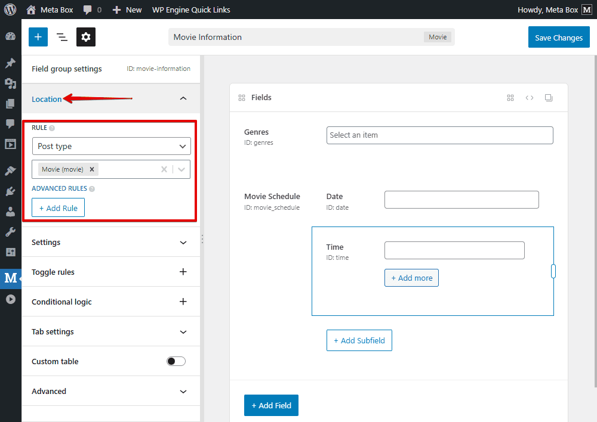

Now, you’ll see all the fields we’ve just created displayed under the post editor. You can now fill in movie details.


The movie schedules are now visible here in the admin dashboard.

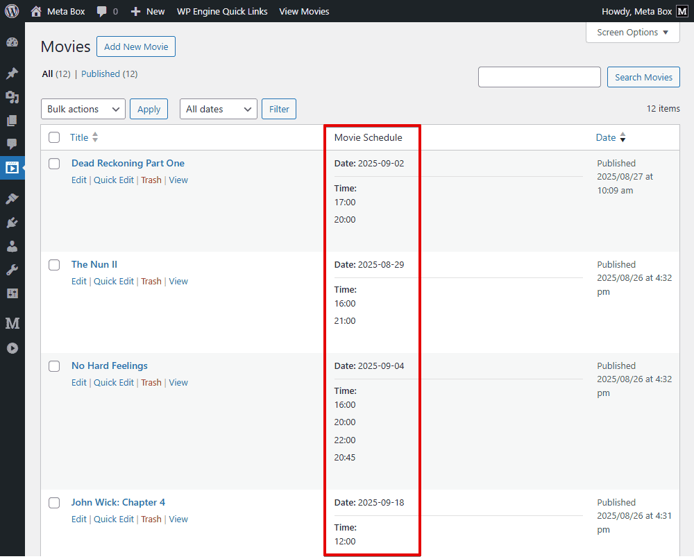

## Showing posts on the page

Before adding the date filter, we first need to make sure that the specific page can already display all the movies.

First, create a new page especially for the cinema schedule.

Next, go to **Meta Box** > **MB Views**, and create a new template specifically for this page.

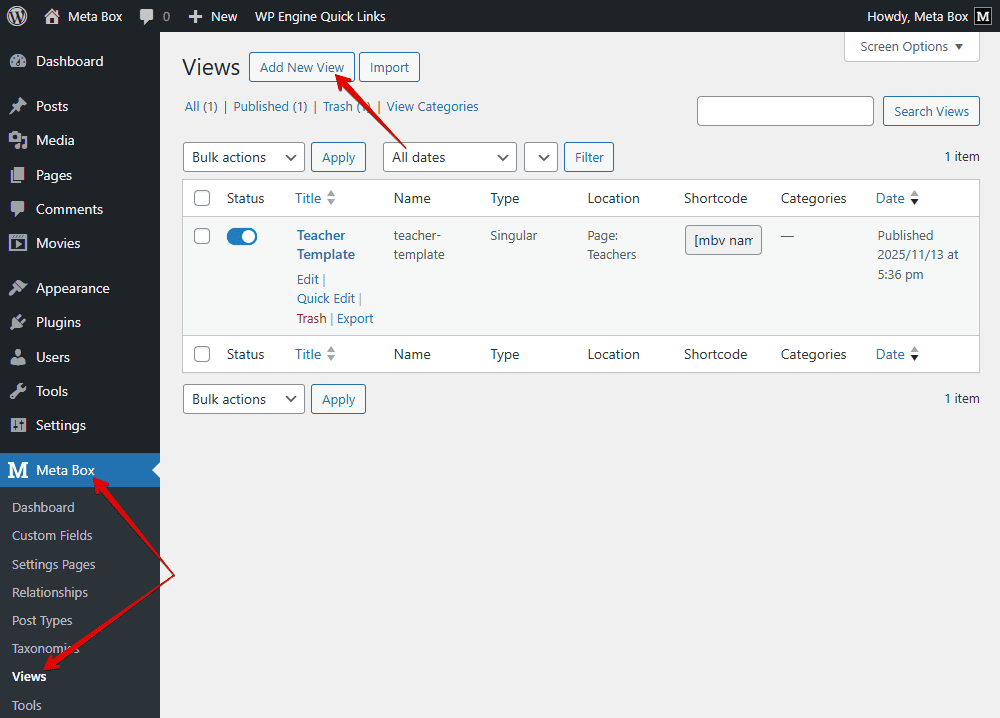

With **MB Views**, I get all movie posts by adding some code in the **Template** tab.

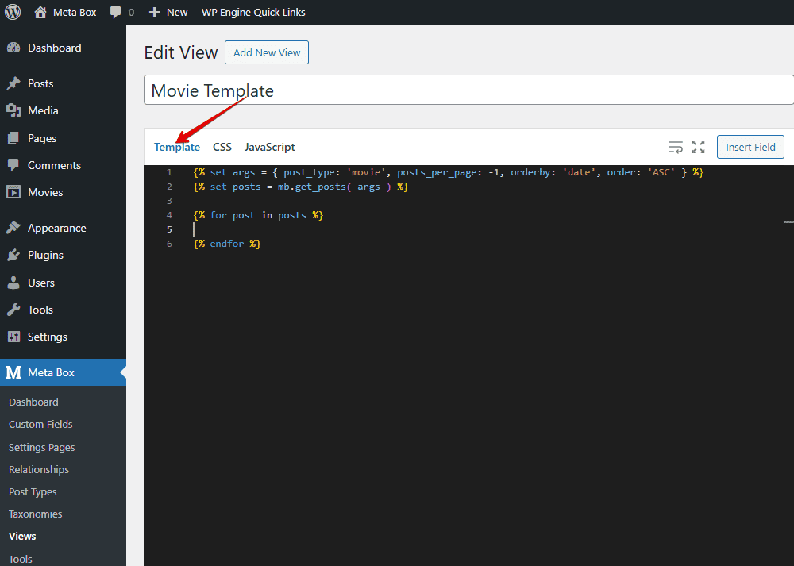

**In there**:

```

```

This whole line is used to query and display posts from a specific post type, sorted by publish date. Particularly, it declares that we’ll get posts from the post type with the `movie` slug. And, `posts_per_page: -1` helps fetch all posts in that post type. You can change the number to get the expected number of posts.

Then, I display each movie’s details, especially the date fields for later filtering. I simply click the **Insert Field** button and choose the fields I need.

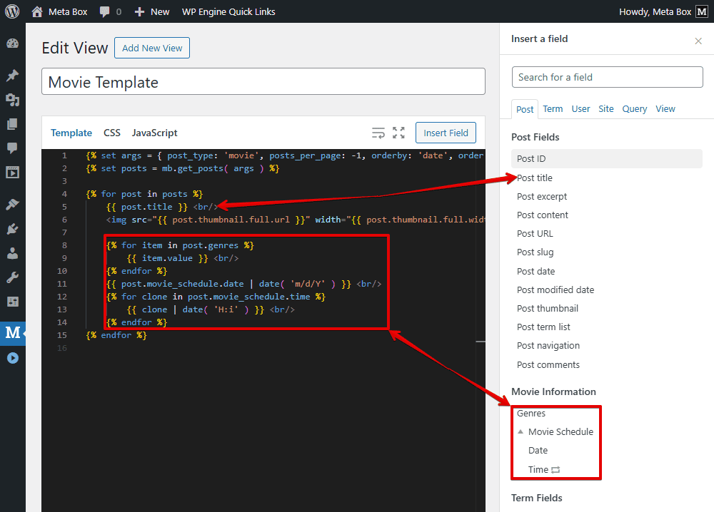
 
After inserting all the fields, move to the **Settings** section to set where this template will appear. Set the **Type** as **Page**, and choose the location as the page you created earlier for the movie listings.


On the frontend, view the page, and you’ll see all the movie information displayed. However, it appears as a basic list without any styling for now. To make it look more visually appealing, we need to apply some styling.


Back to the **Template** tab, add some div tags and classes for styling. And modify the code.

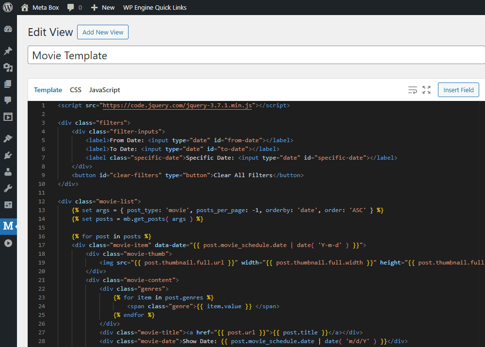

Move to the **CSS** tab to add some lines of code.

```css
.movie-list {
    display: grid;
    grid-template-columns: repeat(4, 1fr);
    gap: 35px 20px;
}

.movie-item {
    background: #fff;
    border-radius: 12px;
    overflow: hidden;
    box-shadow: 0 3px 10px rgba(0, 0, 0, .08);
    transition: transform .2s ease, box-shadow .2s ease;
    padding-bottom: 14px;
}

.movie-item:hover {
    transform: translateY(-3px);
    box-shadow: 0 6px 18px rgba(0, 0, 0, .12);
}

.movie-thumb {
    position: relative;
    width: 100%;
    aspect-ratio: 16/9;
    overflow: hidden;
    background: #eef1f4;
    border-bottom: 1px solid #eef2f7;
}

.movie-thumb img {
    position: absolute;
    inset: 0;
    width: 100%;
    height: 100%;
    object-fit: cover;
    display: block;
}

.movie-title {
    font-size: 18px;
    font-weight: 700;
    color: #213;
}

.movie-title a {
    text-decoration: none;
    color: #282828;
}

.genres {
    display: flex;
    flex-wrap: wrap;
    gap: 8px;
}

.genre {
    padding: 0px 10px;
    background: #e6e7e9;
    color: #213;
    font-size: 13px;
    font-weight: 500;
    border-radius: 6px;
}

.movie-content {
    padding: 20px 10px 0px;
    line-height: 2.0
}


.showtimes {
    display: flex;
    flex-wrap: wrap;
    gap: 10px;
    margin: 5px 0;
}

.showtime {
    padding: 0px 10px;
    border: 1px solid #ccc;
    border-radius: 8px;
    font-size: 12px;
    font-weight: 600;
    background: #d14141;
    color: #fff;
    cursor: pointer;
}

.movie-date {
    font-size: 15px;
    color: #32abb9;
    font-weight: 700;
}
```

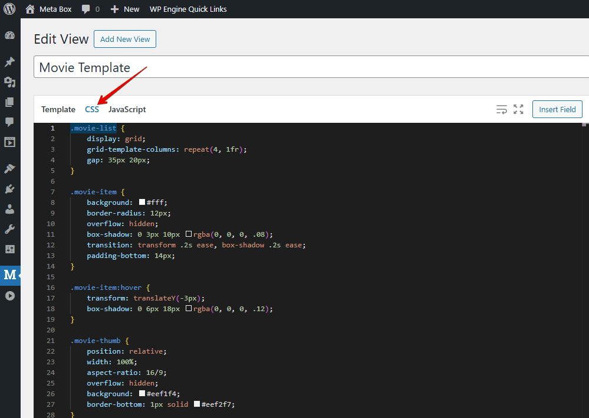

Now, the movie listings look much better. Let’s move on to creating the search box and adding the date filter.

## Filtering posts by date picker

Back to the template created by **MB Views**, let’s add some more code to display the search box and filter options for the movie listings.

```php
<div class="filters">
    <div class="filter-inputs">
        <label>From Date: <input type="date" id="from-date"></label>
        <label>To Date: <input type="date" id="to-date"></label>
        <label class="specific-date">Specific Date: <input type="date" id="specific-date"></label>
    </div>
    <button id="clear-filters" type="button">Clear All Filters</button>
</div>
```

**In there**:

```php
<label>From Date: <input type="date" id="from-date"></label>
<label>To Date: <input type="date" id="to-date"></label>
<label class="specific-date">Specific Date: <input type="date" id="specific-date"></label>
```

We add three date inputs: **From Date**, **To Date**, and **Specific Date**. They let users pick days directly from a calendar to filter the movies. For example, you can choose a range of days or just one specific day to see which movies are showing. Each input has an ID, so we can later handle them in JavaScript.

```php
<button id="clear-filters" type="button">Clear All Filters</button>
```

This line of code is to add the **Clear All Filters** button to reset the date filters with one click, so you can start a new search easily.

Turn to the CSS tab and add styles to make the search section look cleaner.

```css
.filters {
    border-radius: 12px;
    padding: 15px;
    background: #f1f1f180;
    display: flex;
    flex-direction: column;
    gap: 12px;
    margin: 20px 0 35px;
}

.filter-inputs {
    display: flex;
    gap: 16px;
    flex-wrap: wrap;
}

.filters label {
    display: flex;
    flex-direction: column;
    font-weight: 600;
    font-size: 16px;
    gap: 6px;
}

#clear-filters {
    align-self: flex-start;
    padding: 8px 16px;
    border: none;
    border-radius: 8px;
    background: #a3372c;
    color: #fff;
    font-weight: 600;
    font-size: 14px;
    cursor: pointer;
    transition: background 0.2s ease;
}

#clear-filters:hover {
    background: #81281e;
}

#clear-filters:active {
    background: #051325;
}

label.specific-date {
    margin-left: 150px;
}
```

It looks nice now, but we still need to make it work.

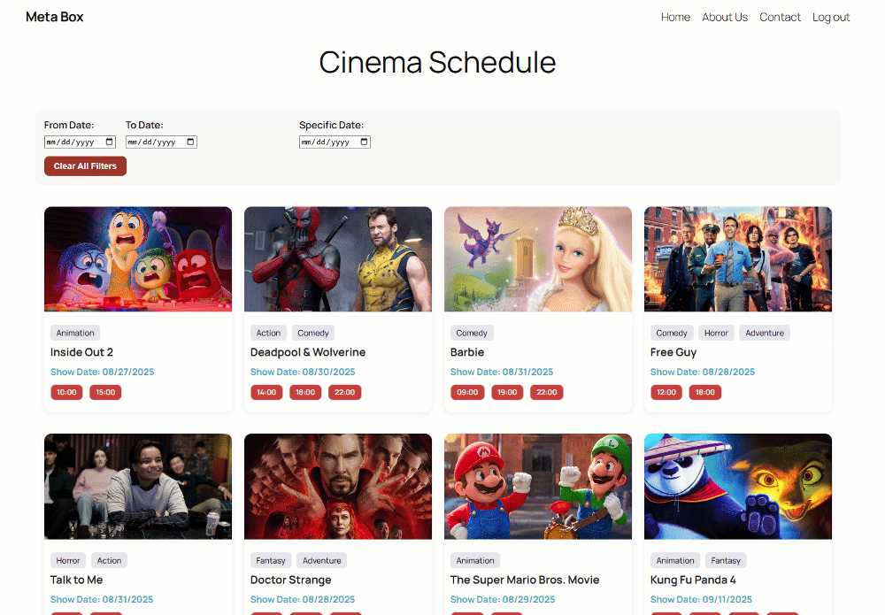

In the template again, add the line of code below to load the **jQuery** library to make it easier to write JavaScript for the filter later.

```php
<script src="https://code.jquery.com/jquery-3.7.1.min.js"></script>
```

And, I add the following code to assign the date field value in the ‘**Y-m-d**’ format to the data-date attribute. Since both the movie date and the date filter input return the same year-month-day format, it’s easy to compare them.

```php
<div class="movie-item" data-date="{{ post.movie_schedule.date | date( 'Y-m-d' ) }}">
```

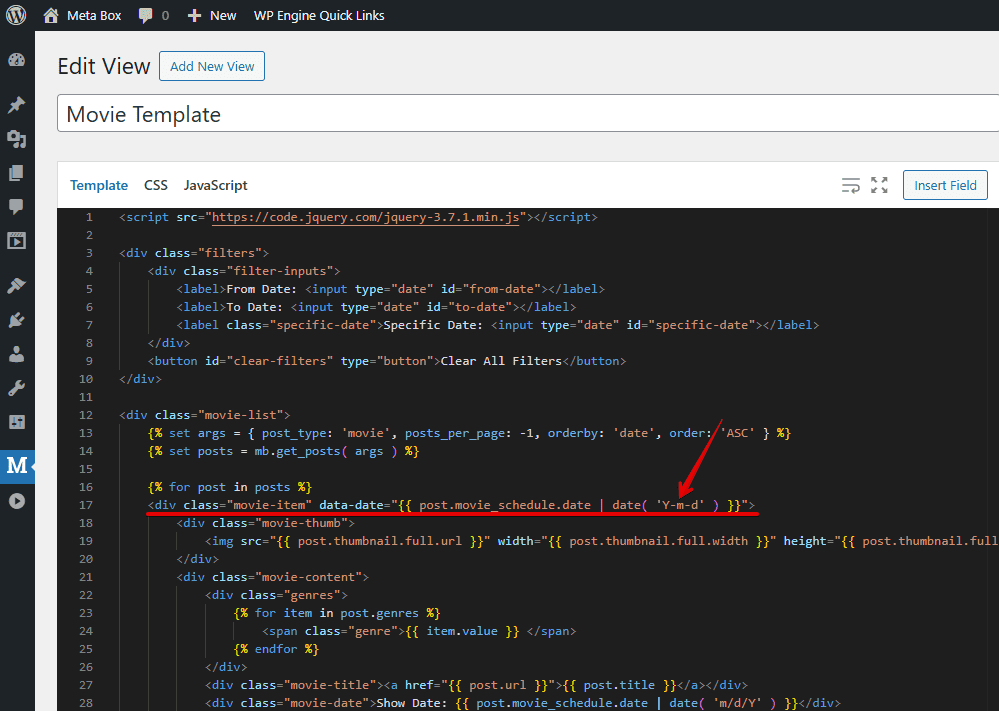

Now, switch to the **JavaScript** tab, add the main script to handle the filtering of the posts.

```js
jQuery(function ($) {
    var $from = $('#from-date');
    var $to = $('#to-date');
    var $spec = $('#specific-date');
    var $items = $('.movie-item');

    $from.on('change', function () {
        $spec.val('');

        if (this.value) {
            $to.attr('min', this.value);
        } else {
            $to.removeAttr('min');
        }

        applyFilter();
    });

    $to.on('change', function () {
        $spec.val('');
        if (this.value) {
            $from.attr('max', this.value);
        } else {
            $from.removeAttr('max');
        }
        applyFilter();
    });

    $spec.on('change', function () {
        $from.val('').removeAttr('max');
        $to.val('').removeAttr('min');
        applyFilter();
    });

    $('#clear-filters').on('click', function (e) {
        e.preventDefault();

        $from.val('').removeAttr('max');
        $to.val('').removeAttr('min');
        $spec.val('');
        $items.show();
    });

    function applyFilter() {
        var from = $from.val();
        var to = $to.val();
        var spec = $spec.val();

        $items.each(function () {
            var d = $(this).data('date');
            var show = true;

            if (spec) {
                show = (d === spec);
            } else {
                if (from) {
                    if (d < from) {
                        show = false;
                    }
                }
                if (to) {
                    if (d > to) {
                        show = false;
                    }
                }
            }

            $(this).toggle(show);
        });
    }
});
```


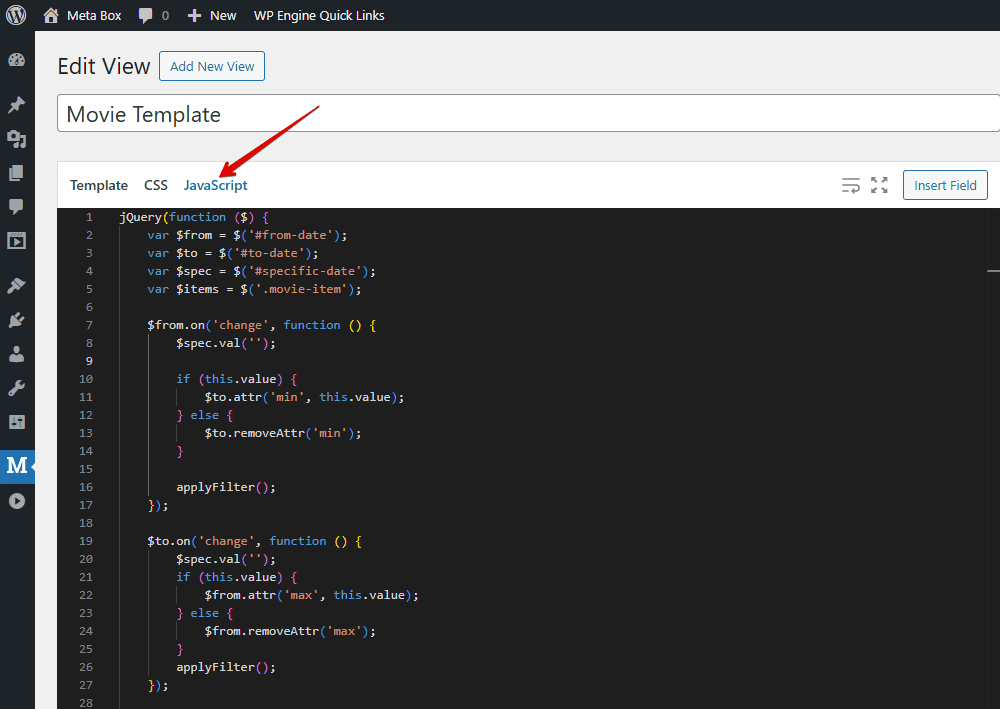

Go through it in more detail.

```js
var $from = $('#from-date');
var $to = $('#to-date');
var $spec = $('#specific-date');
var $items = $('.movie-item');
```

This part initializes variables for selecting the start date, end date, specific date, and all post items.

```js
$from.on('change', function () {
    $spec.val('');

    if (this.value) {
        $to.attr('min', this.value);
    } else {
        $to.removeAttr('min');
    }

    applyFilter();
});
```

When the user picks a start date, the specific date field is automatically cleared. Then, the end date input is limited; you can’t choose a date earlier than the start date. If the start date is cleared, that restriction is removed. And finally, the script calls the `applyFilter()` function to update the filtered movie list.

As the user picks a to-date, it does the same as before. Just the reverse of the from-date logic. It clears the specific date and adjusts the date limit.

```js
$to.on('change', function () {
    $spec.val('');
    if (this.value) {
        $from.attr('max', this.value);
    } else {
        $from.removeAttr('max');
    }
    applyFilter();
});
```

If a specific date is chosen instead, it clears both the start and end dates, removes any date limits, and then calls the created function to update the results.

```js
$spec.on('change', function () {
    $from.val('').removeAttr('max');
    $to.val('').removeAttr('min');
    applyFilter();
});
```
When the user clicks “Clear All Filters,” it resets all date selections to default, removes any date limits, and shows all posts again, just like before filtering.

```js
$('#clear-filters').on('click', function (e) {
    e.preventDefault();

    $from.val('').removeAttr('max');
    $to.val('').removeAttr('min');
    $spec.val('');
    $items.show();
});
```

At this point, the script below retrieves the current values of the start, end, and specific date fields so it knows which filters are active.

```js
var from = $from.val();
var to = $to.val();
var spec = $spec.val();
```
We use `$items.each(function () {}` loops through each post item to check one by one whether the post should be visible based on the selected dates.

We get the date value from the post’s data-date attribute.

```js
var d = $(this).data('date');
```

This gives JavaScript the exact date of each post to compare with the selected filters.

`var show = true;` is to set a variable to indicate that each post is visible by default.

If a specific date is chosen, only posts with the same date are shown. Otherwise, if the post’s date is earlier than the start date, it’s hidden. Similarly, if the post’s date is later than the end date, it’s also hidden.

```js
if (spec) {
    show = (d === spec);
} else {
    if (from) {
        if (d < from) {
            show = false;
        }
    }
    if (to) {
        if (d > to) {
            show = false;
        }
    }
}
```

After these checks, the last script updates the display, showing posts that meet the filter conditions and hiding those that don’t.

```js
$(this).toggle(show);
```

That's all for the code, you can refer it [here](https://github.com/wpmetabox/tutorials/tree/master/filter-posts-by-date-picker).

On the frontend, pick the date you want to filter, and then only the movies on that date will be returned and displayed on the page.


You can also refer to other Meta Box filtering tutorials, such as [filtering by taxonomy](https://metabox.io/filter-posts-by-taxonomy-mb-views/), [relationships](https://metabox.io/filter-posts-by-relationshipd-mb-views/), or multiple conditions to build more advanced and flexible search experiences.
Happy building with Meta Box!

