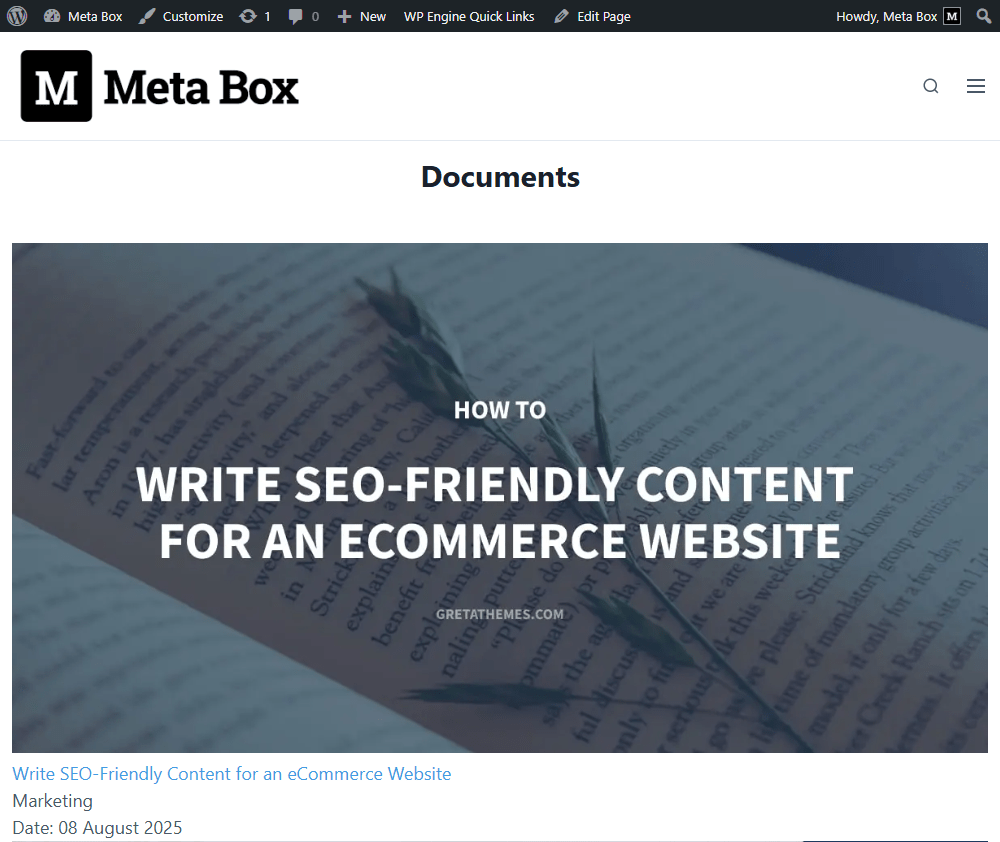

import LiteYouTubeEmbed from 'react-lite-youtube-embed';
import 'react-lite-youtube-embed/dist/LiteYouTubeEmbed.css';

Filtering and displaying posts based on certain criteria is one of the most common functionalities every website needs. And today, let me show you another method: **filtering by relationship**. We’ll do it with the help of **MB Views** from **Meta Box**.

For demonstration purposes, I’ll build an internal company portal with training documents. When employees in different departments log in, they should only see the documents assigned to their department.


## Video version

<LiteYouTubeEmbed id='Wuab_QbG7aE' />

## Preparation

The key idea is that access control relies on conditional display. In this tutorial, we’ll use the default WordPress Posts for the learning materials, and a separate custom post type for Departments. Each post will connect to one or more departments using a Meta Box relationship. To add the user to a department, I use a custom field for the user.

So, you just need [**Meta Box AIO**](https://metabox.io/aio/). It gives you a framework and all the necessary extensions in one package without having to install each separately, specifically:

* [MB Admin Columns](https://metabox.io/plugins/mb-admin-columns/): to display related information neatly in the admin panel;
* [MB Custom Post Type](https://metabox.io/plugins/custom-post-type/): to create the custom post type for departments;
* [MB Relationships](https://metabox.io/plugins/mb-user-meta/): to create the relationship between material posts and departments;
* [MB User Meta](https://metabox.io/plugins/mb-user-meta/): to add the custom field for selecting a work department in each user profile;
* [MB Views](https://metabox.io/plugins/mb-views/): to create the template for displaying the posts belonging to the logged-in user’s department only;
* [MB Builder](https://metabox.io/plugins/meta-box-builder/): to visually create the custom field for the user without writing code.

Now, let’s go step by step.

## 1. Creating a custom post type

Go to **Meta Box** > **Post Types** to create a new custom post type for the Departments.


After publishing, you’ll see the created custom post type in the menu.


You can see some departments I created as posts here.

## 2. Creating the relationship

Since we want to show documentation based on the department, we need to create a relationship between them. 

Go to **Meta Box** > **Relationships** to create a new one.


In the interface of MB Relationships, there are the **From** and **To** sections. Setting them up is the same.
 
Because we’re setting the relationship between the default post and a custom post type, set the **Object Type** as **Post** in both sections.


The relationship is bidirectional, which means it doesn’t matter which side you set up first, data will be linked both ways. For instance, in the **From** section, I set the **Posts** as default posts, and the rest will be `department` post type. 


If you want to show which departments are related to learning material and vice versa, just check the setting of the admin column as below: 


After publishing, go to the post editor, you can see a relationship section on the right panel. Absolutely, you can connect it to more than one department.


In the admin dashboard, there is an additional column that shows the relationship we set.

## 3. Creating a custom field for the users

To define a specific department for each user, we’ll use user meta, it means adding a custom field for the user.

Navigate to **Meta Box** > **Custom Fields** and create a new field group.


We already have departments as posts of the created post type. So, add a **Post** field. 


Then, in the **Post types** option, select the exact post type. This will allow us to assign the correct department to each user.


For better usability, you can also enable **Show as an admin column** to display the user’s department directly in the user list. Its functionality is the same as the admin column in the creating relationship above.


Next, switch to the **Settings** panel and set the **Location** to **User**. As a result, the field will appear in the user profile editing screen.


After publishing, open any user profile editor, and you’ll see the created field. Simply select the department to assign the user to it.


At this point, every user is now placed into their respective department.

## 4. Showing all posts on the page

We’ll display all the documentation on an archive page first. Then, adding a filter to show only those from a specific department will be done later.

We need to have a new page that contains all the posts.


Now, I’ll use MB Views to create a template for displaying documentation.

Navigate to **Meta Box** > **Views**, and create a new one.


In the **Template** tab, let’s add code or insert fields to show posts and their details. This is already quite familiar in many of our tutorials. At the beginning, I add this code:

```




    
    

```


**In there**:

* ``: is to declare that we’ll get posts on the site through the post slug. If you want to get posts from a custom post type, just change that slug.
* `mb.get_posts`: is a Meta Box function to get the post.
* `...`: is a loop to display all of posts since there are various posts.
* `post-to-department`: the ID of the relationship. The whole of code is used to retrieve the post from the `department` post type that is connected to the recent post through the post ID.
* `related_departments`: the attribute that stores all the retrieved departments.

Then, also in the loop, I use the **Insert Field** button get and display material information. Just click on the field from the drop-down list on the right panel.


MB Views also supports you in choosing the size or output of some special fields. A documentation can be assigned to more than one department. So, I have a nested loop here for the variable we have had. I just get the department name, I mean the post title. And this is my template after inserting fields:


Then, move down to the **Settings** section to apply this template for the page that we created before. I set the **Type** as **Singular**, then, choose the page.


Now, view the page on the frontend, you can see all the data is displayed, including the department.



To make the page more beautiful, go back to the template and add some `**div**` tags and classes. 


Then, move to the CSS tab to add some code for styling. 


This is the new look of the page I have. 


You can click on a post to read its content.

## 5. Filtering posts by relationships

Our aim is only showing posts that belong to the logged-in user’s department. I’m still the template that was created in the previous step and add some code.

```

    
        
            
            
                
                    
                
            
        
            
        
```


Specifically, I use `mb.is_user_logged_in()` function that checks whether the current user is logged in. Then, we check whether the user has a department value to run the code below. Because in the case that the user logged in, but doesn’t have a department, such as admin or founder, he can see all the posts of departments.

In the case that the user is assigned to a specific department, the department title will be get and stored in the `user_dept_name` variable.

Next, I compare the user’s department with the post’s related departments. If they are matches, the documentation will be shown. It means the post will only be shown if the user belongs to the same department.

That’s done.

Now, let’s check it on the frontend. It works well.


