import LiteYouTubeEmbed from 'react-lite-youtube-embed';
import 'react-lite-youtube-embed/dist/LiteYouTubeEmbed.css';

In this part of the “**filtering posts by custom taxonomy**” series, we’ll do it using the **MB Views** extension from **Meta Box**.

This is a common need for many industries, especially online travel agencies (OTAs), where users often filter hotels by location to find what they need faster.

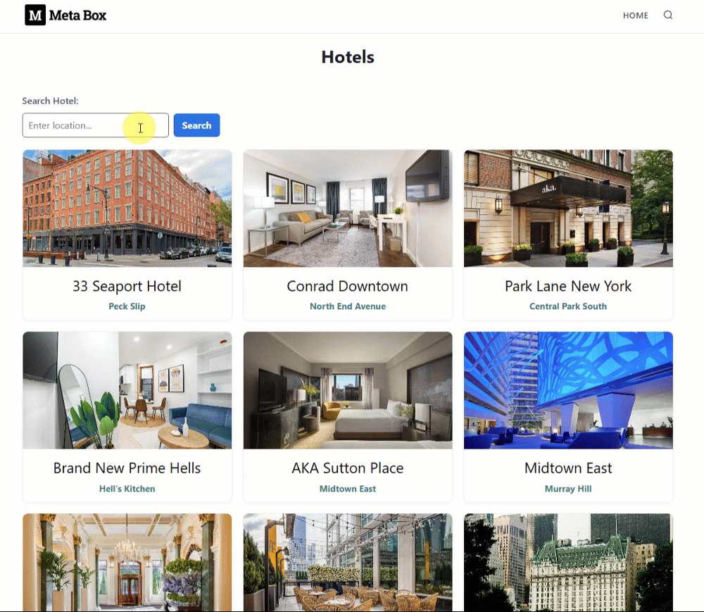

## Video version

<LiteYouTubeEmbed id='y7zFANsPYTM'/>

## Preparation

First of all, I recommend using [Meta Box AlO](https://metabox.io/aio/), which includes the framework and all extensions. Such as:

* [MB Admin Columns](https://metabox.io/plugins/mb-admin-columns/): to add a column in the dashboard to display each hotel’s location;
* [MB Custom Post Type](https://metabox.io/plugins/custom-post-type/): to create a custom post type for hotels and a custom taxonomy for locations;
* [MB Views](https://metabox.io/plugins/mb-views/): to create a template for the archive page, where you can add functionality to filter posts by taxonomy.

## 1. Creating a new custom post type and a custom taxonomy

Now, go to **Meta Box** > **Post Types** to create a new custom post type for the hotels.


After publishing, you’ll see the created custom post type in the menu dashboard.

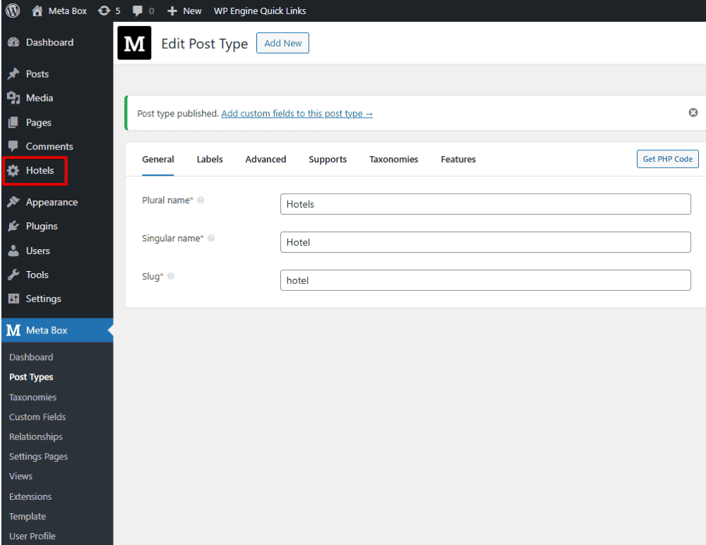

Next, still in the Meta Box screen, create a new taxonomy for location information.

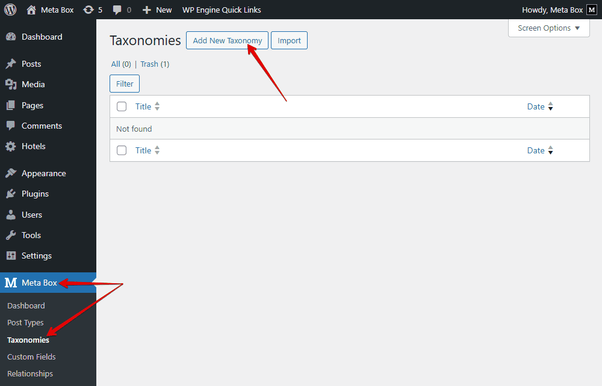

In the **Advanced** tab, pay attention to this setting. It’s available when you activate the [MB Admin Columns](https://metabox.io/plugins/mb-admin-columns/) extension. It’s optional, so I did not mention it before. When you check it, there’ll be a column in the dashboard to show the hotel’s location so that you can compare the results conveniently.


Move to the **Post Types** tab, and choose the Hotel to assign the custom taxonomy that we’ve created to that post type.

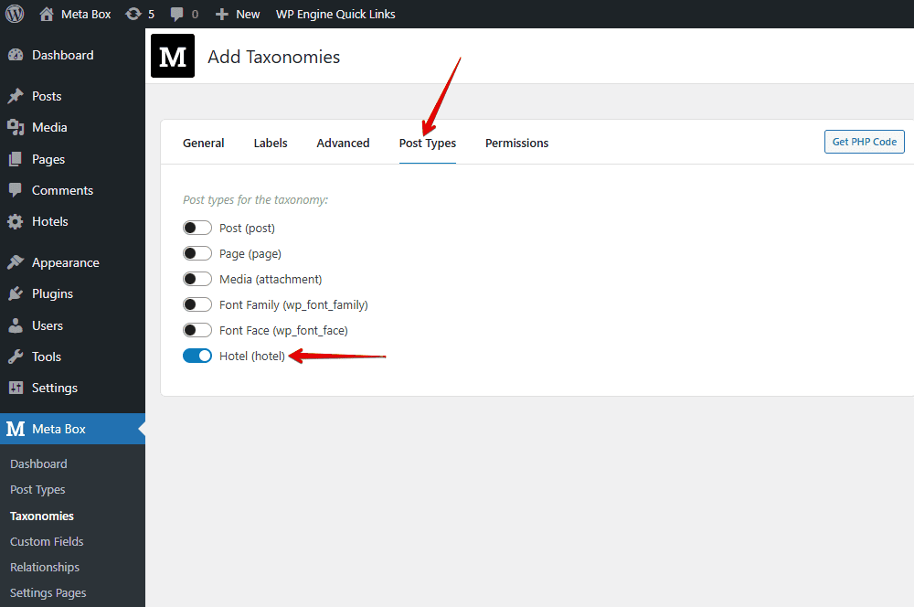

Now, in the post editor of the **Hotel** post type, we’ll see the taxonomy section, where we can enter the hotel location.


Just fill in all the information.

These are some created posts, for example. The location as well as the taxonomy also display in the admin dashboard.


**Note**: I just entered a few sample locations as an example. In reality, you’ll probably have a large set of location data across multiple levels, such as countries, provinces, cities, or regions. That time, instead of adding them manually, you should import the data directly into the Location taxonomy to save time. You can use plugins to easily import data.

## 2. Creating a search box for searching posts by taxonomy

Before creating a search box, we need to make sure that the archive page can already display all the posts; I mean all the hotels.

First, go to **Meta Box** > **MB Views**, and create a new template specifically for this purpose.

With **MB Views**, you can insert fields into it by clicking the **Insert Field** button, then choosing any fields on the right sidebar to get data from them, or by adding some lines of code directly to the **Template** tab.


```




    {{ post.title }} <br/>
     <br/>
    
    
        
            {{ term.name }} <br/>
        
    

```

We’ll go through it for more detail!

```

```

This whole line is used to query and display posts from a specific post type, sorted by publish date. Particularly, it declares that we’ll get posts from the post type with the `hotel` slug. And,  `posts_per_page: -1` helps fetch all posts of that post type. You can change the number to get the expected number of posts.

The `mb.get_posts` function gets the posts.

Since we have multiple posts, use a loop to display all of them.

```

…..

```
For displaying the hotel's information, just click the button I mentioned earlier, insert fields inside the loop. For example, choose **Post title** to show the hotel name.

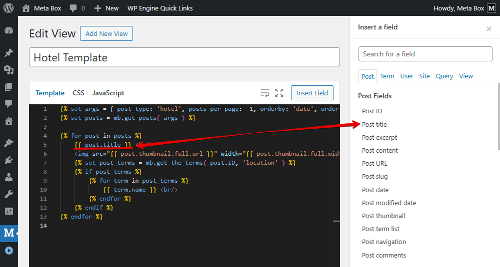

To show the hotel image, find **Post thumbnail** in the list. You also can set the output of it.

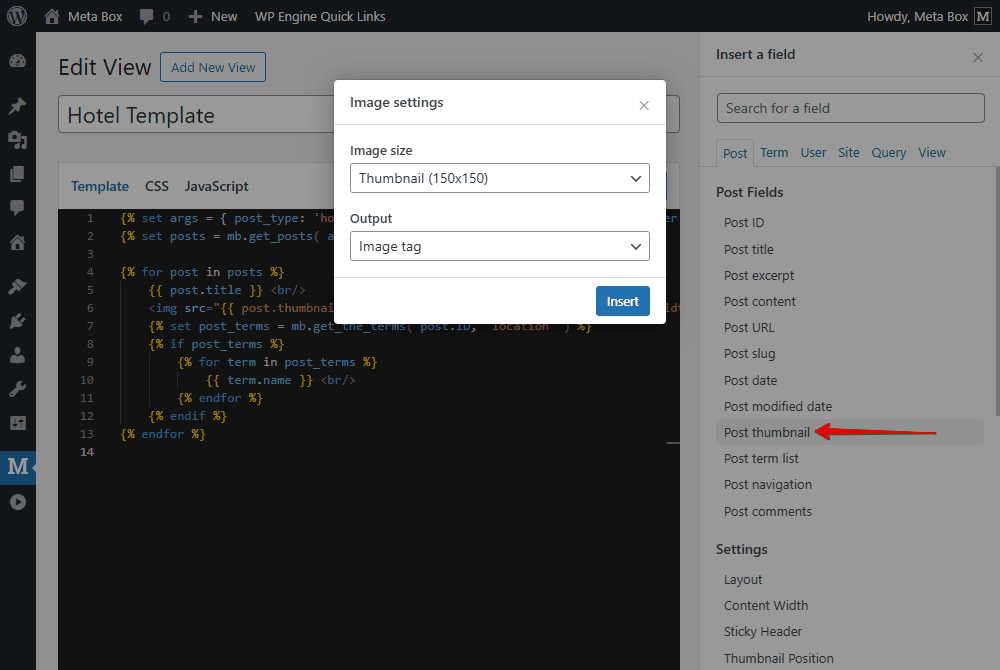
 
The next line is to get all the **location terms** assigned to the current post.

```

```

This line below checks if the `post_terms` variable has any value or not.

```

```

We start a loop to go through each term inside. And insert the term name from the right sidebar, which means the display name of each taxonomy term.

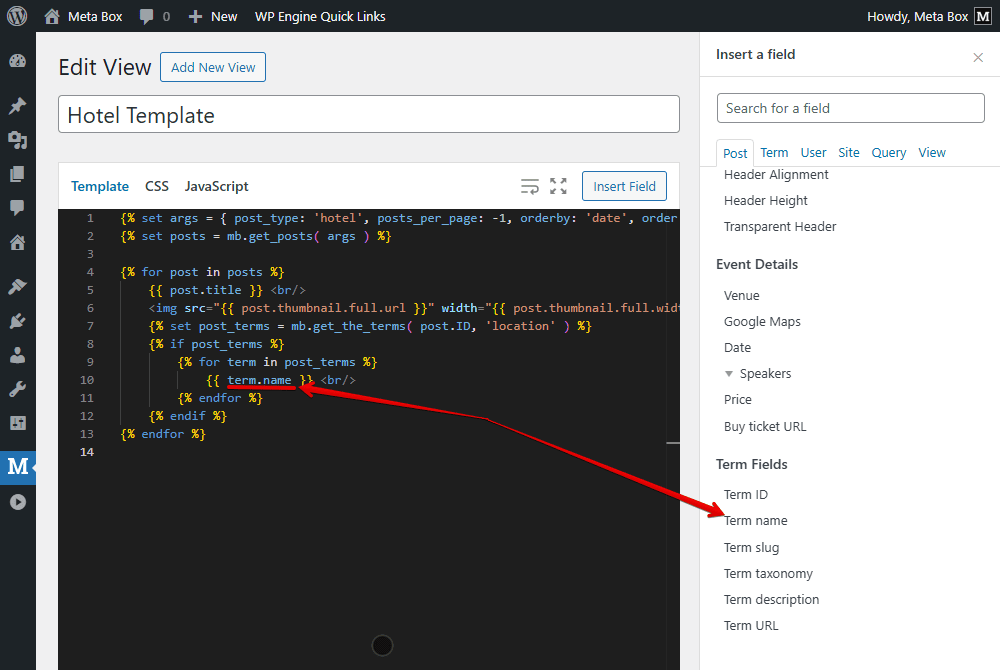

After inserting all the fields, move to the **Settings** section to set where this template will appear. Set the **Type** as **Archive**, and choose the location as the archive you created earlier for the hotel listings.

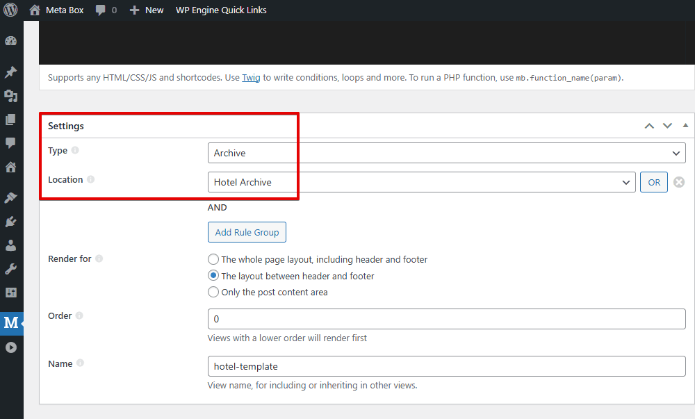

On the frontend, you’ll see all the hotel information displayed. However, it appears as a basic list without any styling for now.


To make it look more visually appealing, we need to apply some styling. Back to the **Template** tab, add some div tags and classes for styling, and modify the code.

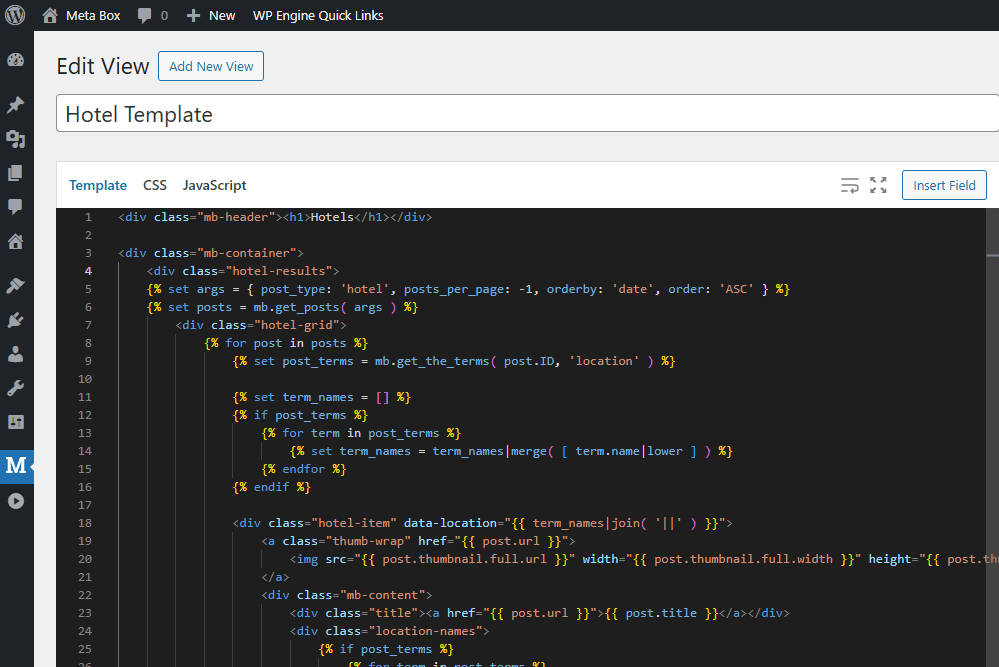

And move to the **CSS** tab to add some lines of code.

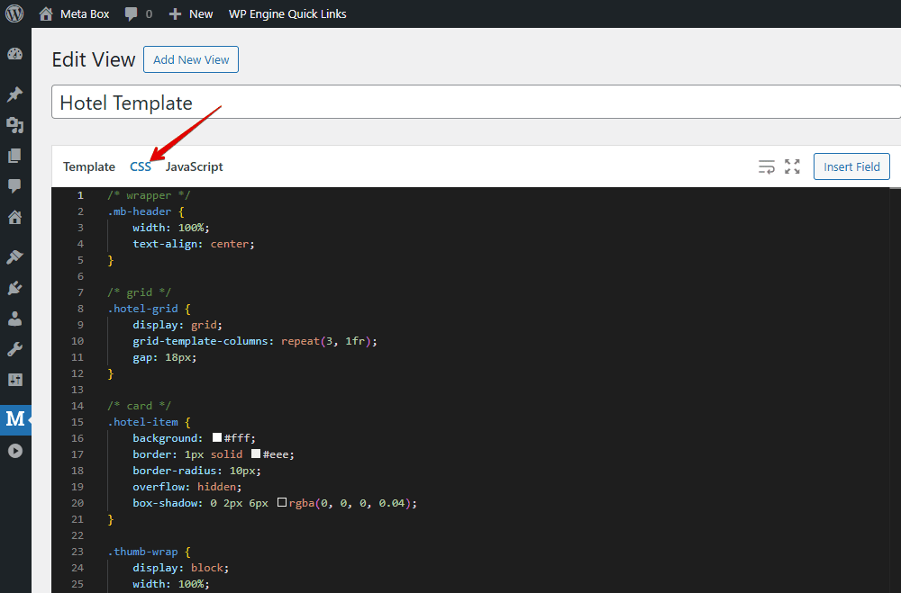

Now, the hotel listings look much better.

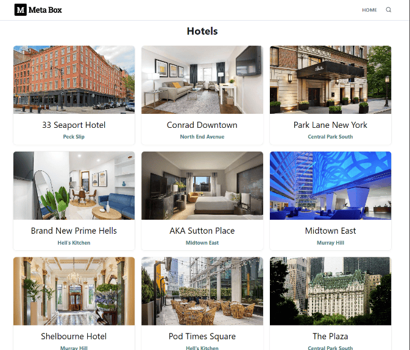

Let’s move on to creating the search box and adding its functionality.

## 3. Customizing filter for searching posts by taxonomy

Back to the template created by **MB Views**, let’s add some code to display the search box and filter options for the hotel listings.

```
<script src="https://code.jquery.com/jquery-3.7.1.min.js"></script>
```
This first script loads jQuery to handle events and dynamically update the HTML content.

Then, use these following codes to create a search box where users can type keywords and filter hotel listings in real time. This includes an input box for location, a suggestion dropdown, and a search button that filters hotels by the selected location.

```
<div class="hotel-input-wrap">
            <input type="text" id="location" placeholder="Enter location..." />
            <ul id="suggestions" class="suggestions" style="display: none;"></ul>
            <button class="filter-action">Search</button>
 </div>
```
Turn to the **CSS** tab and add styles to make the search section look cleaner.

```
/* filter */
.hotel-filter {
    margin: 20px 0;
    display: flex;
    flex-direction: column;
    gap: 5px;
}

.hotel-label {
    font-weight: 600;
    margin-bottom: 4px;
}

.hotel-input-wrap {
    display: flex;
    gap: 8px;
    align-items: center;
    position: relative;
}

#location {
    flex: 1;
    padding: 8px 10px;
    border: 1px solid #646464;
    border-radius: 6px;
    max-width: 250px;
}

.filter-action {
    padding: 8px 15px;
    background: #0b74de;
    color: #fff;
    border: 0;
    border-radius: 6px;
    cursor: pointer;
}


.suggestions {
    position: absolute;
    top: 100%;
    left: 0;
    right: auto;
    width: calc(100% - 90px);
    background: #fff;
    border: 1px solid #e0e0e0;
    box-shadow: 0 6px 18px rgba(0, 0, 0, .06);
    z-index: 9999;
    list-style: none;
    padding: 0;
    overflow: auto;
    max-height: 220px;
    max-width: 250px;
}

.suggestions li {
    padding: 8px 10px;
    cursor: pointer;
}

.suggestions li:hover {
    background: #f5f7fb;
}
```

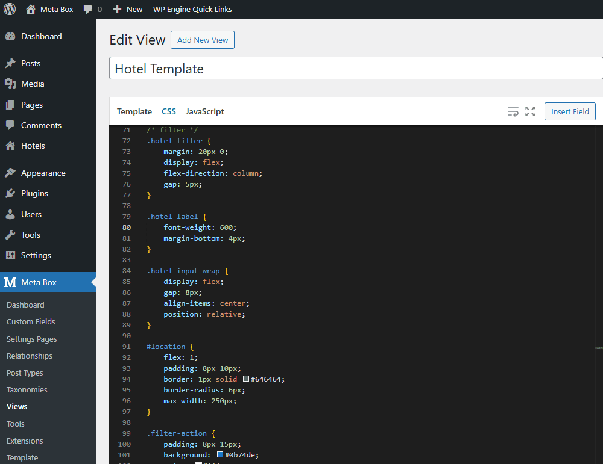

Now, we still need to make the filter work.

In the template again, add the line of code to create an empty array.
```

```
This array will collect all location taxonomy names from the post, convert them to lowercase, and store them in that array.
```

                    
                        
                    

```
It’s later used to add a `data-location` attribute for easier JS filtering.
The following code creates a hidden list of all locations, which is used for the autocomplete feature in the search box. When users start typing a location, JavaScript suggests matching ones.

```
<ul id="location-data" style="display: none;">
    
        <li data-id="{{ term.term_id }}">{{ term.name }}</li>
    
</ul>
```

Now, switch to the **JavaScript** tab, add the main script to handle the filtering of the posts.

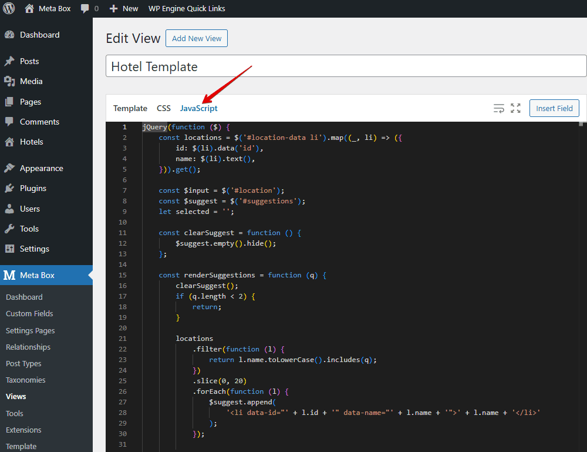

Go through it in more detail.

```
const locations = $('#location-data li').map((_, li) => ({
        id: $(li).data('id'),
        name: $(li).text(),
 })).get();
```
This part retrieves all the location items from the hidden HTML list and stores them as an array of location IDs and names.

```
const $input = $('#location');
const $suggest = $('#suggestions');
let selected = '';
```

We declare variables for the search input, the suggestion list, and the selected location.

```
const clearSuggest = function () {
        $suggest.empty().hide();
};
```
This function clears all list items and hides the suggestion box.
The following code checks if the user’s input has at least two characters. If not, it stops.
Otherwise, it filters the locations whose names include the input text, shows up to 20 results, and displays them in the suggestion box.

```
const renderSuggestions = function (q) {
        clearSuggest();
        if (q.length < 2) {
            return;
        }

        locations
            .filter(function (l) {
                return l.name.toLowerCase().includes(q);
            })
            .slice(0, 20)
            .forEach(function (l) {
                $suggest.append(
                    '<li data-id="' + l.id + '" data-name="' + l.name + '">' + l.name + '</li>'
                );
            });

        if ($suggest.children().length) {
            $suggest.show();
        }
 };
```

This function below goes through all elements with the `.hotel-item` class and gets their `data-location` attribute. If the text entered matches one of these locations, the hotel is shown; otherwise, it’s hidden.

```
const filterHotels = function (filter) {
        $('.hotel-item').each(function (_, el) {
            const loc = ($(el).data('location') || '').toLowerCase();
            $(el).toggle(loc.includes(filter));
        });
};
```

This is the main filtering logic; it controls which hotels are visible based on the selected or typed location.

As the user types, it clears the previous selection and refreshes the suggestions instantly.

```
$input.on('input', function () {
        selected = '';
        renderSuggestions($input.val().trim().toLowerCase());
});
```

When a user clicks on one of the suggested locations, that location’s name is filled into the input box, and the suggestions list disappears.

```
$suggest.on('click', 'li', function (e) {
        const name = $(e.currentTarget).data('name');
        selected = name.toLowerCase();
        $input.val(name);
        clearSuggest();
});
```

If the user clicks anywhere outside the input box or the suggestion list, the suggestion box is cleared and hidden.

```
$(document).on('click', function (e) {
        if (!$(e.target).closest('#location, #suggestions').length) {
            clearSuggest();
        }
});
```

After clicking the **Search** button, the code takes the selected location and shows matching hotels.

```
$(document).on('click', function (e) {
        if (!$(e.target).closest('#location, #suggestions').length) {
            clearSuggest();
        }
});
```

Finally, if the user presses Enter, it works the same as clicking the Search button. It stops the form from submitting and clears the suggestions.

```
$input.on('keydown', function (e) {
        if (e.key === 'Enter') {
            e.preventDefault();
            $('.filter-action').trigger('click');
            clearSuggest();
        }
});
```
That’s all for the code. You can refer to the [GitHub](https://github.com/wpmetabox/tutorials/tree/master/searching-posts-by-taxonomy-with-mb-views) repository for more details.

On the frontend, enter a location in the **Search** box, then only the hotels in that location will be returned and displayed on the page.


You might also like these tutorials about [creating a simple listing](https://docs.metabox.io/tutorials/create-simple-listing-meta-box-bricks/), [filtering posts by custom taxonomies](https://docs.metabox.io/tutorials/filter-posts-by-custom-fields-taxonomies/).
