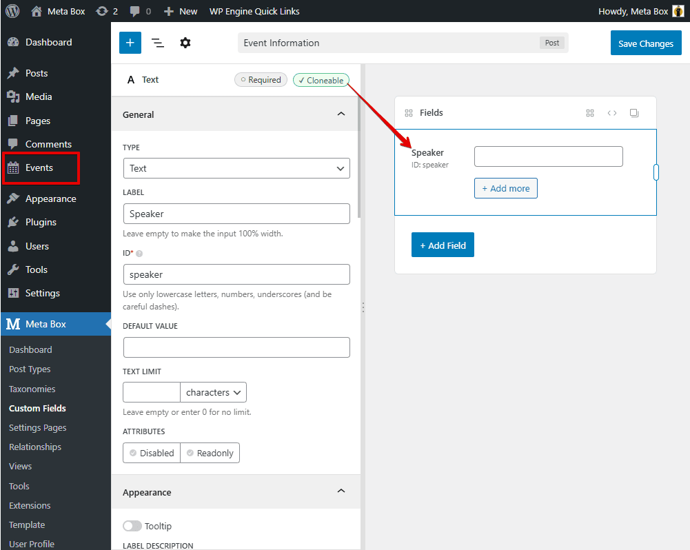
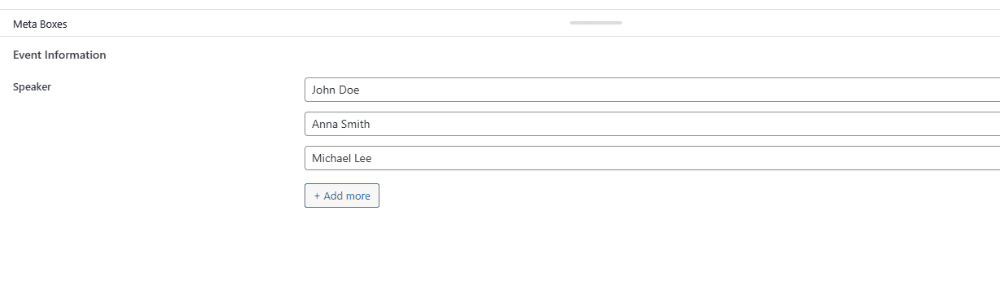
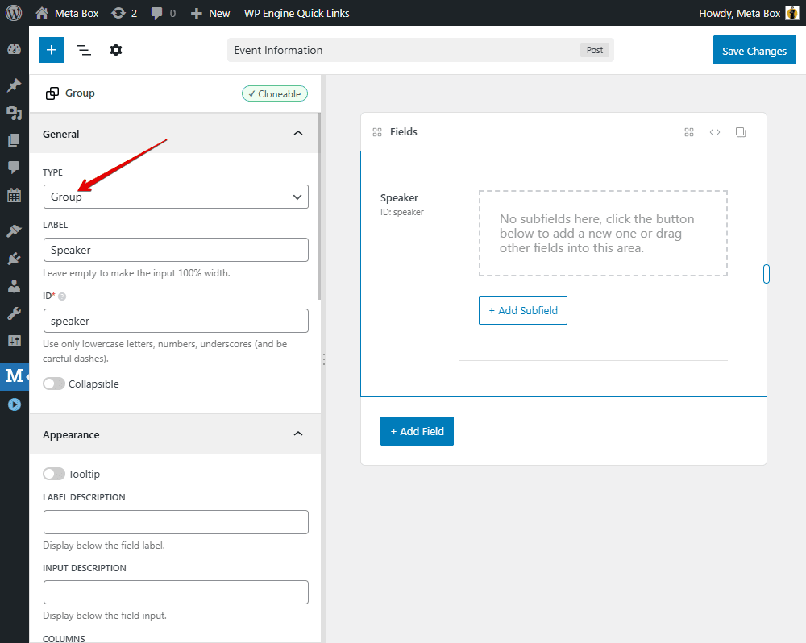
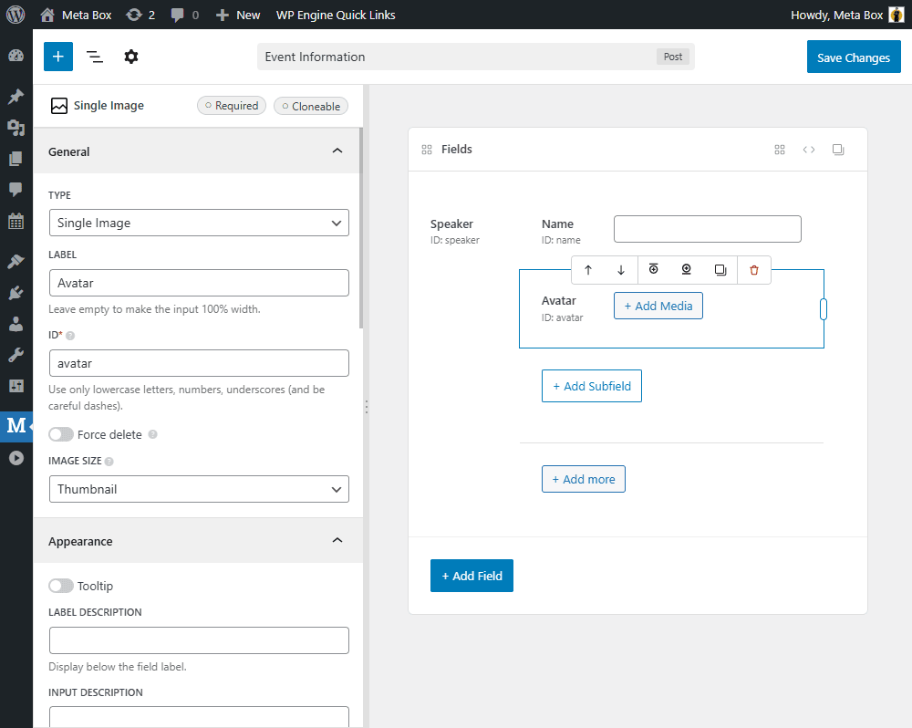
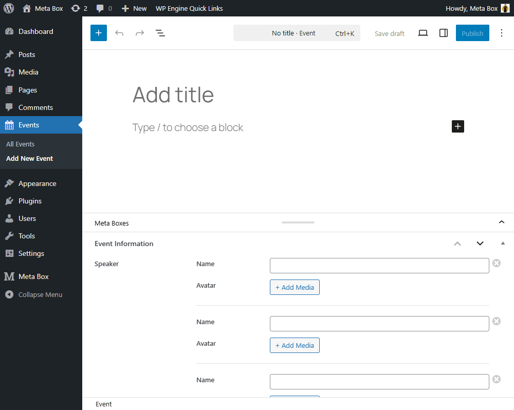
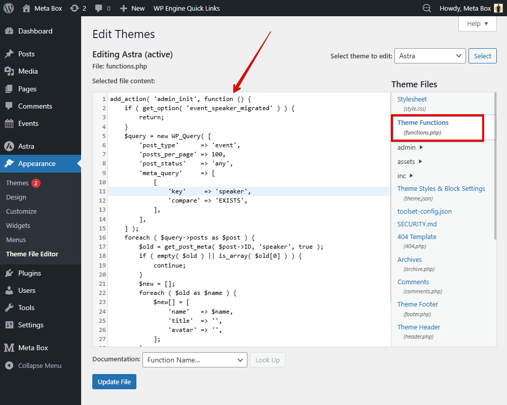
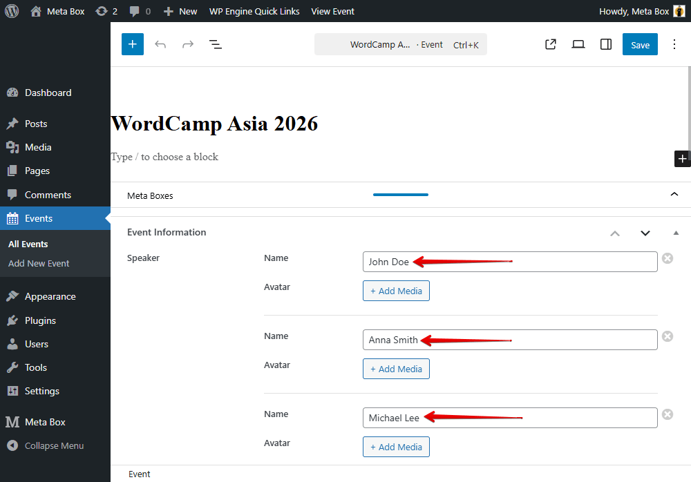

import LiteYouTubeEmbed from 'react-lite-youtube-embed';
import 'react-lite-youtube-embed/dist/LiteYouTubeEmbed.css';

Learn how to safely migrate existing data when switching from cloneable fields to a Group field in Meta Box, so you can upgrade to a more structured setup without losing any information.


result

## Video version

<LiteYouTubeEmbed id='msFfc_2sktg' />

## Preparation
For this guide, we naturally use Meta Box to create custom fields and a post type. Since the goal is to switch the field to a group structure, some premium Meta Box extensions are required. For convenience, we recommend using Meta Box AlO, which includes the framework and all extensions.
In this case, I already have a custom post type called Events, along with a custom field created for it. The field is currently set as cloneable to add multiple speakers.



Fill in the information in post editor.



Now, convert it to a group field type to store multiple related pieces of information.

## Migrating data from cloneable fields to groups

In real-world scenarios, you may need to group related information to create a better structure. Instead of storing only the speaker name, I also want to add another piece of information, for example, an avatar.

So now, go back to the field editor and change the standalone cloneable field to a Group field.



Then, add subfields you need. The most important subfield is the one that stores the speaker name because we’ll migrate the data from the old cloneable field into this new Group structure. And also add a field to store the speaker’s avatar.



In the old post editor, you'll see that the Group field appears correctly. However, the speaker names we previously entered are no longer displayed. But again, the data is still in the database.



So instead of re-entering everything manually, we’ll reconnect the data using a small piece of code. Go to the theme file editor and add the following code:



```
add_action( 'admin_init', function () {
    if ( get_option( 'event_speaker_migrated' ) ) {
        return;
    }
    $query = new WP_Query( [
        'post_type'      => 'event',
        'posts_per_page' => 100,
        'post_status'    => 'any',
        'meta_query'     => [
            [
                'key'     => 'speaker',
                'compare' => 'EXISTS',
            ],
        ],
    ] );
    foreach ( $query->posts as $post ) {
        $old = get_post_meta( $post->ID, 'speaker', true );
        if ( empty( $old ) || is_array( $old[0] ) ) {
            continue;
        }
        $new = [];
        foreach ( $old as $name ) {
            $new[] = [
                'name'   => $name,
                'title'  => '',
                'avatar' => '',
            ];
        }
        update_post_meta( $post->ID, 'speaker', $new );
    }
    update_option( 'event_speaker_migrated', true );
} );
```
**Explanation**:

```
 add_action( 'admin_init', function () {

   if ( get_option( 'event_speaker_migrated' ) ) {
        return;
    }
```
I create a hook that runs when entering the WordPress admin area. This means the code only runs in the admin dashboard, not on the front end.

We next check whether the migration has already been executed:

If the option event speaker migrated exists, it means the migration already ran before, so we stop the process to prevent it from running again.

Then we query the Event posts. Here, we retrieve up to 100 posts of the event post type and only those that have the meta key as speaker.

```
$query = new WP_Query( [
        'post_type'      => 'event',
        'posts_per_page' => 100,
        'post_status'    => 'any',
        'meta_query'     => [
            [
                'key'     => 'speaker',
                'compare' => 'EXISTS',
            ],
        ],
    ] );
```
We use speaker because that was the field ID of the original cloneable field. Next, we loop through each post:

```
    foreach ( $query->posts as $post ) {
```
We get the old data: This returns the entire array stored by the old cloneable field.

```
        $old = get_post_meta( $post->ID, 'speaker', true );
```
After that, we check whether the data is empty or already in group format. 

```
 if ( empty( $old ) || is_array( $old[0] ) ) {
            continue;
        }
```
Next, we create a new empty array:

```
        $new = [];
```
Here, we convert the old array of strings into an array of structured objects that match the Group field format.

```
        foreach ( $old as $name ) {
            $new[] = [
                'name'   => $name,
                'title'  => '',
                'avatar' => '',
            ];
        }
```
We update the post meta and overwrite the old structure:

```
        update_post_meta( $post->ID, 'speaker', $new );
    }
```
After processing all posts, we save a small option in the WordPress database to mark that the migration is complete. This ensures the migration won’t run again the next time you enter the admin area.

```
    update_option( 'event_speaker_migrated', true );
} );
```
That’s all for the code. You can find the full code on GitHub. After confirming everything works correctly, make sure to remove the code to avoid unexpected problems later.

Refresh the post editor. You’ll see that the speaker names are back, this time inside the new Group structure.



From here, you can safely add avatars or any additional subfields without losing your existing data.

If you also need to [migrate data when changing field IDs](https://docs.metabox.io/tutorials/change-id-meta-box-field/), we have a dedicated tutorial for that. You can check it out to learn how to update field IDs without losing existing values.

