import LiteYouTubeEmbed from 'react-lite-youtube-embed';
import 'react-lite-youtube-embed/dist/LiteYouTubeEmbed.css';

In the previous tut, we focused on [displaying only the featured posts](https://docs.metabox.io/tutorials/show-featured-restaurants-mb-views/). But in many real-world cases, highlighting important content without hiding the rest is a common need. Instead of splitting featured items into a separate section, you can simply prioritize them within the same list for better visibility. In this tutorial, we’re going to explore how to do it using the **MB Views** extension of **Meta Box**.

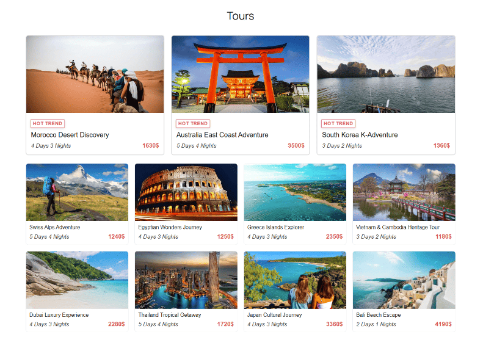

## Video version

<LiteYouTubeEmbed id='Oo1iwTXaKTg' />

## Preparation

In this tutorial, we’ll create a custom post type to manage all the tours on our travel website.
Each tour will include essential information, such as price, duration, and whether it’s featured for the month. All details will be stored in custom fields created with Meta Box.

So I recommend using [Meta Box AlO](https://docs.metabox.io/tutorials/show-featured-restaurants-mb-views/), which includes the framework and all extensions you’ll need for this setup.

* [MB Admin Columns](https://metabox.io/plugins/mb-admin-columns/): help you show whether a tour is marked as featured directly in the dashboard, making it easy to quickly scan and manage which tours should be pushed to the top;
* [MB Custom Post Type](https://metabox.io/plugins/custom-post-type/): create a custom post type for tours;
* [MB Views](https://metabox.io/plugins/mb-views/): create a template and control the logic that displays featured tours first.
* [MB Builder](https://metabox.io/plugins/meta-box-builder/): help you create the custom information for each tour, such as price, duration, and the featured status.

## 1. Creating a new custom post type and custom fields

For this tutorial, I’ve already prepared a custom post type called **Tours** to store all the tour packages on the travel website. Each tour is saved as a post inside this post type, making it easy to manage and display them later with MB Views.

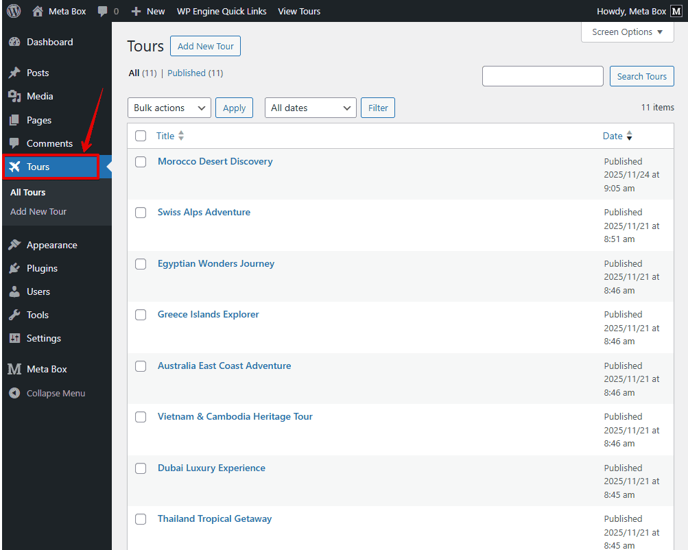

I also created a custom field group to store all the essential information for each tour.


You can see some fields. Pay attention to an important field called ‘The Trend of Month****’. We use the **Checkbox** field type so that you can easily tick it whenever you want to highlight a tour.

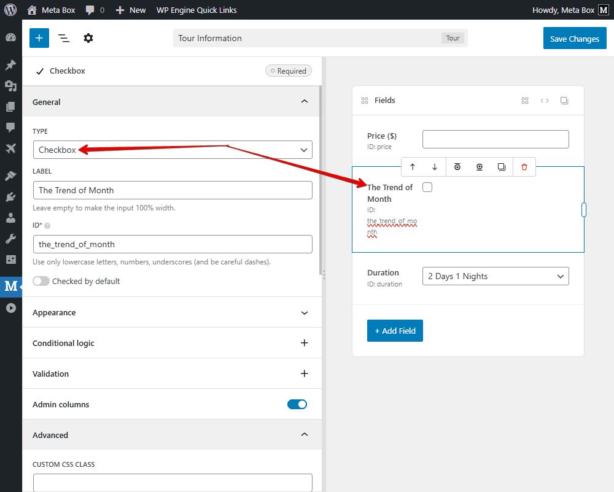

For this field, I enabled the **Admin Column** feature. With the **MB Admin Columns** extension activated, it allows me to quickly see whether a tour is marked as featured directly from the post list.

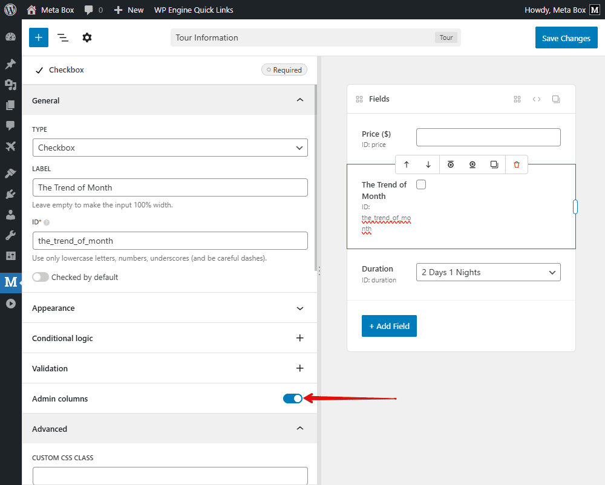

You can create any other fields you need depending on the information you want to display for each tour.
Once everything is set up, move to the **Settings** tab and set the **Location** as **Post Type**. Choose **Tours** to ensure that the custom fields appear only for tour posts.

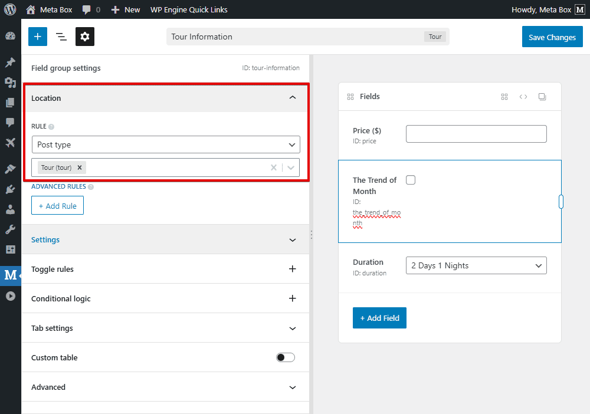

Now, all the fields we’ve created will appear right under the post editor, and you can start filling in the tour details right away.

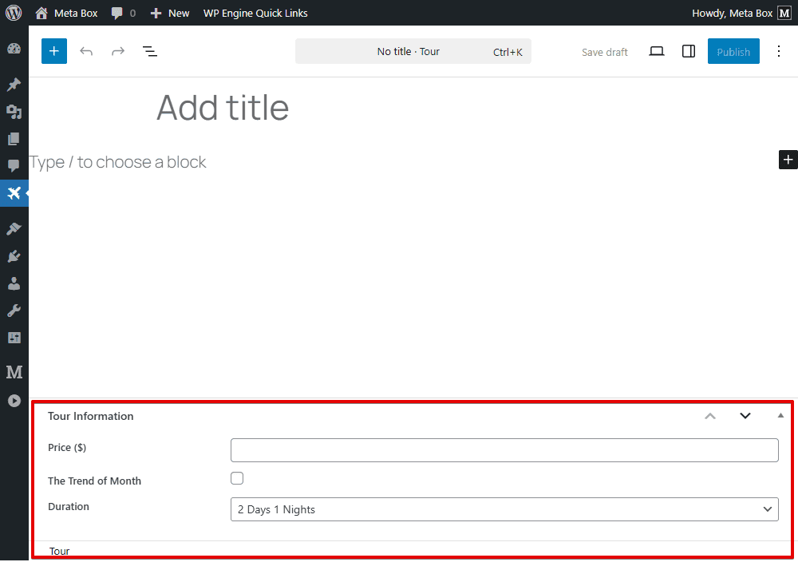

The featured status is now visible in the admin dashboard, making it very convenient to manage highlighted tours.

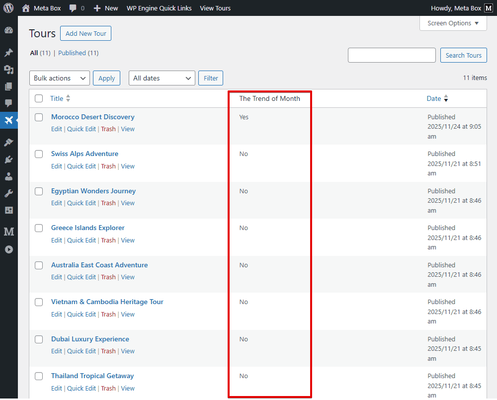

## 2. Showing the tour listing on the page

Before displaying the newest featured posts at the top of the page, we first need to show all the tours.

First, create a new page specifically for the tour listings.

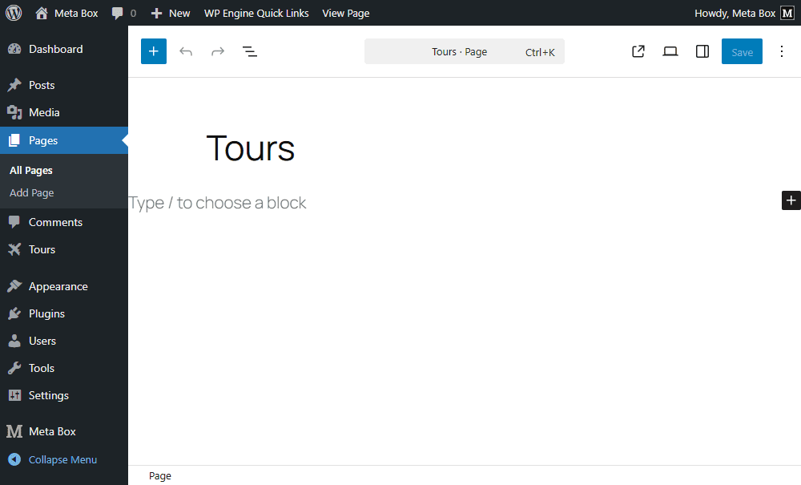

Next, go to **Meta Box** > **MB Views** and create a new template for this page.

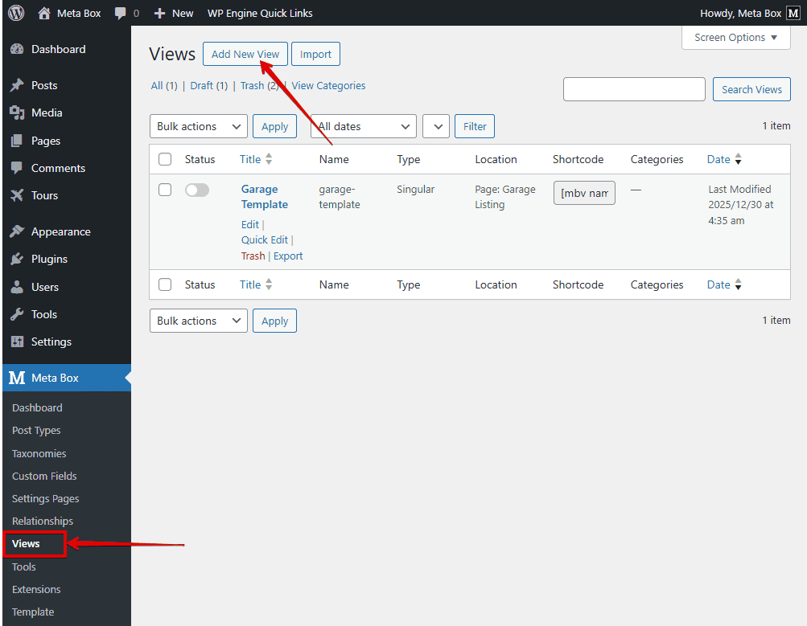

With **MB Views**, you can add some lines of code directly in the **Template** tab to query and retrieve all posts from the **Tours** post type. To display the tour information from your custom fields, simply click the **Insert Field** button and select any fields from the right sidebar, especially the **Trend of Month** field, which we’ll use in the next step to pin featured tours at the top.

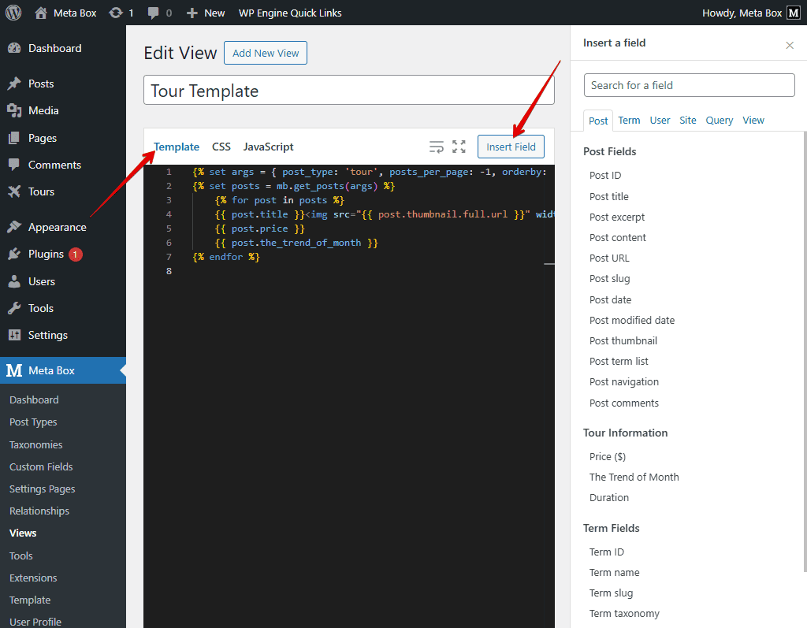

After inserting all the fields, move to the **Settings** section to set where this template will appear. Set the **Type** to **Singular**, and choose the page you created for the tour listings.

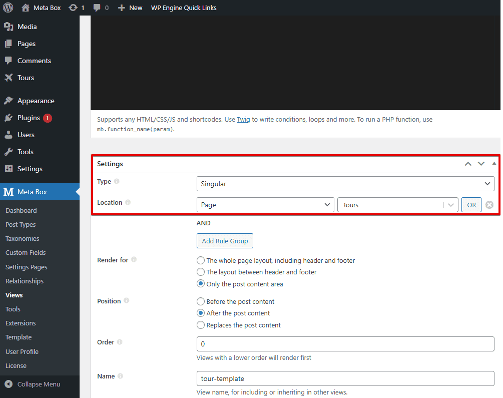

On the frontend, you’ll see all the tour information displayed. At this stage, it appears as a basic list without any styling.

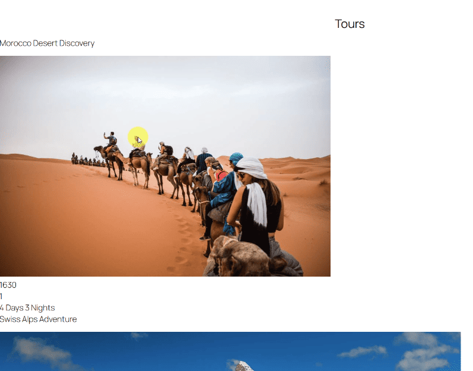

To make it look more visually appealing, add some div tags and classes in the **Template** tab, then switch to the **CSS** tab to style the layout.

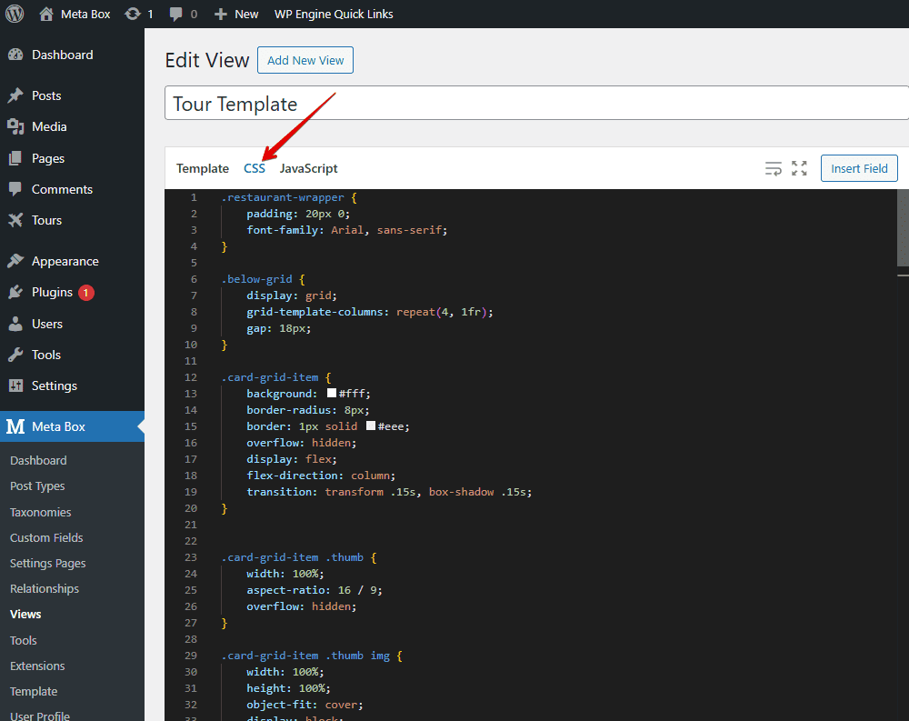

```css
.restaurant-wrapper {
    padding: 20px 0;
    font-family: Arial, sans-serif;
}

.below-grid {
    display: grid;
    grid-template-columns: repeat(4, 1fr);
    gap: 18px;
}

.card-grid-item {
    background: #fff;
    border-radius: 8px;
    border: 1px solid #eee;
    overflow: hidden;
    display: flex;
    flex-direction: column;
    transition: transform .15s, box-shadow .15s;
}


.card-grid-item .thumb {
    width: 100%;
    aspect-ratio: 16 / 9;
    overflow: hidden;
}

.card-grid-item .thumb img {
    width: 100%;
    height: 100%;
    object-fit: cover;
    display: block;
}

.card-grid-item .info {
    padding: 10px;
}


.card-grid-item .title {
    margin: 0;
    font-size: 16px;
    color: #222;
}

.card-grid-item:hover {
    transform: translateY(-4px);
    box-shadow: 0 8px 18px rgba(0, 0, 0, 0.06);
}

.card-grid-item .title a,
.featured-large-card .title a {
    text-decoration: none;
}

.tour-meta {
    display: flex;
    justify-content: space-between;
    align-items: center;
    margin-top: 6px;
    font-size: 14px;
    color: #444;
}

.tour-meta .duration {
    font-weight: 500;
    font-size: 17px;
    font-style: italic;
}

.tour-meta .price {
    font-weight: 700;
    color: #e35858;
    font-size: 18px;
}
```

Now, the tour listings look much better. Let’s move on to displaying the newest featured tours appearing first on the page.

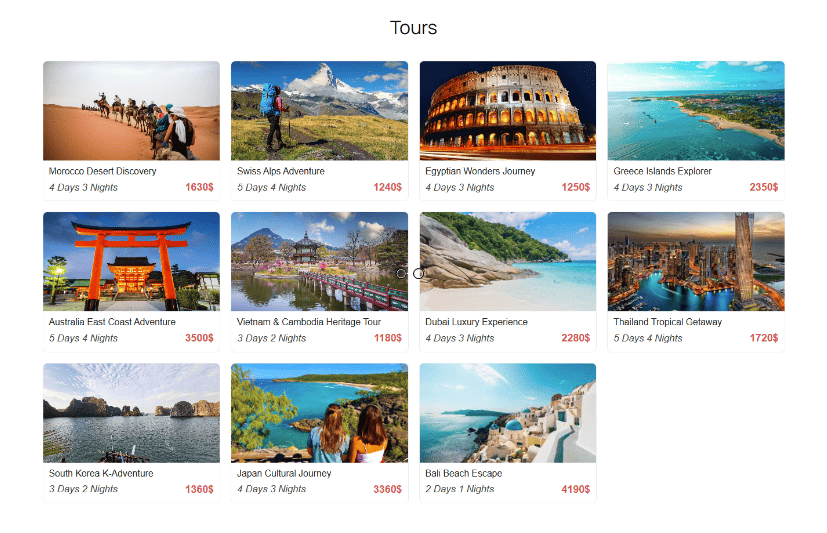

## 3. Displaying newest featured tours first

Back to the template created with **MB Views**, we’ll add a small piece of logic to control the display order by adding some code, so the featured tours appear first, without duplicating any posts.

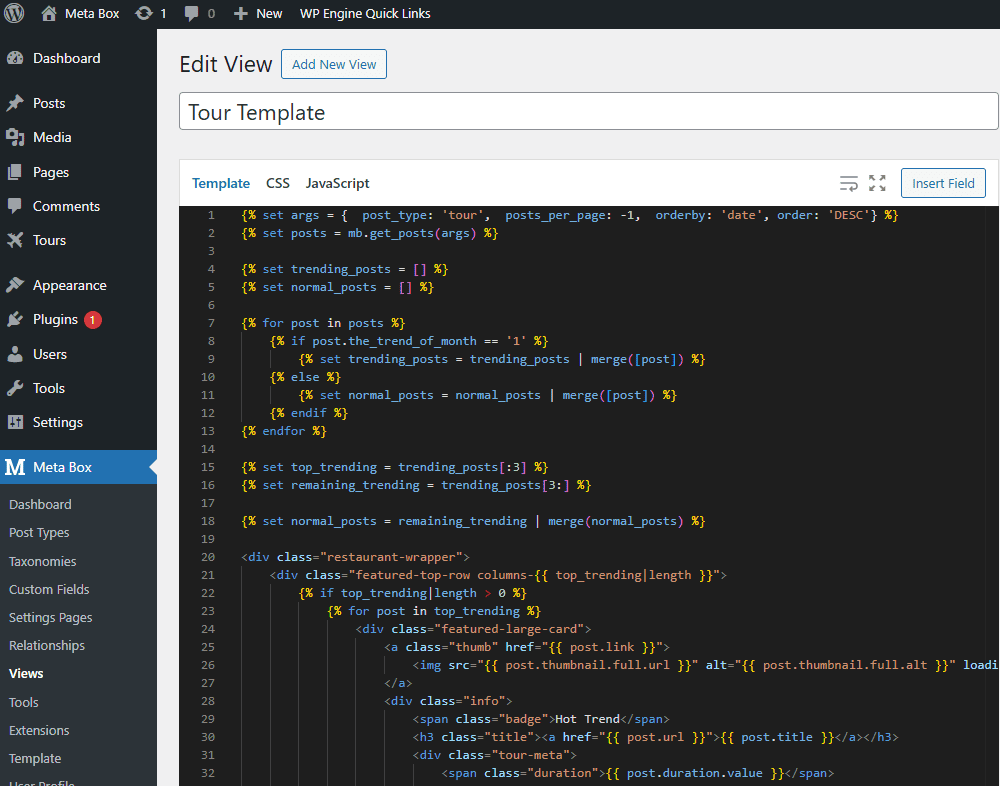

**In there**:

```php


```

Two empty arrays to categorize the tours: one for Hot Trend tours and one for regular tours.

We loop through all the tours from the existing query to process them one by one.

```php

```

Inside the loop, we check the value of the **Trend of Month** field. If it’s set to 1, it means this tour is marked as a Hot Trend, so we add it to the trending posts array. Otherwise, the tour is treated as a normal one and pushed into the normal posts array.

```php

    

    




```

This code is to split the Hot Trend posts into two groups. The first three latest Hot Trend posts are used at the top of the page, while the remaining featured posts are pushed down and displayed together with the normal tours. You can easily change this number to control how many featured tours appear at the top.

This line below combines the two lists into one.

```php

```
We use the following code to display the featured tours at the top of the page. I did modify the code a bit so that the specified tour posts have a highlighted layout, with the number of columns adjusting dynamically based on how many featured items we have. Each featured tour is highlighted with a Hot Trend badge to make it stand out from the rest.

```php
<div class="featured-top-row columns-{{ top_trending|length }}">
    
        
            <div class="featured-large-card">
                <a class="thumb" href="{{ post.link }}">
                    
                </a>
                <div class="info">
                    <span class="badge">Hot Trend</span>
                    <h3 class="title"><a href="{{ post.url }}">{{ post.title }}</a></h3>
                    <div class="tour-meta">
                        <span class="duration">{{ post.duration.value }}</span>
                        <span class="price">{{ post.price }}$</span>
                    </div>
                </div>
            </div>
        
    
</div>
```

And, this code below stays unchanged for displaying normal posts as we did before.

```php
<div class="below-grid">
    
        <div class="card-grid-item">
            <a class="thumb" href="{{ post.link }}">
                
            </a>
            <div class="info">                    
                <h4 class="title"><a href="{{ post.url }}">{{ post.title }}</a></h4>
                <div class="tour-meta">
                    <span class="duration">{{ post.duration.value }}</span>
                    <span class="price">{{ post.price }}$</span>
                </div>
            </div>
        </div>
    
</div>
```
                              
Turn to the **CSS** tab and add styles to make the highlight section look cleaner.

```css
.featured-top-row {
    display: grid;
    gap: 20px;
    margin-bottom: 24px;
}


.featured-top-row.columns-1 {
    grid-template-columns: 1fr;
}

.featured-top-row.columns-2 {
    grid-template-columns: repeat(2, 1fr);
}

.featured-top-row.columns-3 {
    grid-template-columns: repeat(3, 1fr);
}

.featured-top-row.columns-4 {
    grid-template-columns: repeat(4, 1fr);
}


.featured-large-card {
    background: #fff;
    border: 2px solid #ddd;
    border-radius: 8px;
    overflow: hidden;
    display: flex;
    flex-direction: column;
    min-height: 260px;
    transition: transform .18s, box-shadow .18s;
}

.featured-large-card.empty {
    background: transparent;
    border: 2px dashed #eee;
    display: block;
    min-height: 260px;
}

.featured-large-card .thumb {
    width: 100%;
    aspect-ratio: 16 / 9;
    overflow: hidden;
}

.featured-large-card .thumb img {
    width: 100%;
    height: 100%;
    object-fit: cover;
    display: block;
}

.featured-large-card .info {
    padding: 14px;
    flex: 1;
}

.featured-large-card .badge {
    display: inline-block;
    background: #00c1b3;
    color: #fff;
    padding: 6px 10px;
    border-radius: 4px;
    font-weight: 700;
    font-size: 13px;
    margin-bottom: 10px;
}

.featured-large-card .title {
    margin: 0 0 8px;
    font-size: 20px;
    line-height: 1.15;
}

.featured-large-card .excerpt {
    margin: 0;
    color: #555;
    font-size: 14px;
}

/* Hover */
.featured-large-card:hover {
    transform: translateY(-6px);
    box-shadow: 0 8px 24px rgba(0, 0, 0, 0.08);
}

@keyframes blink {

    0%,
    100% {
        opacity: 1;
    }

    50% {
        opacity: 0.4;
    }
}

.featured-large-card .badge {
    animation: blink 1s infinite;
}

@keyframes shake {
    0% {
        transform: rotate(0deg);
    }

    25% {
        transform: rotate(5deg);
    }

    50% {
        transform: rotate(-5deg);
    }

    75% {
        transform: rotate(3deg);
    }

    100% {
        transform: rotate(0deg);
    }
}

.featured-large-card .badge {
    display: inline-block;
    animation: shake 0.8s infinite;
}


@keyframes zoom {

    0%,
    100% {
        transform: scale(1);
    }

    50% {
        transform: scale(1.2);
    }
}

.featured-large-card .badge {
    display: inline-block;
    animation: zoom 1s infinite;
}


.featured-large-card .badge {
    display: inline-block;
    background: #00c1b3;
    color: #fff;
    padding: 6px 10px;
    border-radius: 4px;
}


.featured-large-card .badge {
    display: inline-block;
    font-size: 13px;
    font-weight: 700;
    color: #e35858;
    background: transparent;
    border: 1px solid #e35858;
    border-radius: 3px;
    padding: 2px 6px;
    text-transform: uppercase;
    letter-spacing: 0.5px;
    box-shadow: 0 2px 6px rgba(0, 0, 0, 0.1);
}


@keyframes ticker {

    0%,
    100% {
        transform: scale(1) translateX(0);
    }

    50% {
        transform: scale(1.1) translateX(2px);
    }
}

.featured-large-card .badge {
    animation: ticker 1s infinite;
}
```

It looks nice now; Hot Trend posts show at the top, but they also appear in the normal list below.

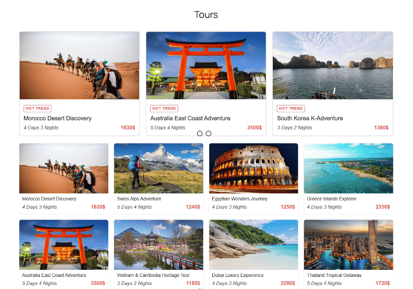

We need to remove these duplicates.

Back to the template with **MB Views**. Currently, the posts array contains all posts, including those already shown at the top. To avoid duplicates, we replace it with normal posts, which include regular posts plus any Hot Trend posts not featured at the top.

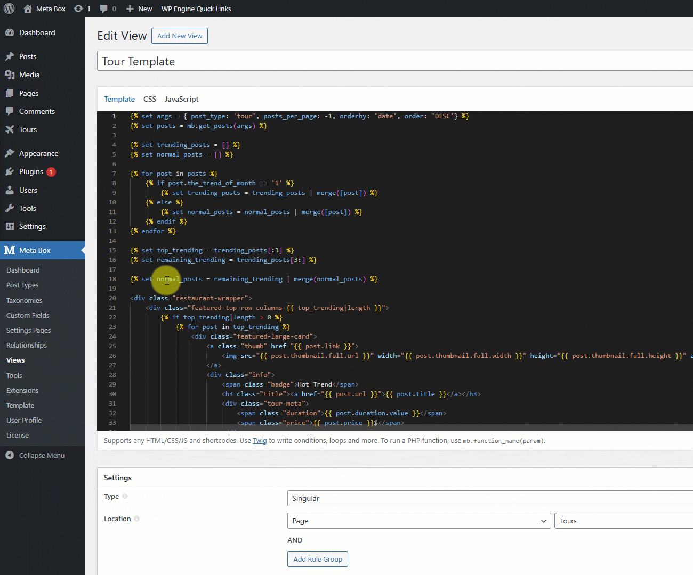

For example, if we have 5 Hot Trend posts but only show 3 at the top, the remaining 2 are displayed below without repeating.

That’s all for the code. I’ve put everything on [Github](https://github.com/wpmetabox/tutorials/tree/master/pin-newest-featured-posts), so you can check it out there.

Now the featured posts are displaying as intended, without any duplicates


You can go to the backend and change a post’s Featured status to test if it works correctly.
