import LiteYouTubeEmbed from 'react-lite-youtube-embed';
import 'react-lite-youtube-embed/dist/LiteYouTubeEmbed.css';

Assuming that you already have a taxonomy with posts assigned to it. However, in some cases, you may want to rename that taxonomy for SEO purposes or to make it more meaningful. Normally, if you rename a taxonomy, WordPress treats it as a completely new one. As a result, all previously assigned posts will be detached and no longer linked to their terms.

But in this tutorial, we’ll do it differently. We’ll **rename the taxonomy in a way that keeps all existing assignments intact**, so the posts remain connected just as before; no need to reassign anything manually.

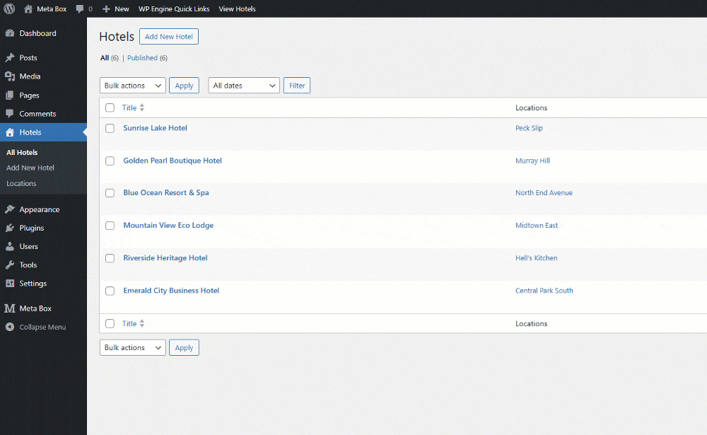

Let’s see how to do that.

## Video version

<LiteYouTubeEmbed id='B6vFKFMhd_E' />

## Preparation

For this practice, we only need the free version - [Meta Box Lite](https://metabox.io/lite/) to have the framework and [ MB Custom Post Type](https://metabox.io/plugins/custom-post-type/) for creating custom post types and taxonomies.

For demonstration purposes, I’ll create a sample post type and taxonomy so you can clearly see how the relationships behave before and after renaming.

## Creating a custom post type & taxonomy

First, go to **Meta Box** > **Post Types** to create a custom post type for hotels as an example.

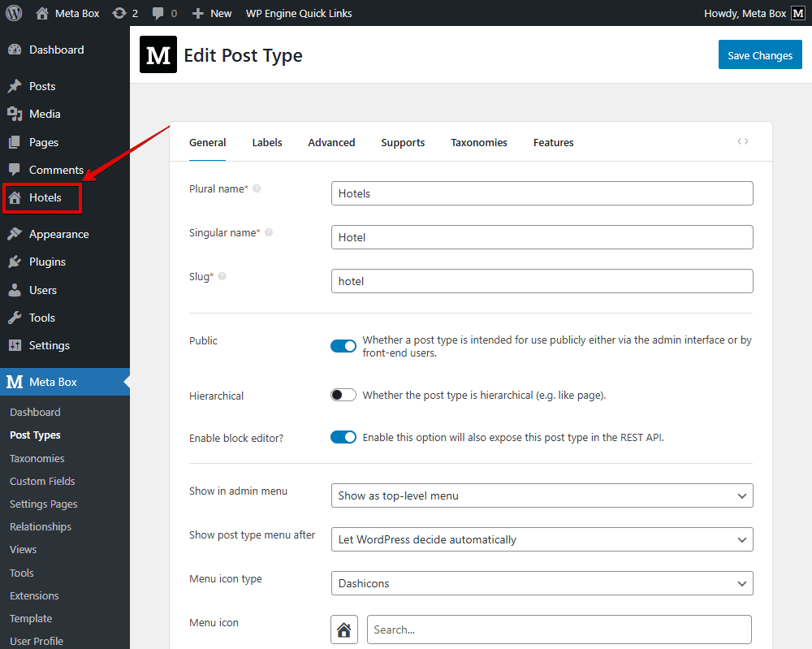

Next, still in the **Meta Box** screen, create a new taxonomy for location information.

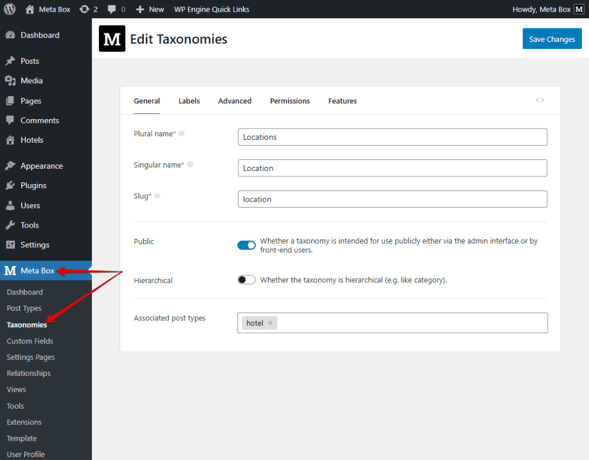

In the **Advanced** tab, pay attention to this setting. It’s available when you activate the **MB Admin Columns** extension. It’s optional, so I did not mention it before. When you check it, there’ll be a column in the dashboard to show the hotel’s location so that you can compare the results conveniently.

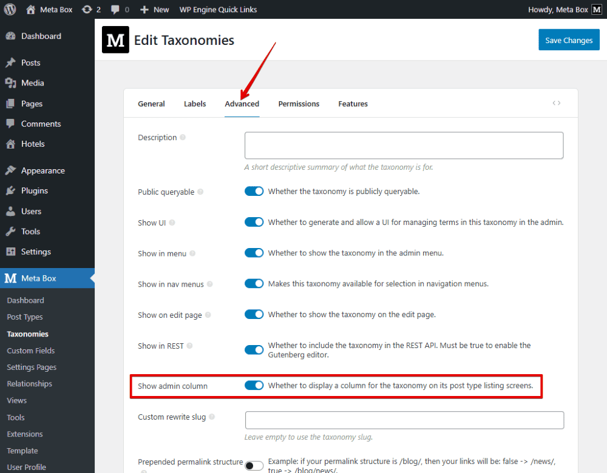

Back to the **General** tab, in the **Associated post type** section, choose the Hotel to assign the custom taxonomy that we’ve created to that post type.

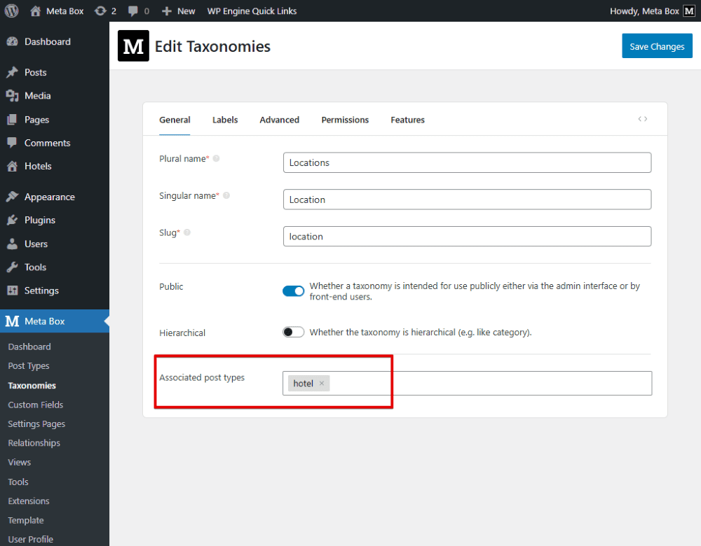

Let’s create each term for that taxonomy.

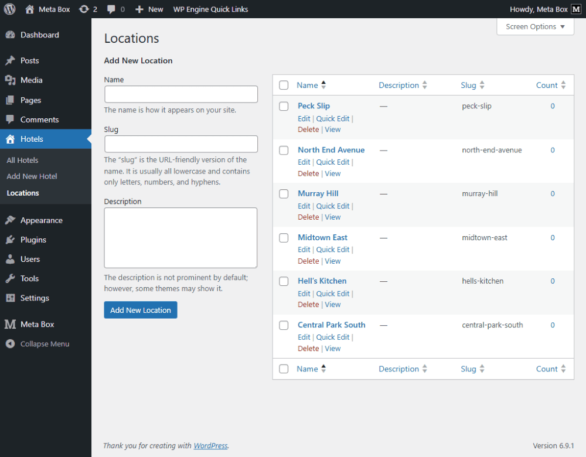

Now, in the post editor of the Hotel post type, we’ll see the taxonomy section, where we can enter the hotel location.

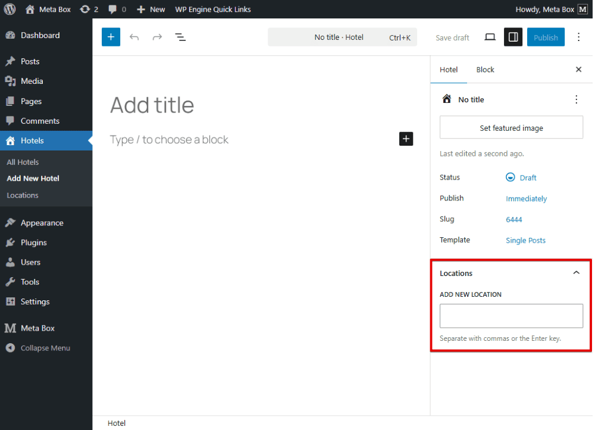

Just fill in all the information.

These are some posts, for example, that I created. The locations as well as the taxonomy are also displayed in the admin dashboard. Everything works normally at this stage.

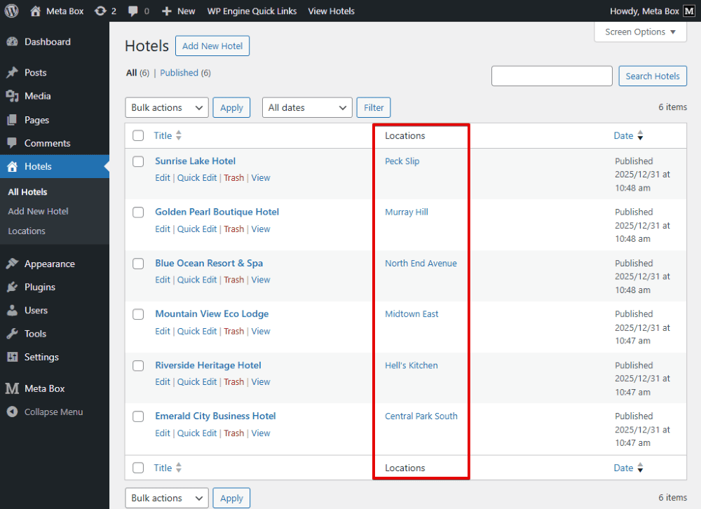

## Renaming taxonomy without losing assigned posts

Now let’s say we want to rename the taxonomy from Location to Address to make it clearer and more SEO-friendly.

I change the taxonomy slug from `location` to `address`.

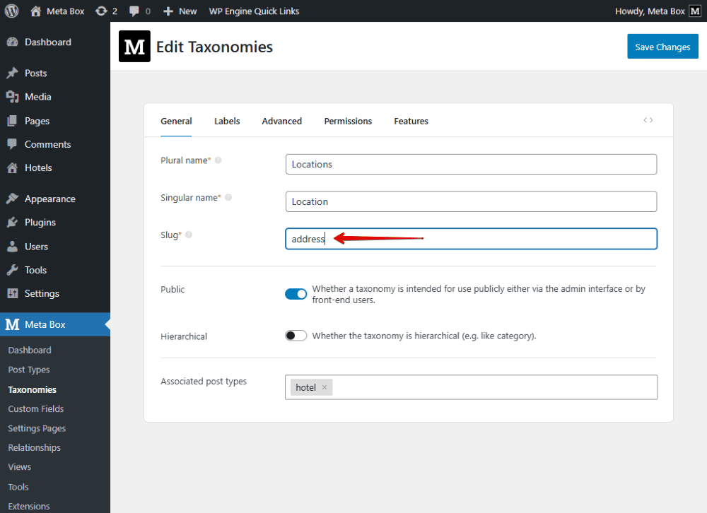

After saving, you’ll notice that the terms previously created under the Location taxonomy no longer appear. When going back to the posts, all assigned terms disappear.

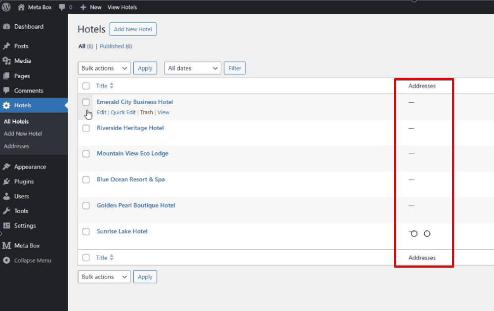

The hotels are no longer connected to their locations. This happens because WordPress treats address as a brand-new taxonomy, even though the old relationships still exist in the database.

So instead of reassigning everything manually, we’ll reconnect the data using a small piece of code. Now, go to the theme file editor and add the following code.

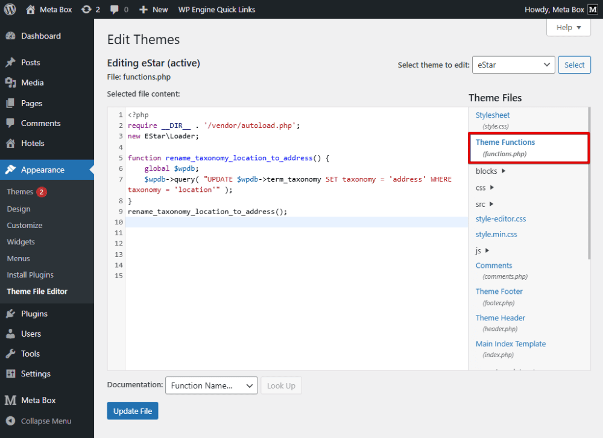

```php
function rename_taxonomy_location_to_address() { 
	global $wpdb;
	$wpdb->query( "UPDATE $wpdb->term_taxonomy SET taxonomy = 'address' WHERE taxonomy = 'location'" );
}
rename_taxonomy_location_to_address();
```
**In there**:

```
function rename_taxonomy_location_to_address() { 
```
This one is to declare a function.

The `global $wpdb` variable allows us to access the WordPress database.

Most importantly, the following line finds all terms that belong to the location taxonomy and converts them to addresses.

```php
$wpdb->query( "UPDATE $wpdb->term_taxonomy SET taxonomy = 'address' WHERE taxonomy = 'location'" );
```
Finally, we run the function.

```php
rename_taxonomy_location_to_address();
```
That’s all for the code. Note that this code should run only once. After confirming that everything works correctly, remove the code immediately.


You’ll see that all posts have their taxonomy terms back. The taxonomy now has the new name, but the terms remain exactly as before. That’s how you rename a taxonomy without losing assigned data.

If you also want to do a similar [migration with custom fields](https://docs.metabox.io/tutorials/change-id-meta-box-field/), we already have a dedicated tutorial for that. You can check it out to learn how to change field IDs without losing existing values.
