import LiteYouTubeEmbed from 'react-lite-youtube-embed';
import 'react-lite-youtube-embed/dist/LiteYouTubeEmbed.css';

Today, we’ll **reorder items by their values from cloneable custom fields**. Imagine that you have a list of services, each with its own name and price, and you want to display them in order from the lowest to the highest. That’s exactly when this method comes in handy. In this tutotial, we’ll walk through a simple case study to show you how it’s done.

I created a car services pricing as an example. As you can see, this page contains the services and its price is sorted in ascending order. All of this information will be saved in the custom fields. 


In this practice, I’ll show you two different ways to do it. If you use a page builder, you can refer to the method with **Bricks**. In case you only use **Meta Box**, you can still do it with the support of **MB Views**. I will go into detail on both of these methods, so you can choose the most suitable method for yourself.

Let’s get started!

## Video Version

<LiteYouTubeEmbed id='sZynQjyc4Lw' />

## Preparation

I will use a cloneable group for demonstration in this practice. So, I recommend that you should use [Meta Box AIO](https://metabox.io/aio/) to have the framework for creating custom fields. As well as the Meta Box extensions inside it provide you with advanced features, specifically:

* [MB Builder](https://metabox.io/plugins/meta-box-builder/): to have a UI on the backend to create custom fields easily;
* [MB Group](https://metabox.io/plugins/meta-box-group/): to organize custom fields into the groups.

If you don't use any page builder like I mentioned before, you will need [MB Views](https://metabox.io/plugins/mb-views/) to create a template for displaying prices information and create order cloneable fields by value.

Otherwise, **Bricks** is used to build the layout and create a real-time filtering system using query loops and dynamic data.

Now, let’s go step by step.

## 1. Creating custom fields

To store car services details, we need to create a group of custom fields. They will cover key information such as services name and prices. Feel free to add additional fields depending on your needs.

Now, go to **Meta Box** > **Custom Fields**, and create a new field group. Here I created fields with this structure:

<table>
<thead>
<tr>
<th>Field</th>
<th>Types of Field</th>
<th>ID</th>
</tr>
</thead>
<tbody>
<tr>
<td>Services</td>
<td>Group</td>
<td>services</td>
</tr>
<tr>
<td>Service Name</td>
<td>Text</td>
<td>service_name</td>
</tr>
<tr>
<td>Price</td>
<td>Number</td>
<td>price</td>
</tr>
</tbody>
</table>

This is a group with 2 subfields inside. I also set this group as cloneable to have more spaces to add different services information. 

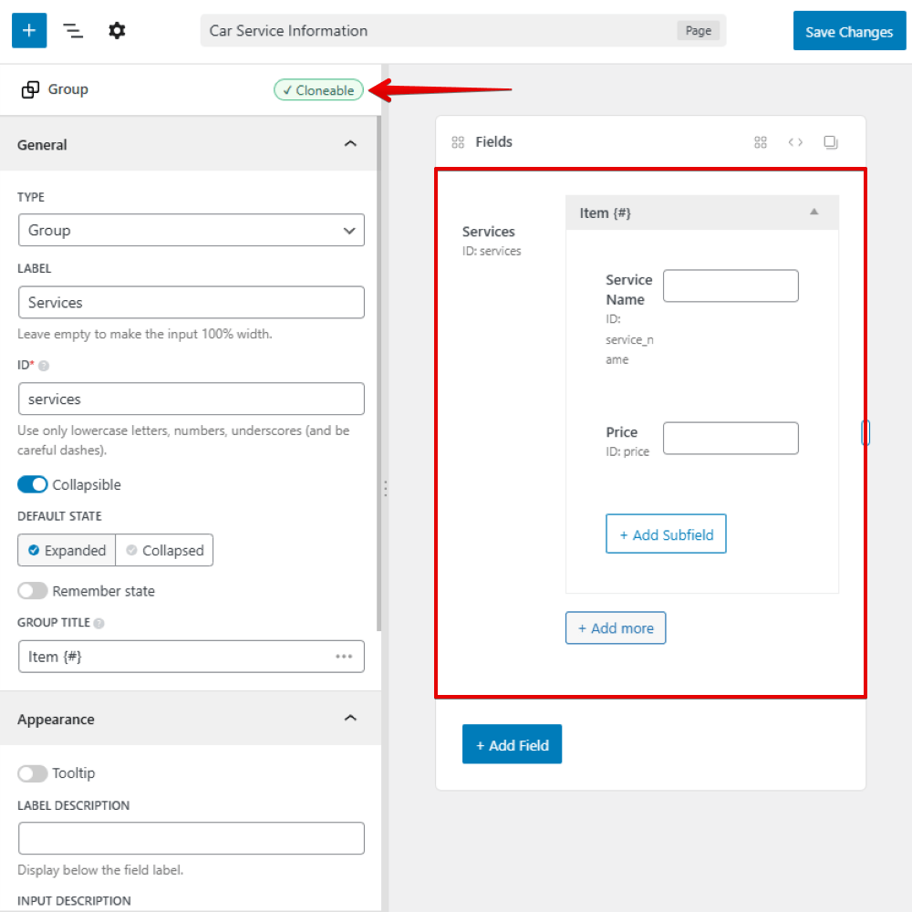

After saving, go to the page editor then you will see all of the custom fields. Just enter information for each service, you can press the **Add more** button to add another service for your needs.

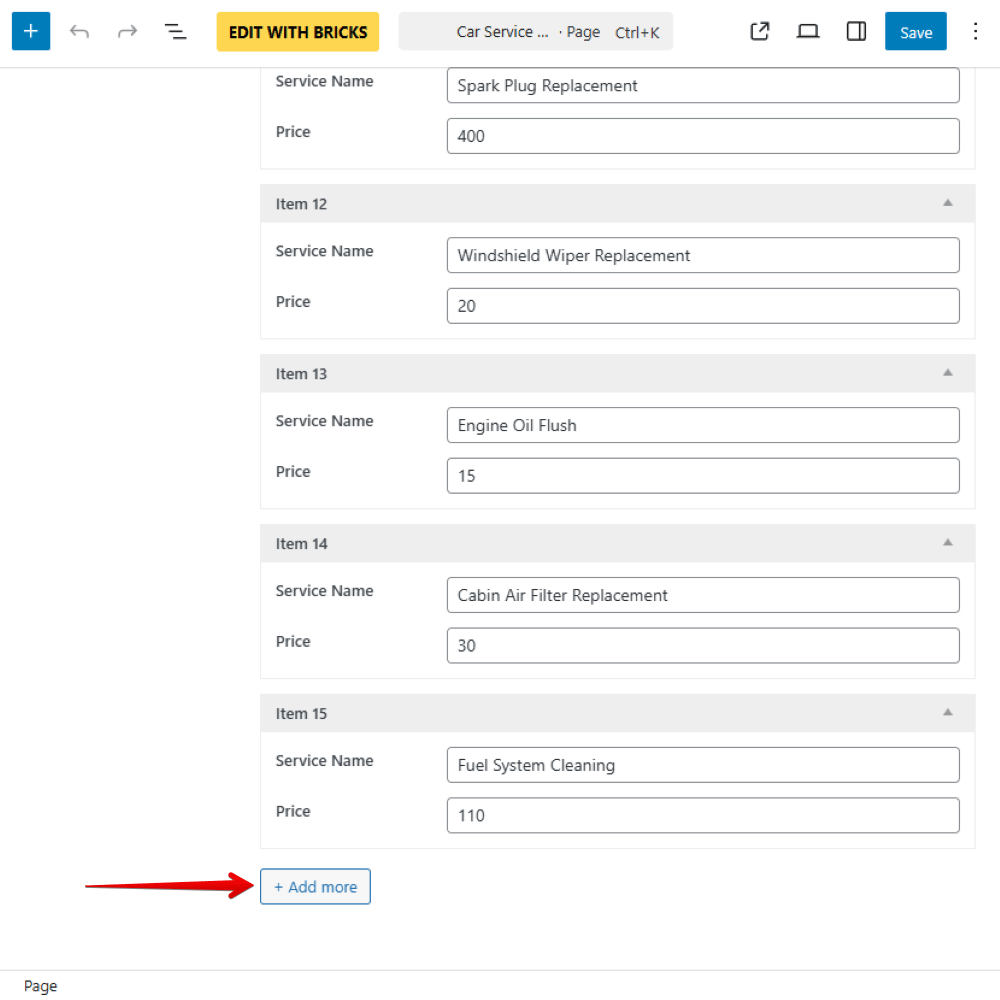

## 2. Method 1: Reordering items by their values from cloneable custom fields with Bricks

Let's sort the car service pricing from low to high by using **Bricks**. I have displayed the information on page first, if you want to see the details, you can find it on this practice. As you can see, the list of services' names and prices is fully displayed, but it is not sorted in any order. 

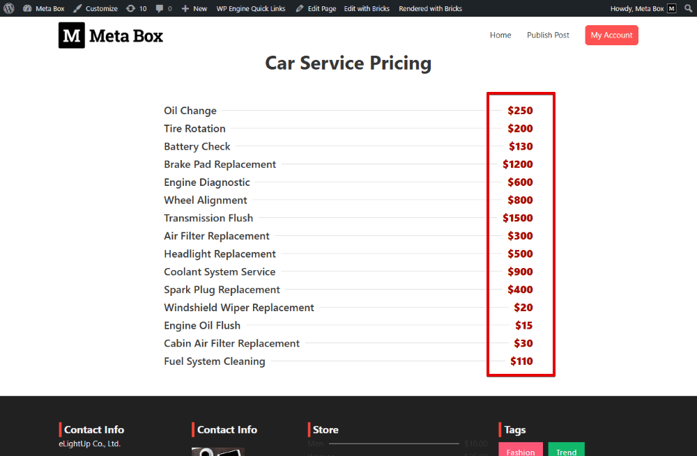

Now I will arrange the value of the items as I want.

Since **Bricks** doesn't support sorting clonable field values ​​directly, I need to use code to do it.

Now, go to **Appearance** > **Theme File Editor** to add some code functions:

```
$target_field_id = 'services';
$sort_field = 'price';
$location = 'page';

add_filter( 'bricks/query/run', function( $results, $query_obj ) use ( $target_field_id, $sort_field, $location ) {
	$expected_object_type = 'mb_' . $location . '_' . $target_field_id;
	if ( $query_obj->object_type !== $expected_object_type ) {
        return $results;
    }
	if ( is_array( $results ) && ! empty( $results ) ) {
        usort( $results, function( $a, $b ) use ( $sort_field ) {
            return ( $a[$sort_field] ) <=> ( $b[$sort_field] );
        });
    }
	return $results;
}, 20, 2 );
```

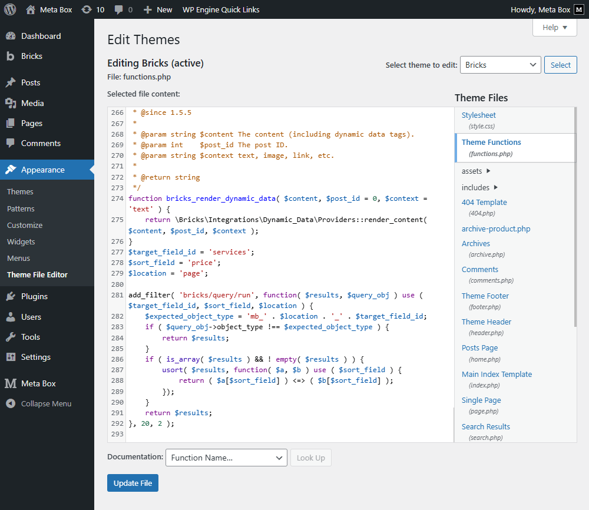

**Explanation**: 

* `$target_field_id = 'services'`: is the ID of the group that I want to sort. 
* `$sort_field = 'price'`: is the subfield of the group whose value I want to sort.
* `$location = 'page'`: is the location of the field group that is applied to. 
* `add_filter( 'bricks/query/run', function( $results, $query_obj ) use ( $target_field_id, $sort_field, $location ) {`:  is to add a function. It will help process the queried data above based on the declared variables. 
* `$expected_object_type = 'mb_' . $location . '_' . $target_field_id`: is to create the name of the object type that I want Bricks to query from the Meta Box data. It is related to these two variables: `$location` ; `$target_field_id`.
  
```
if ( $query_obj->object_type !== $expected_object_type ) {
    return $results;
}
```
This part is to show that if the current query is not the query we want to intervene in, return the intact, unchanged result to avoid affecting other queries.

* `if ( is_array( $results ) && ! empty( $results ) ) {`: is to check if the data is an empty array or not.
  
```
    usort( $results, function( $a, $b ) use ( $sort_field ) {
        return ( $a[$sort_field] ) <=> ( $b[$sort_field] );
    });
}
```
This part is to sort the values ​​in the array of this subfield in ascending order.

Here is the front-end page after I sorted items by value. As you can see, these values ​​are sorted in ascending order along with their corresponding service.

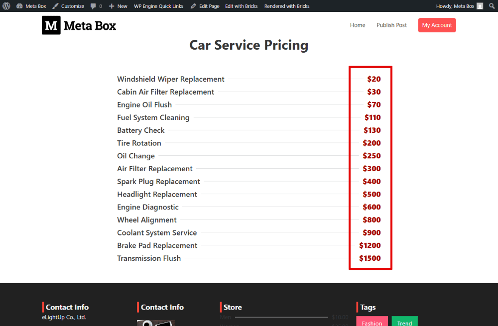

The data of price can be dynamic, and the code still works well. For example, pay attention to this item.

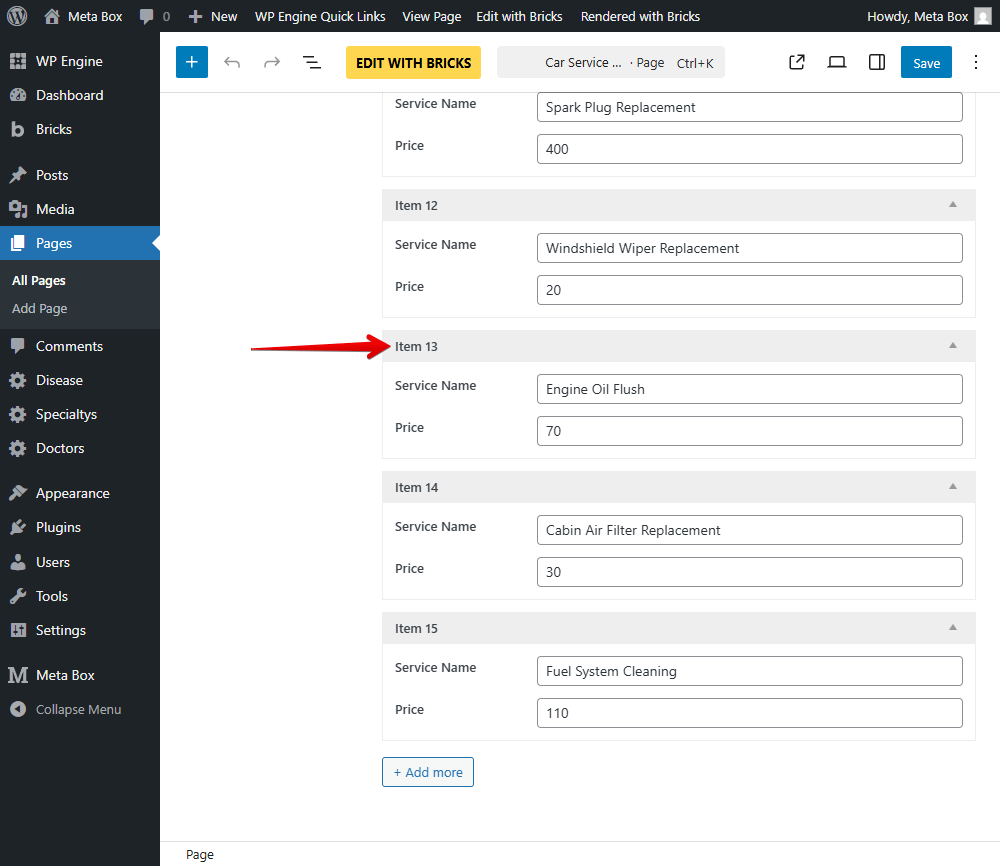

Now, I change its value. 

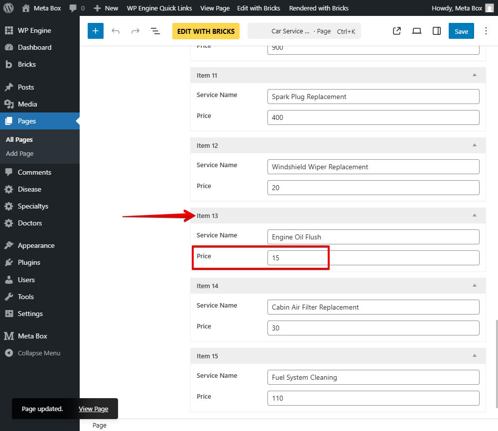

Then, that item is moved up to the top. That’s the result I expected.

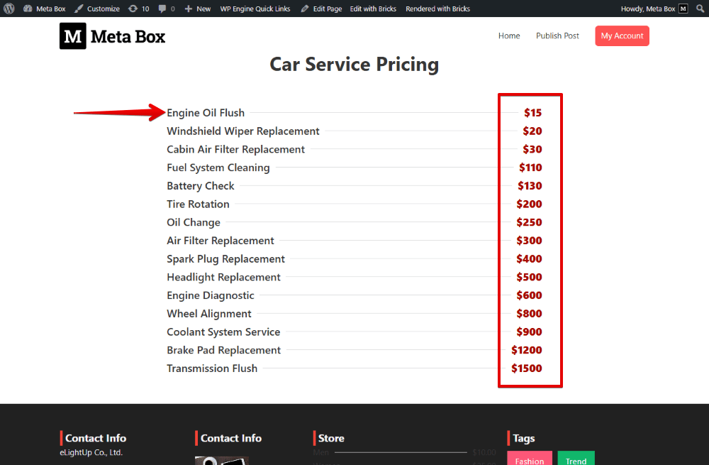

## 3. Method 2: Reordering items by their values from cloneable custom fields with MB Views

In the case that you don’t use any page builder, you can refer to this method. It is also simpler than the above method with the help of **MB Views** from **Meta Box**. I will also display the data first, then sort them.

Go to **Meta Box** > **Views**, and add a new view.

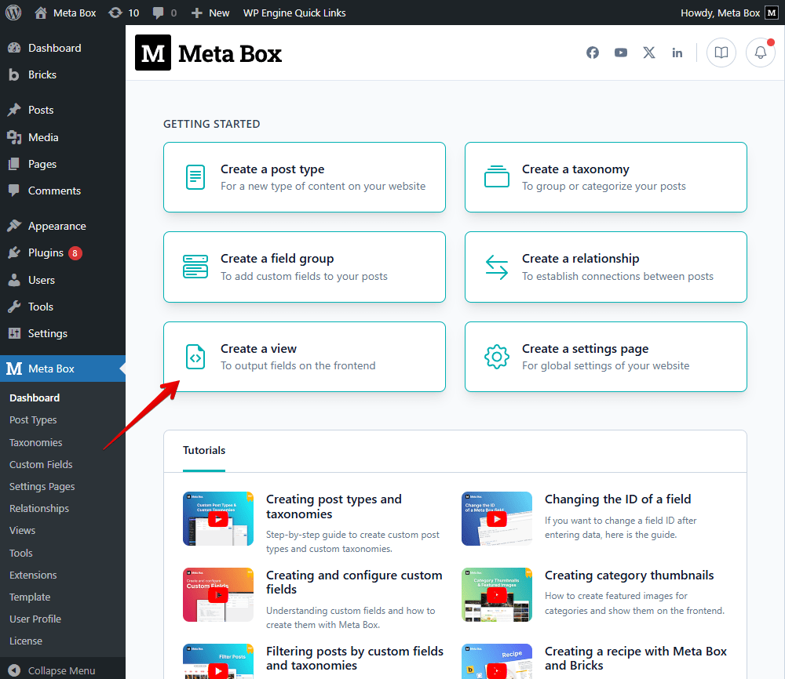

In the **Template** tab, you can use the **Insert Field** button to insert fields or add code directly. 

First, add this code:
```

    {{ clone.service_name }} <br/>      
    {{ clone.price }} <br/>    

```

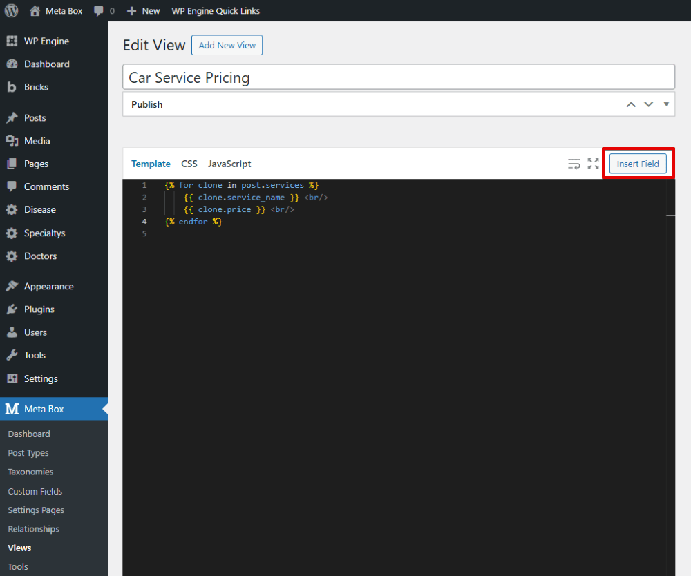

**In there**:

``: is to insert the service name and the price inside. Since it is a clonable group, it’ll be a loop. Inside this loop, insert the subfield you want to get the value of as usual.
`{{ clone.service_name }} <br/>` : is to get all values ​​of subfield in group with ID service_name
`{{ clone.price }} <br/>`: is to get all values ​​of subfield in group with ID price

After inserting all the fields you need, scroll down to the **Settings** section, choose the type of the template as **Singular**, set the **Location** as **Page**, then select your page you created for the car service pricing listing.

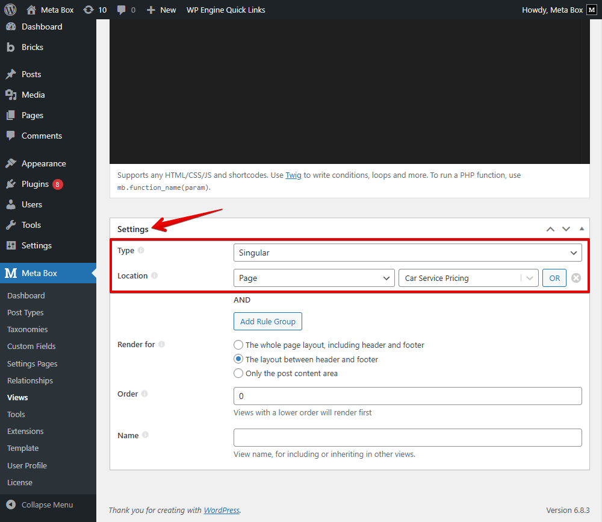

Now, go to the page editor and view it on the frontend, you can see all the data is displayed.

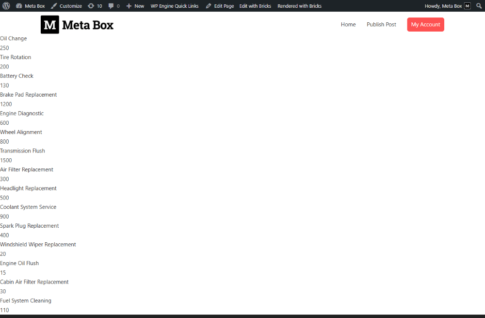

To make the page more beautiful, I’m adding some div tags and classes, as well as modifying the code a little bit.


Then, move to the **CSS** tab and add code. 

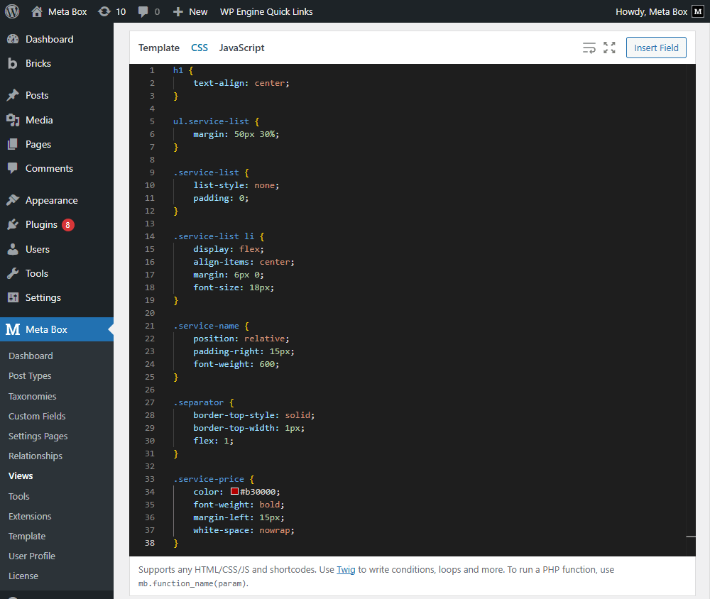

After styling, our page is like this.


Now, it’s time to order them. Back to the created template to add code for this purpose.

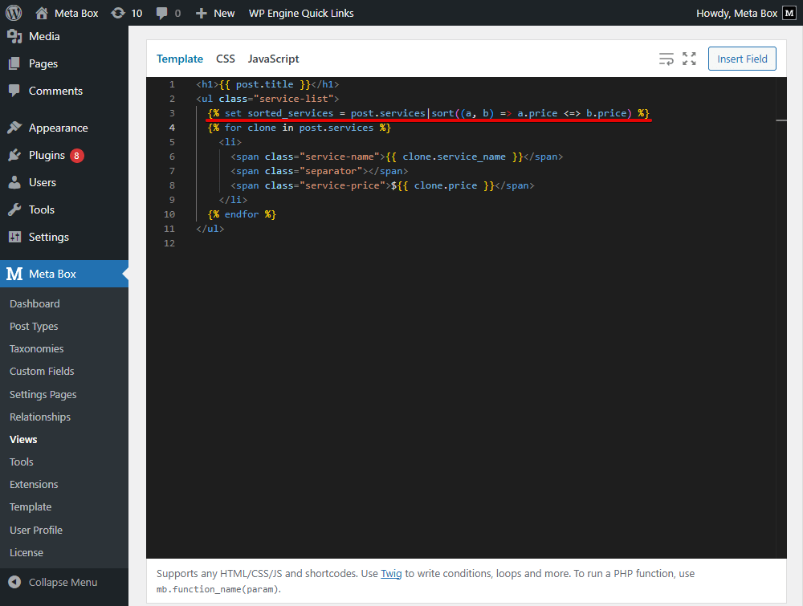

**Specifically**:

```

```

This line is to declare that we’ll create a new array containing a list of services with their prices sorted from low to high. This value will be taken from the subfield with ID price.

Don't forget to update the array you'll be querying for this loop.

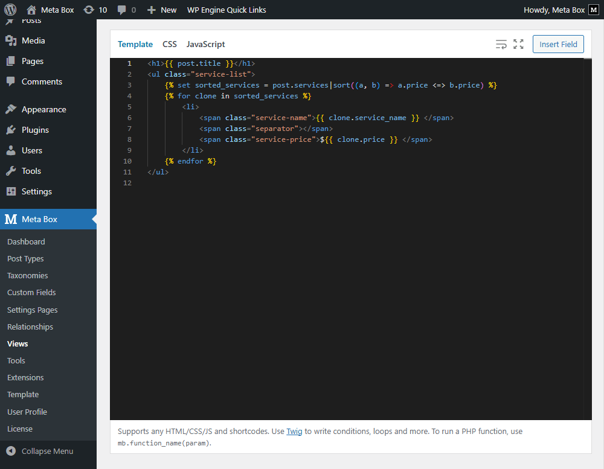

That's all. It's so simple.

Now, let’s check the page on the frontend; these are our expected results. 

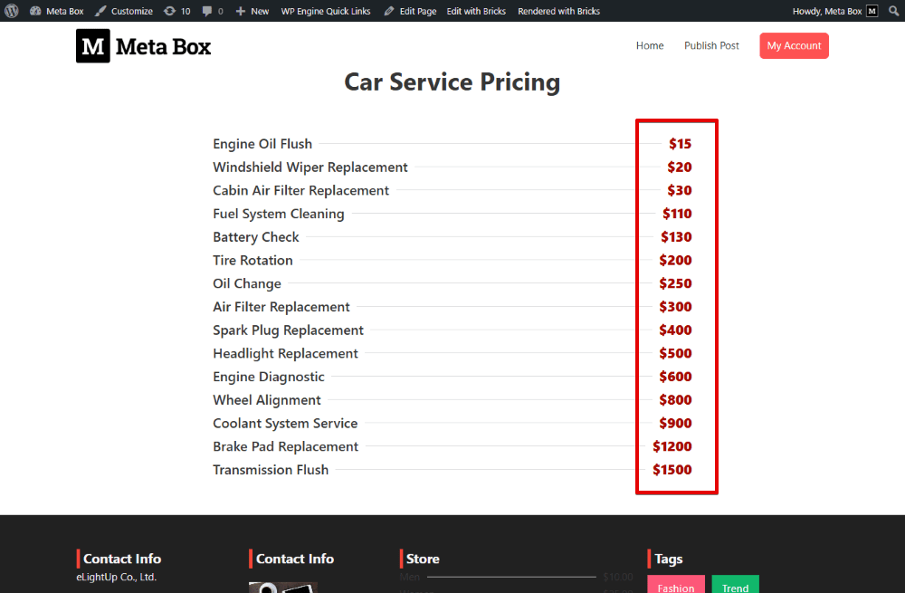


