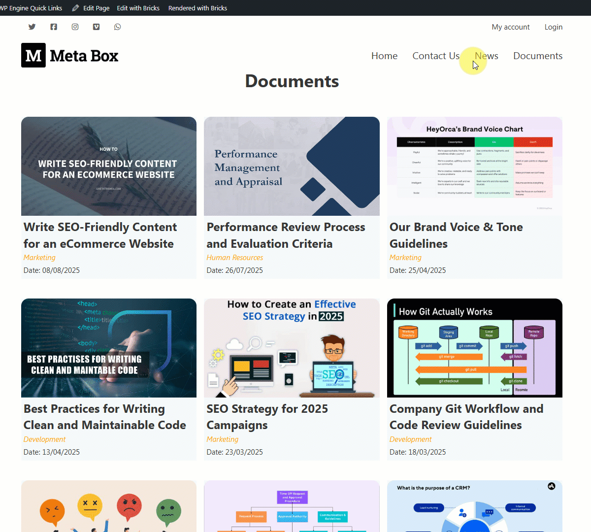
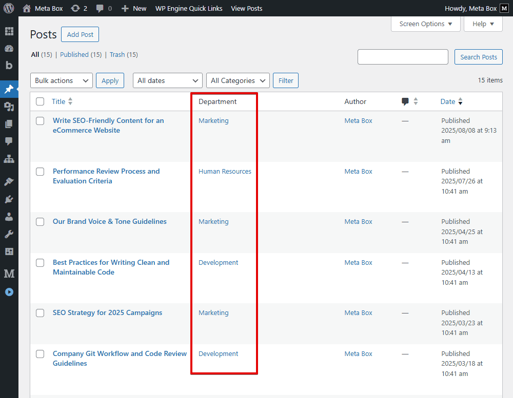

import LiteYouTubeEmbed from 'react-lite-youtube-embed';
import 'react-lite-youtube-embed/dist/LiteYouTubeEmbed.css';

In today’s tutorial, I’ll show you how to **restrict access and display posts only for logged-in users**. Specifically, how to display documents by department – using **Meta Box** and **Bricks**.

Imagine that you’re building an internal company portal with training documents. Each document is linked to a department through a **Meta Box relationship**. When employees in different departments log in, they should only see the documents assigned to their department, not the ones from others.

Normally, you might filter posts by taxonomy, or by a custom field value. That works fine in many cases. But here, instead of that, we’ll filter **based on relationships between posts**. This approach is different, and can be applied to a variety of scenarios. For example:

* Showing announcements targeted to specific groups of employees.
* Assigning work shifts, like on-duty doctors for a given day.
* Listing staff members by department or specialty.

The key idea is that access control relies on conditional display. Bricks supports conditions out of the box, and in this tutorial, I’ll walk you through how to combine that with Meta Box relationships to restrict and display posts exactly as needed.

Let’s dive in!

## Video version

<LiteYouTubeEmbed id='GQ8g5oV0KTg'/>

## Preparation

In this tutorial, we’ll use the default **WordPress Posts** for the documents and a separate custom post type for **Departments**. Each post will represent a piece of document, and we’ll connect it to one or more departments using a **Meta Box relationship**. Logged-in users will then only see posts linked to their own department.

To make the setup smoother, I recommend using [Meta Box AIO](https://metabox.io/aio/). It gives you all the necessary extensions in one package without having to install each separately.

And, **Bricks** is used to build the layout and set up the filter so that only the posts belonging to the logged-in user’s department are displayed.

Now, let’s go step by step.

## Creating a custom post type

Go to **Meta Box** to create a new custom post type for the **Departments**.

After publishing, you’ll see the created custom post types in the admin menu. And you can see some departments I created as posts, such as Marketing, Development, Human Resources, and Sales.

## Creating the relationship

Go to **Meta Box** > **Relationships** to create a relationship between the default Posts - documents - and the **Departments** post type.

We have the **From** and **To** sections. The relationship is bidirectional, which means it doesn’t matter which side you set up first - data will be linked both ways.

In this case, both sections will have the Object Type set to Post, since we’re connecting the default Posts with the Departments custom post type.

In the **From** section, choose Post in the **Post type** option because I set it for the default posts, and the rest is **Department** post type.

Pay attention to the **Show as an admin column** setting. It’s available when you activate the **MB Admin Columns** extension. When you check it, there’ll be a column in the dashboard to show which departments are related to the document and which posts are related to departments.

After publishing, go to create a new post; you can see a section allowing you to select several departments.

Here’s an example of how the relationship between learning posts and departments looks in the admin dashboard.

## Creating a custom field for the users

To assign each user to a specific department, we’ll create a custom field that stores this information.

Now, go to **Meta Box** > **Custom Fields**, and create a new field group.

Choose the field type as **Post**. And in the **Post types** option, select the exact post type. This will allow us to assign the correct department to each user.

For better usability, you can also enable the **Admin columns** option to display the user’s department directly in the user list.

Next, switch to the **Settings** tab and set the **Location** to **User** so the field appears in the user profile editing screen.

After publishing, open any user profile editor, and you’ll see the new **Department** section. Simply select the department you want to assign to that user and update the profile.

At this point, every user is now placed into their respective department.

## Showing all posts on the page

Now, let’s display the full list of documents on a page, whether or not they have assigned departments. Later, we’ll add a filter to show only those from a specific department.

First, create a new page named **Documents**. Then, edit the page with **Bricks**.

To start building the layout, add a **Section** element to cover all the page content. There’s already a **Container** available inside, so we’ll add elements into this container to show the list of documents.

Before going further, add a **Post Title** element. It will automatically display the title of the current page on the frontend.

We want to display all documents, so we need to use a query loop. To do that, select a **Div** as the wrapper, and enable the **Query loop** button. And in the **Query** section, choose the default Posts. And enter `-1` in the Posts per page section so that it will retrieve all the documents. I mean all the posts

Also, add the second **div** that will later be used to filter the documents into their respective departments. That part will come in the next step.

Inside this div, add some elements to display each document’s details.

Choose the **Image** element for the post’s image. Since these are the post’s featured images, click the **Dynamic Data** icon and choose the **Featured Image** option. As you can see, the image is displayed in the preview.

Next, add another **Div** to hold the other information, like the title, department, and publish date, for styling purposes.

Now, choose the **Post Title** element to display the title of each document within the query loop. This is different from the page’s Post Title element added earlier, as it specifically pulls the title from each post in the loop.

To show the department that the document is assigned, add a **Basic Text** element. As this info is saved in Meta Box’s relationship, in the **Content** section, we’ll use the **Dynamic Data** and then look for the relationship to connect posts with departments. This ensures each document displays its correct department. So, now we can see the department for that post.

Finally, for the date of publishing, select another **Basic Text** element. Add a label as you want. Then, use the **Dynamic data** button again and choose the **Post date** option. The label will always display alongside the post date.

All the information for the documents and their assigned departments is in place.

View the page on the frontend: the list of documents is now showing up whether they are assigned to a department or not. However, the layout is still quite basic, so let’s make it more visually appealing.

To style it, choose each element and adjust its settings as desired. Once styled, the list will look much better.

Next, we’ll move on to filtering the posts conditionally by their department relationship.

## Filtering posts conditionally by relationship

Now we’re going to add conditions so the list only shows posts that belong to the logged-in user’s department.

Head back to the page editor with **Brick**. In the second div that we created earlier, click the **Conditions** icon to start setting them up.

**In there**:

1. Add a condition to check whether the user is logged in. For that, select **User login**, set the operator to **Is**, and the value to **logged in**. This way, if the user isn’t logged in, they won’t see any posts at all.
2. Set the second condition to match the post’s department with the user’s department. Choose **Dynamic data**, then select the relationship between posts and departments. This returns the list of department names that are linked to the current post. Set the operator to **contains**, meaning we’re checking whether that list includes a certain value. For the value, choose **Department** custom fields, which retrieves the department assigned to the currently logged-in user. This way, Bricks will only display posts whose related departments include the user’s own department.

Let’s tidy things up a bit. Add a custom class named `mb-content` to the parent div that wraps each post. After that, add this snippet to the **CSS** tab. This hides any div that doesn’t contain post content, so we don’t get any awkward blank spaces on the page.

With this setup, only posts whose department matches the logged-in user’s department will be displayed. For example, if you log in as a Developer staff member, you’ll only see posts from the Developer department. If you switch to an HR account, you’ll only see posts from HR and so on.

