import LiteYouTubeEmbed from 'react-lite-youtube-embed';
import 'react-lite-youtube-embed/dist/LiteYouTubeEmbed.css';

Today, we are going to find out how to **search posts on a map** using **MB Views**. Imagine that you run a restaurant chain, coffee shop, store, or any business with locations in different cities. Displaying all of them on a single map helps users get a clear overview and explore what’s available at a glance. This is exactly where this method becomes useful. 

I created a map like that for example. It allows users to filter restaurants by rating, type, price, distance in kilometers from the user’s current location, helping them quickly find exactly what they need. 


First, I’ll display all the restaurant posts directly on the map so you can see how the locations appear. After that, I’ll move on to building the search filters that will allow users to refine and find restaurants based on specific criteria. 

Let’s get started!

## Video version

<LiteYouTubeEmbed id='CUnT6oucGBs'/>

## Preparation

In this practice, the information of each restaurant will be saved as a post of a custom post type and I will use custom fields for the address, location, rating, price and cuisine type. 

So, I recommend that you should use [Meta Box AIO](https://metabox.io/aio/) to have the framework for creating a template, a custom post type and custom fields. As well as the Meta Box extensions inside it, provide you with advanced features, specifically:

* [MB Custom Post Type](https://metabox.io/plugins/custom-post-type/): to create a custom post type for the restaurants;
* [MB Builder](https://metabox.io/plugins/meta-box-builder/): to have a UI in the back end to create custom fields easily;
* [MB Views](https://metabox.io/plugins/mb-views/): to create a page template for displaying the listings and filtering it on the map.

Now, let’s go step by step.

## 1. Creating a custom post type and custom fields

Go to **Meta Box** and create a new post type for your listings. Here I’ve already set up a post type. 
 
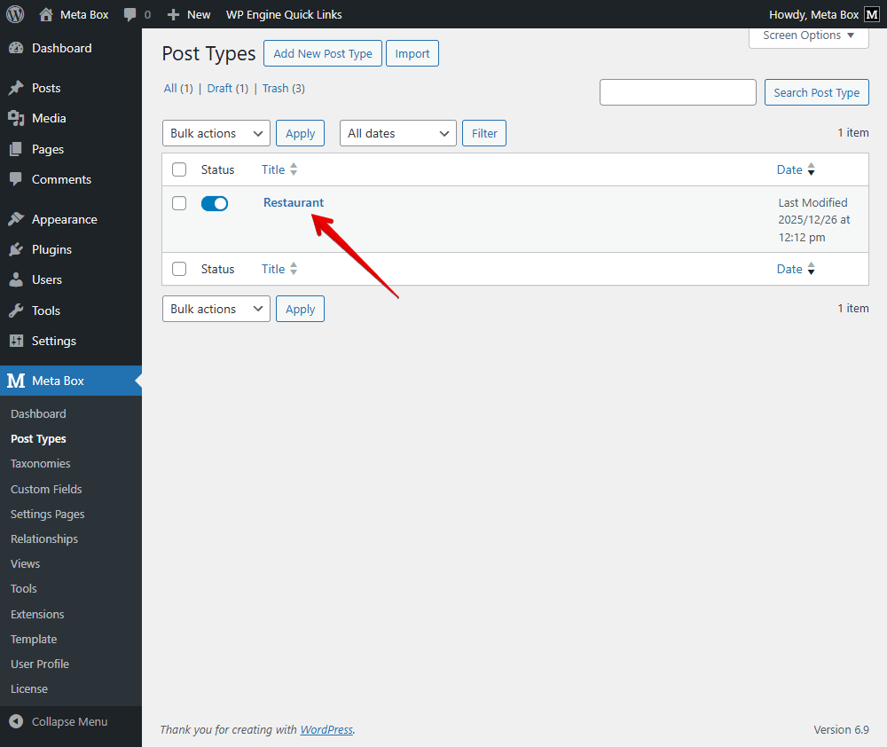

And I’ve done the same for the custom fields as well. If you want to see the details, you can find it on [this practice](https://docs.metabox.io/tutorials/create-download-preview-buttons-mb-views/). 

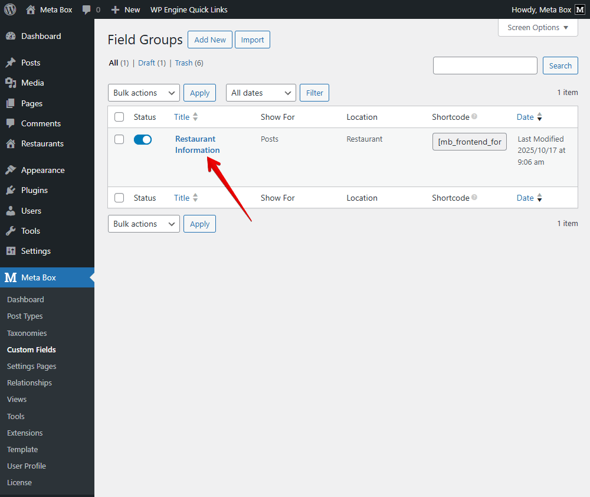

I created a field group with fields like this. You can customize it as needed.  

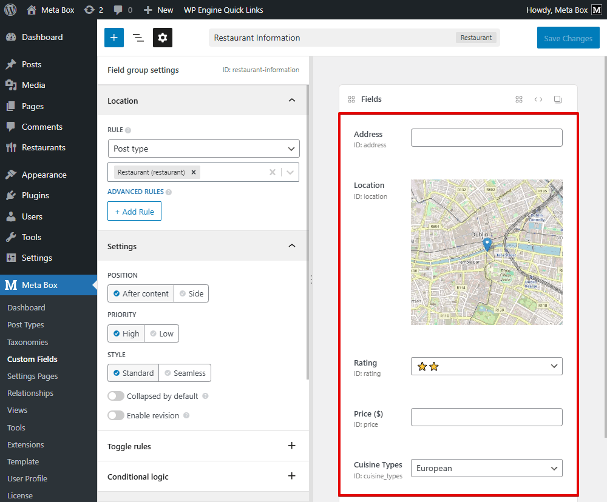

Go to the post editor, you will see the created custom fields.

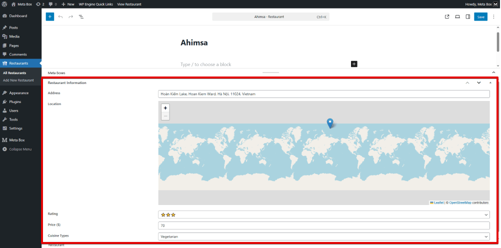

## 2. Showing restaurants on the map

In this step, we’ll show all posts on the page using **MB Views** from **Meta Box**, which means displaying all restaurants. For filtering, I’ll do it later. We already have a case study that shows how to display listings on a map. You can find it on [this tutorial](https://docs.metabox.io/tutorials/display-listings-on-map/). 

First, create a new page for the restaurant listing. 

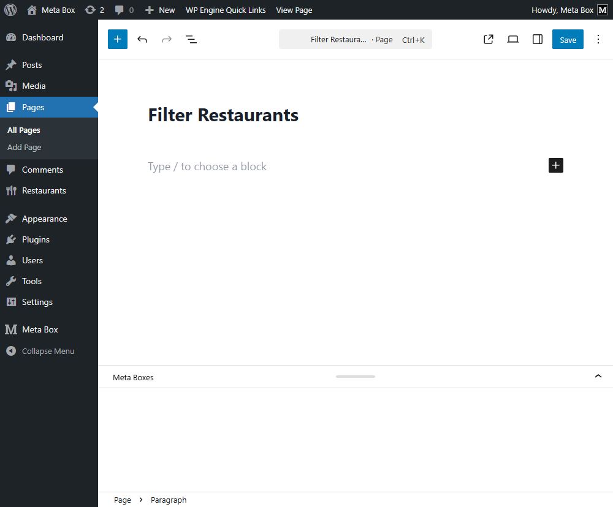

Then, go to **Meta Box** > **Views** and add a new view.

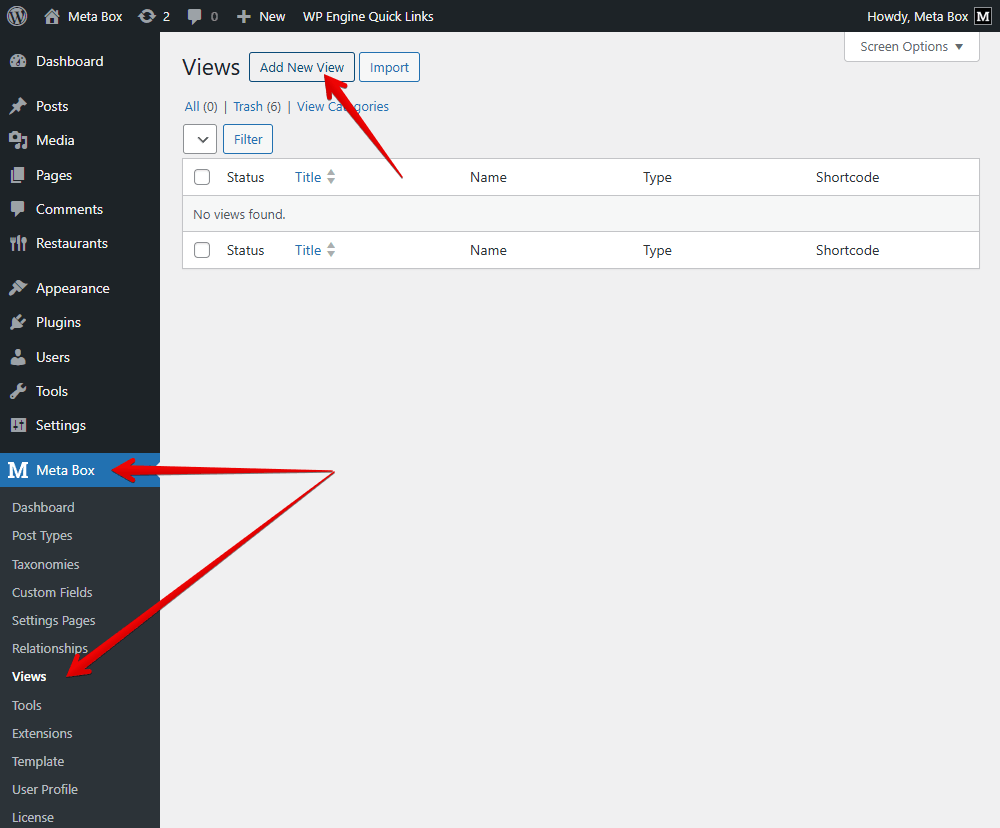

In the **Template** tab, I’m going to add some code. You can use the **Insert Field** button to insert fields or add code directly. 
```




    {{ post.address }} <br/>
    {{ post.location.latitude }} <br/>
    {{ post.location.longitude }} <br/>
    {{ post.rating.value }} <br/>
    {{ post.price }} <br/>
    {{ post.cuisine_types.value }} <br/>

```
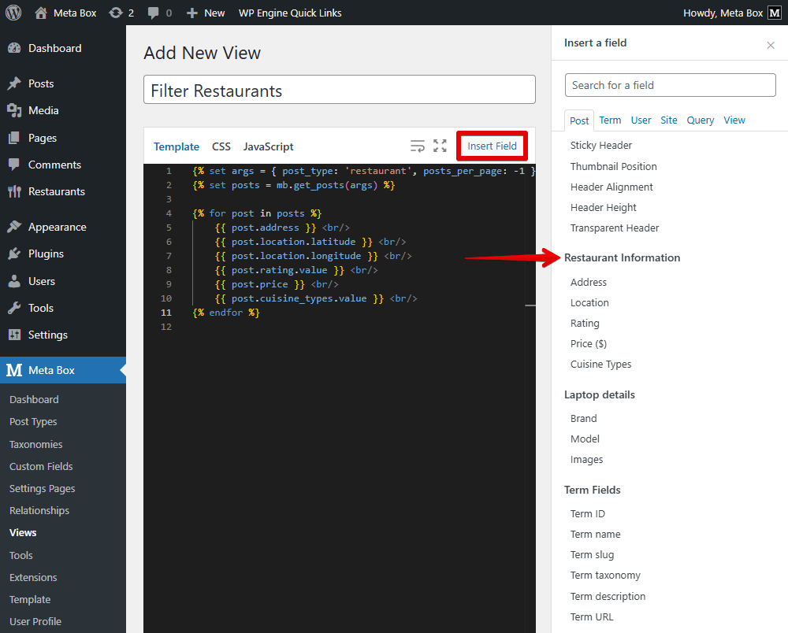

**In there**:

* ``: is to declare that we’ll get posts from the restaurant post type. 
* `mb.get_posts(args)`: is used as a function to get posts. 
* ``: is to insert the restaurant information inside. There will be multiple posts so we have a loop. Inside this loop, insert the field you want to get the value of as usual.
* `{{ post.address }}`: is to get all values in a post ​​with an ID `address`.
* `{{ post.location.latitude }}`:  is to get all values in post ​​with ID `location.latitude`
* `{{ post.location.longitude }}`:  is to get all values in post ​​with ID `location.longitude`
* `{{ post.rating.value }}`:  is to get all values in post ​​with ID `rating`
* `{{ post.price }}`:  is to get all values in post ​​with ID `price`
* `{{ post.cuisine_types.value }}`:  is to get all values in post ​​with ID `cuisine_types`

After inserting all the fields you need, scroll down to the **Settings** section, choose the type of the template as **Singular**, set the **Location** as **Page**, then select your page you created for the filter restaurants.

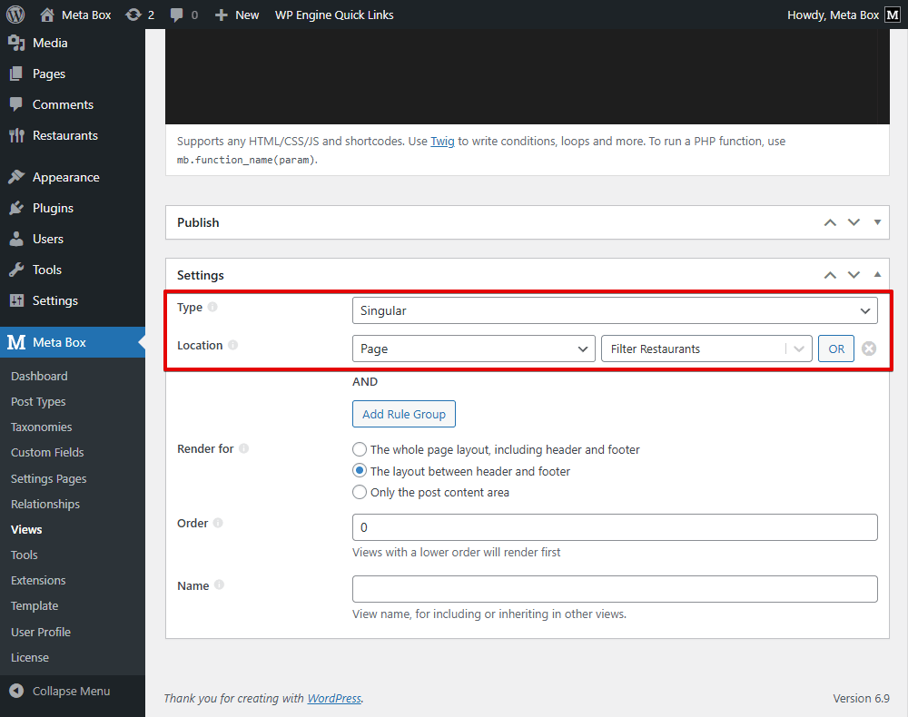

Now, go to the page editor and view it on the frontend, you can see all the data is displayed.

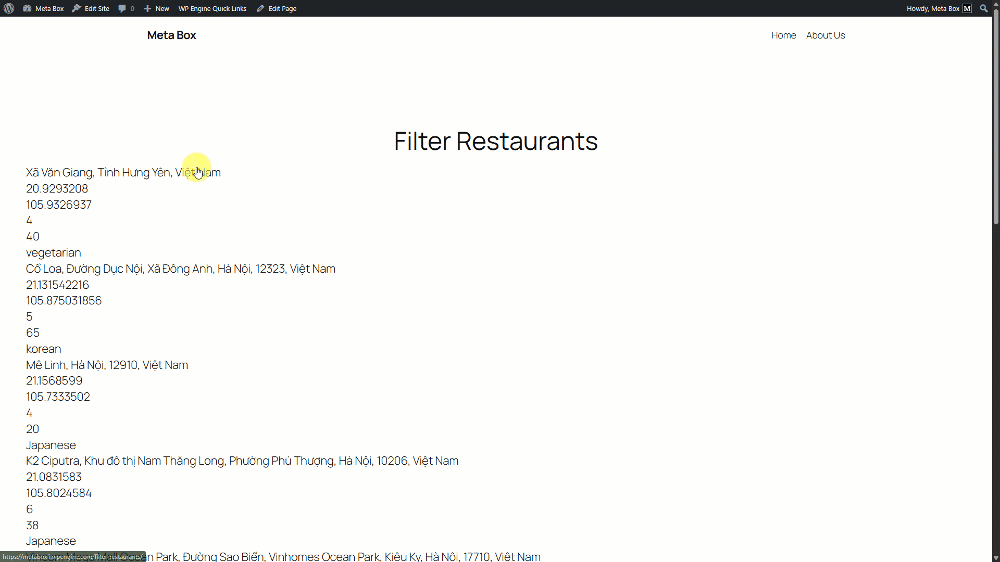

To improve the layout and show the restaurant information on a map instead of plain text from custom fields, I'm going back to the template to add a few divs, classes, and a small amount of code.
```
<link rel="stylesheet" href="https://unpkg.com/leaflet@1.9.4/dist/leaflet.css" />
<script src="https://code.jquery.com/jquery-3.7.1.min.js"></script>
<script src="https://unpkg.com/leaflet@1.9.4/dist/leaflet.js"></script>




<div id="map"></div>



    
    
    
    
    
    

    


<div id="restaurants-data" data-items='{{ restaurantsArray|json_encode()|raw }}' style="display:none;"></div>
```
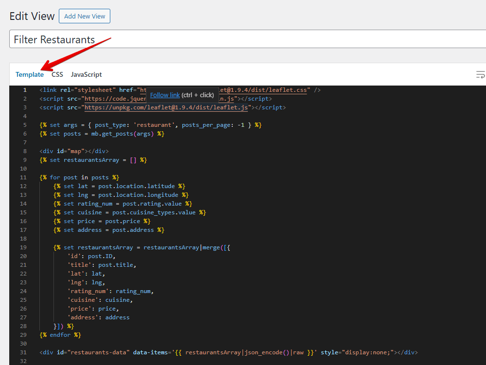

**Explanation**: 
```
<link rel="stylesheet" href="https://unpkg.com/leaflet@1.9.4/dist/leaflet.css" />
<script src="https://code.jquery.com/jquery-3.7.1.min.js"></script>
```
This code is to download and declare the Leaflet JavaScript library.
`<script src="https://unpkg.com/leaflet@1.9.4/dist/leaflet.js"></script>`: is to add the jQuery library.

`<div id="map"></div>`: is to display the map.
```



    
    
    
    
    
    

    

```
This part is to create an array to get all data in each post about: ID, Name, Coordinates, Price, Rating, Cuisine and Address.

`<div id="restaurants-data" data-items='{{ restaurantsArray|json_encode()|raw }}' style="display:none;"></div>`

We use the `id="restaurants-data"` as an HTML class, and all values from the array are passed to it.

After that, I added the **CSS** code. 

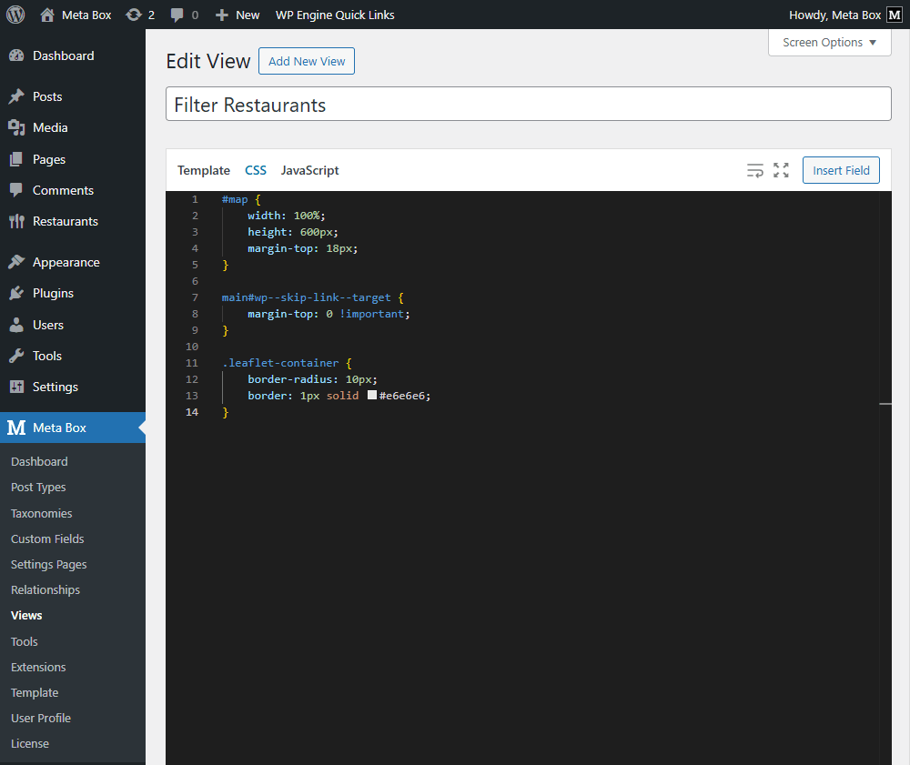

Followed by the **JavaScript** tab to add code.
```
jQuery(function ($) {
    let rawData = $('#restaurants-data').data('items');

    if (typeof rawData === 'string') {
        Locations = JSON.parse(rawData);
    } else {
        Locations = rawData;
    }

    Locations.forEach(it => {
        it.lat = parseFloat(it.lat) || null;
        it.lng = parseFloat(it.lng) || null;
        it.rating_num = parseInt(it.rating_num || (it.rating_num || '').replace(/[^\d]/g, '')) || null;
        it.price = parseInt(it.price) || 0;
        it.cuisine = Array.isArray(it.cuisine) ? it.cuisine.join(', ') : (it.cuisine || '');
        it.title = it.title || '';
        it.address = it.address || '';
    });

    const initialCenter = [21.0285, 105.85];
    const map = L.map('map').setView(initialCenter, 12);
    L.tileLayer('https://{s}.tile.openstreetmap.org/{z}/{x}/{y}.png', { maxZoom: 19 }).addTo(map);

    let currentMarkers = [];
    let userMarker = null;
    let userLocation = null;

    function clearMarkers() {
        currentMarkers.forEach(m => map.removeLayer(m));
        currentMarkers = [];
    }

    function renderMarkers(items) {
        clearMarkers();
        let points = [];
        items.forEach(it => {
            if (!it.lat || !it.lng) return;
            let stars = it.rating_num ? '⭐'.repeat(it.rating_num) : '⭐';
            let popup = `
                <div style="font-family:Arial;min-width:180px;">
                    <strong style="font-size:18px;color:#7a1c1c;">${it.title}</strong><br>
                    <span style="color:#f39c12;">${stars}</span><br>
                    <span>🍽 ${it.cuisine}</span><br>
                    <span>💰 ${it.price} $</span><br>
                    ${it.address ? `📍 ${it.address}` : ''}
                </div>`;
            let mk = L.marker([it.lat, it.lng]).addTo(map).bindPopup(popup);
            currentMarkers.push(mk);
            points.push([it.lat, it.lng]);
        });
        if (points.length) {
            let bounds = L.latLngBounds(points);
            if (userMarker) bounds.extend(userMarker.getLatLng());
            map.fitBounds(bounds, { padding: [40, 40] });
        }
    }
    renderMarkers(Locations);
});
```
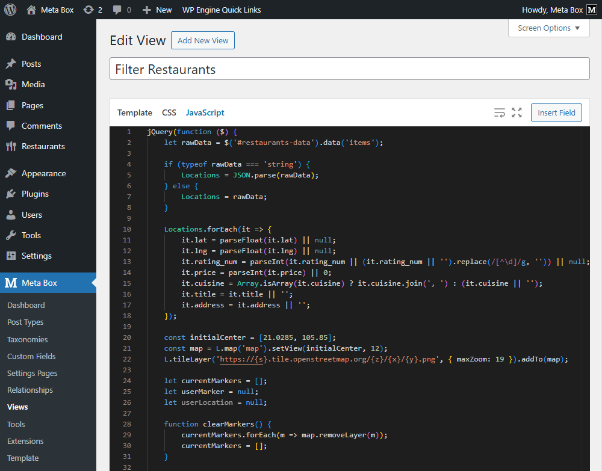

**Specifically**:
```
jQuery(function ($) {
    let rawData = $('#restaurants-data').data('items');
```
To start, a variable is created to get the raw data from the div with the restaurants data.
```
    if (typeof rawData === 'string') {
        Locations = JSON.parse(rawData);
    } else {
        Locations = rawData;
    }
```
Next, the code checks the data: if it’s a JSON string, it converts it to an object; if it’s already in that form, leave it unchanged.
```
    Locations.forEach(it => {
        it.lat = parseFloat(it.lat) || null;
        it.lng = parseFloat(it.lng) || null;
        it.rating_num = parseInt(it.rating_num || (it.rating_num || '').replace(/[^\d]/g, '')) || null;
        it.price = parseInt(it.price) || 0;
        it.cuisine = Array.isArray(it.cuisine) ? it.cuisine.join(', ') : (it.cuisine || '');
        it.title = it.title || '';
        it.address = it.address || '';
    });
```
Afterward, it ensures each location’s data has the correct format, valid values, and won’t cause errors.
```
    const initialCenter = [21.0285, 105.85];
    const map = L.map('map').setView(initialCenter, 12);
    L.tileLayer('https://{s}.tile.openstreetmap.org/{z}/{x}/{y}.png', { maxZoom: 19 }).addTo(map);
```
The following section sets up the map with the default center in Hanoi, and applies OpenStreetMap as the base layer.
```
    let currentMarkers = [];
    let userMarker = null;
    let userLocation = null;
```
At the same time, several global variables are declared to support Marker and User Position.
```
    function clearMarkers() {
        currentMarkers.forEach(m => map.removeLayer(m));
        currentMarkers = [];
    }
```
Before rendering new results, all existing markers are cleared and the array is reset to avoid overlapping markers.
```
    function renderMarkers(items) {
        clearMarkers();
        let points = [];
        items.forEach(it => {
            if (!it.lat || !it.lng) return;
            let stars = it.rating_num ? '⭐'.repeat(it.rating_num) : '⭐';
            let popup = `
                <div style="font-family:Arial;min-width:180px;">
                    <strong style="font-size:18px;color:#7a1c1c;">${it.title}</strong><br>
                    <span style="color:#f39c12;">${stars}</span><br>
                    <span>🍽 ${it.cuisine}</span><br>
                    <span>💰 ${it.price} $</span><br>
                    ${it.address ? `📍 ${it.address}` : ''}
                </div>`;
            let mk = L.marker([it.lat, it.lng]).addTo(map).bindPopup(popup);
            currentMarkers.push(mk);
            points.push([it.lat, it.lng]);
        });
        if (points.length) {
            let bounds = L.latLngBounds(points);
            if (userMarker) bounds.extend(userMarker.getLatLng());
            map.fitBounds(bounds, { padding: [40, 40] });
        }
    }
```
Moving on, this function displays markers from an array of items. It loops through the restaurant list, builds popups with the name, rating, cuisine, price, and address, and adjusts the map so all restaurants remain visible. 
```
    renderMarkers(Locations);
});
```
In the end, markers are displayed on the map so that users can see the location of the restaurants.

After styling and adding functions, our page is like this.


## 3. Filtering restaurants on the map

Now, it’s time to create filters for restaurants on the map. Back to the created template to add code for this purpose. I will display all the filters first, then add functions for it later.


**Explanation**: 
```
    
    
        
        
            
        
    
    

    <select id="filter-rating">
        <option value="">- All Ratings -</option>
        
            <option value="{{ rate }}">
                ⭐
            </option>
        
    </select>
```
First, in this part, an array is created to store all rating values from the posts. This is used to display the ratings in a select dropdown on the archive page, allowing users to search restaurants by the number of stars they want. There are a lot of posts so this part will run in a loop.
```
    
    
        
        
            
                
                    
                
            
        
            
                
            
        
    
    

    <select id="filter-cuisine">
        <option value="">- All Cuisines -</option>
        
            <option value="{{ cuis }}">{{ cuis }}</option>
        
    </select>
```
In the same way, another array is created to store all cuisine types from the posts. These values are also shown in a select dropdown, so users can filter restaurants by their preferred cuisine, and this process also runs in a loop.
```
    <div class="price-range">
        <span class="price-label">💰 Price:</span>
        <div class="price-control">
            <span class="price-min-label">Min</span>
            <input type="range" id="price-min" min="0" max="100" value="10">
        </div>
        <div class="price-control">
            <span class="price-max-label">Max</span>
            <input type="range" id="price-max" min="0" max="100" value="50">
        </div>
        <span id="price-display">10 - 50$</span>
    </div>
```
To handle price filtering, a min–max range bar is set up. At first, it only shows the default minimum and maximum values, then **JavaScript** updates them dynamically when the user drags the slider.
```
    <button id="locate-btn" type="button">📍 My Location</button>
```
After that, a button is added to get the user’s current location. When clicked, it detects the exact position of the user at that moment.
```
    <input type="number" id="filter-radius" placeholder="Radius (km)" min="0" step="1">
```
A radius input is then created so users can define a search range. Once the location is available and a radius is entered, only restaurants within that distance are included in the results.
```
    <button id="filter-btn" type="button">Search</button>
```
Next, a Search button is added to trigger the filtering process based on all selected criteria.
```
    <span id="filter-info"></span>
</div>
```
Last but not least, an area is set up to display the results, where the total number of restaurants found is shown.

Then, move to the **CSS** tab and add some code. 
 
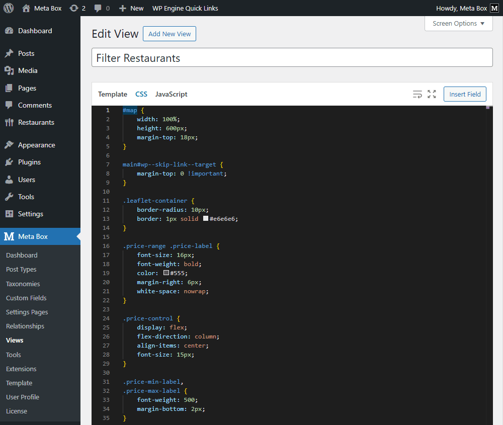

After saving, go to the front-end page, you can see all the search filters displayed here. The filters are showing now, but they're not working yet.

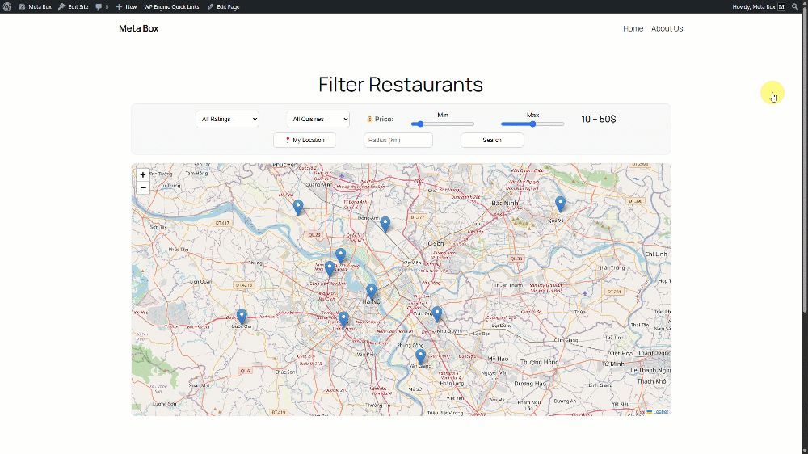

Go back to the page editor to add code for the **JavaScript** tab. This step will help the filters work properly.

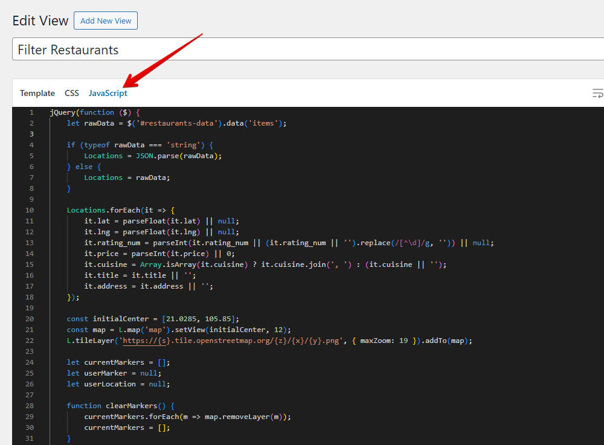
 
```
$('#locate-btn').on('click', function () {
        let $btn = $(this);
        if (!navigator.geolocation) return alert('Browser does not support geolocation.');
        $btn.prop('disabled', true).text('Getting location...');
        navigator.geolocation.getCurrentPosition(pos => {
            userLocation = { lat: pos.coords.latitude, lng: pos.coords.longitude };
            if (userMarker) map.removeLayer(userMarker);
            userMarker = L.circleMarker([userLocation.lat, userLocation.lng], { radius: 8 }).addTo(map).bindPopup('Your Location').openPopup();
            map.setView([userLocation.lat, userLocation.lng], 13);
            $btn.prop('disabled', false).text('📍 My Location');
            alert('Your location has been detected.');
        }, () => {
            $btn.prop('disabled', false).text('📍 My Location');
            alert('Unable to get location.');
        });
 });
```
I added another feature that gets the user’s location, shows it with a marker, and zooms the map to that spot.
```
    function updatePrice() {
        let min = $('#price-min').val();
        let max = $('#price-max').val();
        $('#price-display').text(`${min} - ${max}$`);
    }

    $('#price-min, #price-max').on('input', updatePrice);
```
In addition, this part updates the text from 10 to 100$ when the user drags the price bar.
```
    $('#filter-btn').on('click', function () {
        let r = $('#filter-rating').val();
        let c = $('#filter-cuisine').val();
        let minP = parseInt($('#price-min').val());
        let maxP = parseInt($('#price-max').val());
        let rad = parseFloat($('#filter-radius').val());

        if (rad && !userLocation) return alert('Vui lòng lấy vị trí của bạn trước.');

        function getDistance(lat1, lon1, lat2, lon2) {
            let R = 6371;
            let dLat = (lat2 - lat1) * Math.PI / 180;
            let dLon = (lon2 - lon1) * Math.PI / 180;
            let a = Math.sin(dLat / 2) * Math.sin(dLat / 2) +
                Math.cos(lat1 * Math.PI / 180) * Math.cos(lat2 * Math.PI / 180) *
                Math.sin(dLon / 2) * Math.sin(dLon / 2);
            let c = 2 * Math.atan2(Math.sqrt(a), Math.sqrt(1 - a));
            return R * c;
        }

        let filtered = Locations.filter(it => {
            let basicFilter = (!r || it.rating_num == r) &&
                (!c || it.cuisine.toLowerCase().includes(c.toLowerCase())) &&
                (it.price >= minP && it.price <= maxP);

            if (!basicFilter) return false;
            if (!rad) return true;
            if (!it.lat || !it.lng) return false;

            let dist = getDistance(userLocation.lat, userLocation.lng, it.lat, it.lng);

            return dist <= rad;
        });

        renderMarkers(filtered);
        $('#filter-info').text(`Result: ${filtered.length} Restaurants`);
    });
```
Subsequently, this section above creates the search button that filters results by rating, cuisine, price, and radius. If the user sets a radius but hasn’t gotten their location yet, it will ask for the location first. I use a helper function to calculate the distance in kilometers between two coordinates. When the radius is missing or set to 0, that filter is skipped. 
```
    renderMarkers(Locations);
    $('#filter-info').text(`Show: ${Locations.length} Restaurants`);
});
```
After filtering, the updated results are rendered and the total number of matches is displayed. That’s all for the code. I’ve put everything on **[Github](https://github.com/wpmetabox/tutorials/tree/master/searching-post-on-the-maps)**, so you can check it out there.

Now, let’s check the page on the frontend, you can see the filters work well. 


